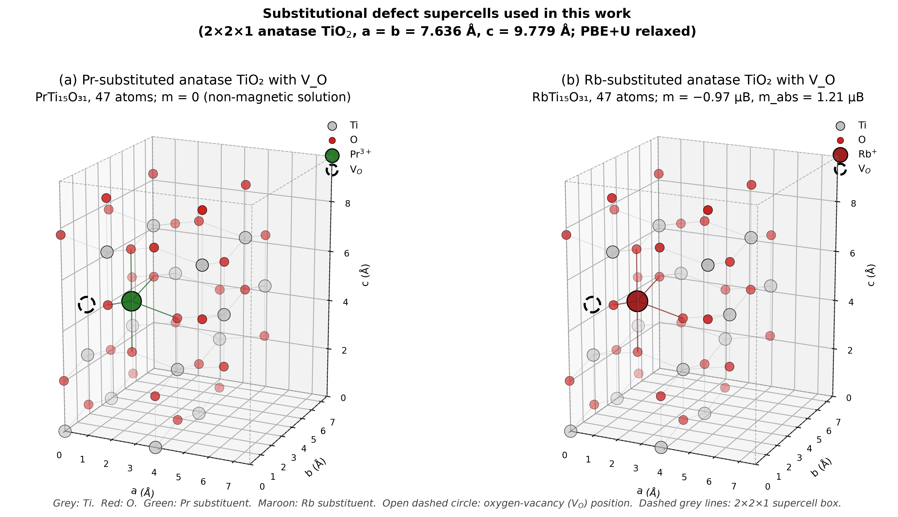
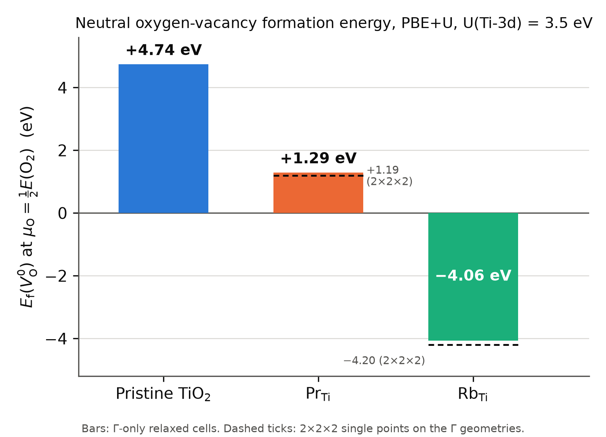
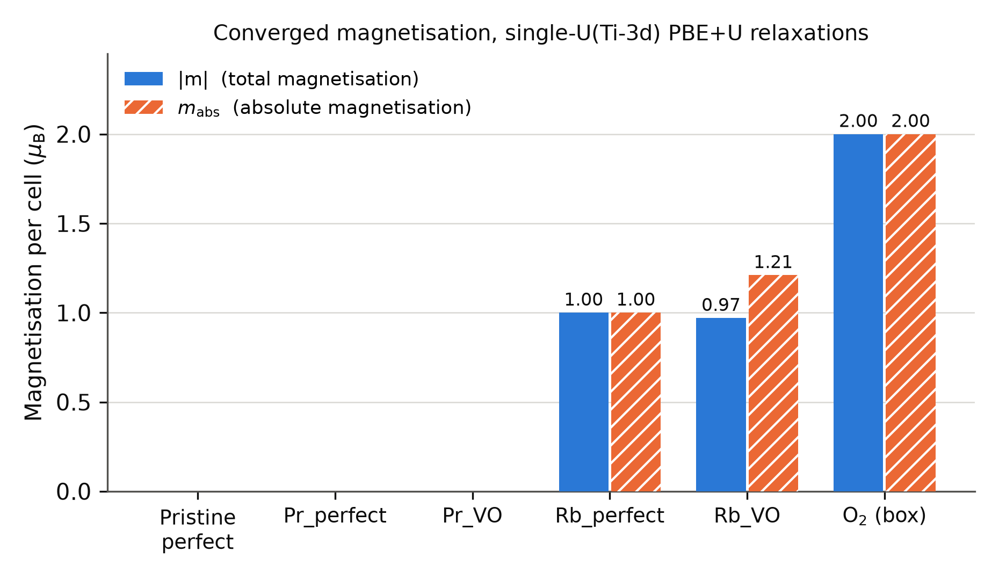
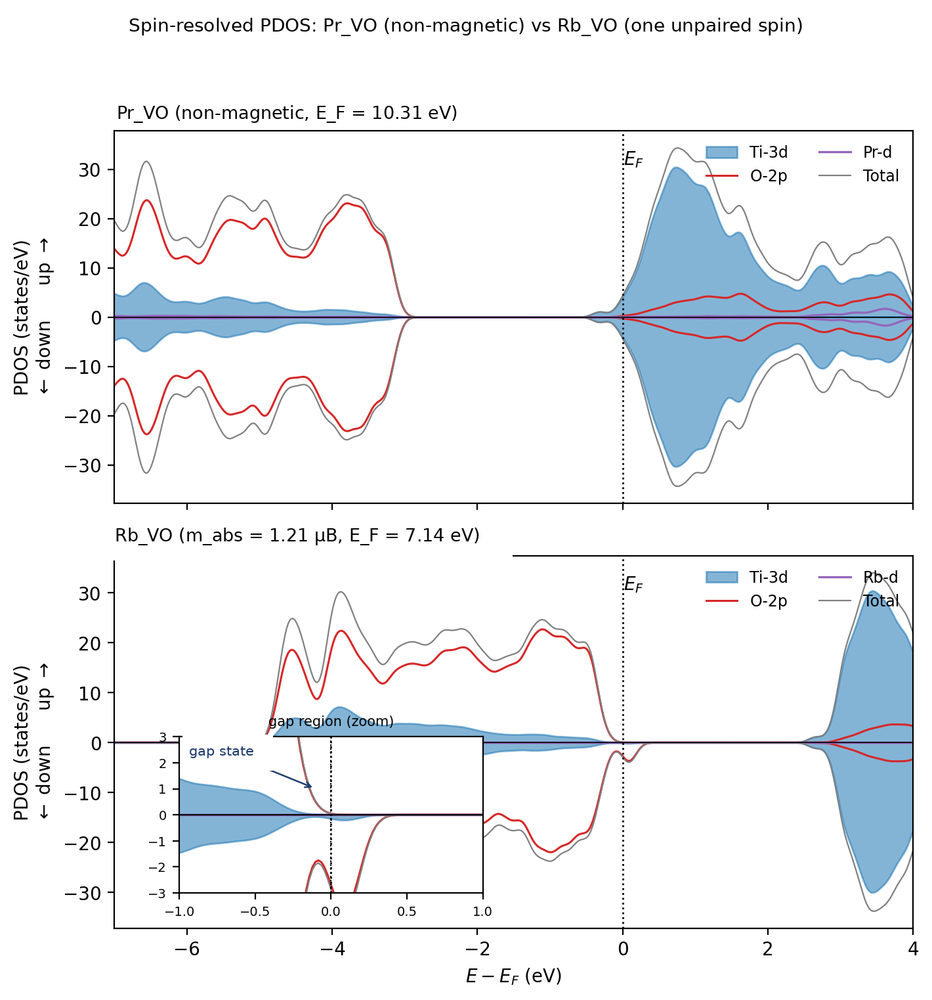

# Oxygen-Vacancy Energetics and Hole Localisation in Pr- and Rb-Substituted Anatase TiO~2~: A DFT+U Comparison

Mohammad Ghadimimehr^1,2^, Azimah Binti Omar^2,3,\*^, Siti Rohani Binti Sheikh Raihan^2^

*^1^ Institute for Advanced Studies, Universiti Malaya, 50603 Kuala Lumpur, Malaysia*

*^2^ UM Power Energy Dedicated Advanced Centre (UMPEDAC), Universiti Malaya, 59990 Kuala Lumpur, Malaysia*

*^3^ Department of Electrical Engineering, Faculty of Engineering, Universiti Malaya, 50603 Kuala Lumpur, Malaysia*

\* *Corresponding author: azimahomar@um.edu.my*

> **Revision note (v4, 2 October 2026; delete before submission).** This version implements the thirteen corrections of the Error Audit (E1–E13) and responds to the eighteen findings of the Reviewer/Editor Audit (R01–R18). All numerical values are unchanged from the FINAL draft and were re-derived from the Rydberg totals in the Supporting Information. Passages marked **[AUTHOR ACTION]** require information or calculations that only the authors can supply; they are listed again in the accompanying revision report.

**Abstract**

Oxygen vacancies (V~O~) in wide-gap oxide electron-transport layers are a recognised source of trap-assisted recombination, and aliovalent substitution is the usual lever for controlling them, yet trivalent rare-earth and monovalent alkali dopants have rarely been compared in the same host with the same protocol. Here we compare Pr^3+^ and Rb^+^ substitution on the Ti site of anatase TiO~2~ with spin-polarised PBE+U calculations (U = 3.5 eV on Ti-3d, 2×2×1 supercell) and a common oxygen reference, μ~O~ = ½E(O~2~). The neutral V~O~ formation energy falls from +4.74 eV in pristine anatase to +1.29 eV in the Pr-substituted cell and −4.06 eV in the Rb-substituted cell: both substitutions lower the cost of oxygen removal, the Pr cell remains uphill and the Rb cell is downhill, a 5.36 eV contrast that changes by only 0.04 eV on a 2×2×2 k-mesh. The ordering follows the formal electron count, one hole per Pr^3+^ and three per Rb^+^, so one vacancy over-compensates Pr and leaves one residual hole with Rb. The Rb cells carry unpaired spin in every treatment tested, and the absolute magnetisation of the vacancy cell reaches 2.99 μ~B~ when doubly ionised, consistent with three holes per Rb. The Pr cells converge to non-magnetic smeared solutions with U on Ti-3d only, but the vacancy-free Pr cell develops a localised hole (1.00 μ~B~) when an oxygen-2p Hubbard term is added, so hole localisation in Pr-substituted anatase is method dependent. The results are consistent with charge-compensation control of V~O~ energetics in this host, while the two-dopant design does not separate oxidation state from ionic size and bonding.

**Keywords:** DFT+U; anatase TiO~2~; oxygen vacancy; aliovalent substitution; hole localisation; electron-transport layer.

**1. Introduction**

Indoor photovoltaics are a leading candidate to replace disposable batteries in the growing population of low-power sensors [1]. Under the 200–1000 lx illumination typical of indoor spaces the open-circuit voltage is limited by non-radiative recombination, and wide-gap absorbers such as CsPbBr~3~ [2] are paired with n-type oxide electron-transport layers (ETLs), most commonly TiO~2~ or SnO~2~ [3]. The same oxides serve as electron-transport layers in organic light-emitting diodes [4]. In TiO~2~ the oxygen vacancy (V~O~) is the dominant native defect: microscopy, photoemission, transient spectroscopy and first-principles work agree that its two excess electrons can either delocalise into the conduction band or localise as Ti^3+^ centres, and that the localised configuration acts as a trap [5,6,7,8,9,10,11,12,13,14,15]. Controlling the equilibrium V~O~ population of an ETL is therefore a materials-design problem, and substitutional aliovalent doping is the principal lever [16,17,18,19].

For trivalent dopants on the Ti^4+^ site the formal charge mismatch is −1 e per site. Several DFT+U and experimental studies of lanthanide-doped TiO~2~ and related oxides describe this deficit as accommodated electronically, by rehybridisation at the valence-band edge or by a change of dopant oxidation state [20,21,22,23,24]. The picture is not universal: Iwaszuk and Nolan showed for trivalent dopants in bulk rutile that oxygen-vacancy compensation can compete with, and in some cases dominate, electronic compensation [18]; the coupling between a trivalent dopant and an oxygen vacancy has been analysed for Ce-doped anatase [25] and Gd-doped CeO~2~ [19]; and Bahmanrokh et al. derived a general defect-equilibria formalism for Ce-doped anatase in which both channels appear [26]. Pr in particular has been treated at the anatase (101) surface [27] and in the bulk [24], and is an attractive test case because its +3 state is well defined and its ionic radius (0.99 Å in six-fold coordination [28]) is far from that of Ti^4+^ (0.605 Å). For monovalent alkali dopants the mismatch is −3 e per site, and the available evidence points consistently to V~O~ formation as the compensation channel: Carey and Nolan found that Li, Na, K and Rb substitution in α-Cr~2~O~3~ strongly reduces the V~O~ formation energy, with the larger alkalis having the larger effect [17]; hybrid-functional work on alkali-doped α-Bi~2~O~3~ reached a similar conclusion [29]; and Tian et al. recently combined experiment and calculation to show that Rb doping, in synergy with lattice strain, promotes oxygen-vacancy formation in TiO~2~ [16].

What is missing is a comparison of the two dopant families in the same anatase host with the same supercell, pseudopotentials, Hubbard treatment and oxygen reference; the Rb case of Tian et al., for example, is embedded in a strained photochromic system and is not paired with a trivalent dopant. Without such a comparison, differences between published trivalent and monovalent results cannot be separated from differences in host, protocol or reference state. The comparison is also a useful test of the Kröger–Vink bookkeeping that is routinely invoked for dopant selection [30]: a Pr^3+^ substitution should leave one hole and a Rb^+^ substitution three, so a single neutral V~O~ (two electrons) should over-compensate Pr and under-compensate Rb.

This work provides that bounded comparison. Using one PBE+U protocol we compute the neutral V~O~ formation energy in pristine, Pr-substituted and Rb-substituted 2×2×1 anatase supercells, characterise the spin state and electron count of each cell, test the sensitivity of the localisation picture to an oxygen-site Hubbard term, and report charged-cell spin trends, Bader-charge differences, a hybrid-functional check on the pristine cell, dispersion-corrected single points, a k-mesh verification and alternative vacancy sites. We state explicitly which conclusions the two-dopant design supports: it establishes the ordering and magnitude of the V~O~ energetics within this protocol and shows that they follow the formal charge count, but it does not isolate oxidation state from ionic radius or dopant-specific bonding, and it does not establish device-level recombination behaviour. The bulk formation energies reported here are the reference against which surface and interface V~O~ energetics in ETL films would be measured; interface models are outside the present scope. Section 2 describes the protocol, Section 3 reports structure, energetics, electronic structure and sensitivity tests, Section 4 discusses the results against prior work, Section 5 states the limitations and Section 6 concludes.

**2. Computational Methods**

**2.1 Code, functional and pseudopotentials.** All calculations were performed with Quantum ESPRESSO v7.5 [31,32] using the PBE exchange–correlation functional [33] and projector-augmented-wave datasets from PSlibrary 1.0.0 [34]: Ti.pbe-spn-kjpaw_psl.1.0.0, O.pbe-n-kjpaw_psl.1.0.0, Pr.pbe-spdn-kjpaw_psl.1.0.0 and Rb.pbe-spn-kjpaw_psl.1.0.0. The valence configurations and electron counts of these datasets are listed in Table 1 because they fix the electron count of every supercell. The Pr dataset belongs to the PSlibrary "spdn" lanthanide family, which is generated for the trivalent ion with the 4f electrons frozen in the core; its 11 valence electrons comprise the 5s, 5p, 5d and 6s/6p shells (the generation configuration uses fractional 6s/6p occupations). **[AUTHOR ACTION: copy the exact valence configuration from the UPF header into Table 1 and Table S7.]** The Pr-4f states are therefore not variational in the present calculations, and no conclusion about 4f occupation or 4f hybridisation can be drawn from them (Section 5). The Bader electron totals of the Pr~Ti~+V~O~ and Rb~Ti~+V~O~ cells (376.998 and 374.998 e, Table S3) reproduce the counts in Table 1 and confirm the valence assignment. **[AUTHOR ACTION: insert the SHA-256 hashes of the four UPF files used, and copy the "Valence configuration" block of each UPF header into Table S7.]** Kinetic-energy cut-offs of 40 Ry (wavefunctions) and 320 Ry (charge density) were used throughout. No cut-off convergence test was performed; comparable anatase defect work uses 55 Ry for the same species [14], and the consequences are discussed in Section 5. **[AUTHOR ACTION: quote the suggested minimum cut-offs printed in the headers of the four UPF files, and run one 55 Ry single point on Pr_perfect and Pr_VO to bound the cut-off error on E~f~.]**

***Table 1. Pseudopotential valence configurations and resulting supercell electron counts.*** *N~e~ is the number of valence electrons per cell; all counts are for neutral cells. "Formal carriers" is the Kröger–Vink bookkeeping for Pr^3+^, Rb^+^, Ti^4+^ and O^2−^ with two electrons per neutral V~O~; it does not state where the carriers localise.*

| Species / cell | Valence configuration (PSlibrary 1.0.0) | Z~val~ | Composition | N~e~ | Formal carriers |
|---|---|---|---|---|---|
| Ti (spn) | 3s^2^3p^6^3d^2^4s^2^ | 12 | – | – | – |
| O (n) | 2s^2^2p^4^ | 6 | – | – | – |
| Pr (spdn, 4f in core) | 5s^2^5p^6^5d^1^(6s,6p)^2^ | 11 | – | – | – |
| Rb (spn) | 4s^2^4p^6^5s^1^ | 9 | – | – | – |
| Pristine_perfect | – | – | Ti~16~O~32~ | 384 | none |
| Pristine_VO | – | – | Ti~16~O~31~ | 378 | 2 excess electrons |
| Pr_perfect | – | – | PrTi~15~O~32~ | 383 | 1 hole |
| Pr_VO | – | – | PrTi~15~O~31~ | 377 | 1 net excess electron |
| Rb_perfect | – | – | RbTi~15~O~32~ | 381 | 3 holes |
| Rb_VO | – | – | RbTi~15~O~31~ | 375 | 1 residual hole |

**2.2 Hubbard correction.** A Hubbard term in the rotationally invariant Dudarev form [35], which is the form implemented behind the HUBBARD card of Quantum ESPRESSO 7.x, was applied to the Ti-3d manifold with U~eff~ = 3.5 eV using ortho-atomic projectors. Deák et al. note that this value is close to an ab initio determination of U for anatase [36], and it has been used for Er-doped anatase [21] and for anatase (101) defect chemistry [7]; other anatase work uses U = 4.2 eV [14,15], a value originally fitted for the rutile (110) surface [37]. Literature U values obtained with other projector schemes are not strictly transferable to the ortho-atomic projectors used here, and the sensitivity of the present results to U is reported in Section 3.7. **[AUTHOR ACTION: verify against the full texts that Mazierski et al. and Yin et al. used U(Ti-3d) = 3.5 eV and that Deák et al. quote an ab initio anatase value near 3.5 eV.]** The DFT+U approach rests on the formulation of Anisimov et al. [38]; linear-response determination of U [39] was not performed for the dopant-containing cells. For the oxygen-site tests of Section 3.4 an additional U~eff~ = 5.5 eV was placed on the O-2p manifold. This value is transferred from the Cr~2~O~3~ study of Carey and Nolan [17], where it was used together with a Cr-3d term to localise oxygen holes; it has not been derived for anatase and is treated here as a sensitivity parameter rather than a calibrated value.

**2.3 Supercells.** A 2×2×1 anatase supercell with a = b = 7.63632 Å and c = 9.77900 Å (volume 570.25 Å^3^) was used, containing 48 atoms (Ti~16~O~32~) in the perfect cell and 47 after removal of one oxygen atom. Dopants were introduced by replacing one Ti atom with Pr or Rb, i.e. 6.25 % of cation sites; one V~O~ per cell corresponds to 3.1 % of oxygen sites or 1.75×10^21^ cm^−3^. These concentrations are far above the dilute limit relevant to ETLs, and all absolute quantities below should be read as those of a concentrated periodic defect array. Lattice parameters were taken from a variable-cell relaxation of the pristine cell and held fixed for all defect cells. **[AUTHOR ACTION: state the k-mesh, cut-off and residual stress of that variable-cell relaxation.]** The production V~O~ in each doped cell is an oxygen atom in the neighbourhood of the dopant site; three alternative sites in the Pr cell are examined in Section 3.7. **[AUTHOR ACTION: state the atom index and the relaxed dopant–O distance of the production V~O~ in both cells. The earlier draft stated that the nearest-neighbour oxygen (index O3, 2.17 Å from Pr) was not tested, whereas SI Table S4 describes the production site as the closest oxygen at ≈2.17 Å; reconcile from the input files before any statement about nearest-neighbour preference is made. Also give the relaxed first-shell dopant–O bond lengths for Pr and Rb (six values each) as Table S8; note that 2.17 Å is well below the Shannon-radius sum of 2.39 Å for six-fold Pr^3+^–O^2−^.]**

**2.4 Brillouin-zone sampling and electronic settings.** Production relaxations used Γ-point sampling, a choice the earlier literature on anatase defect cells of comparable size has also made [15]. **[AUTHOR ACTION: verify that Arrigoni and Madsen used Γ-only sampling; otherwise remove the attribution.]** Single-point total energies on the Γ-relaxed geometries were recomputed on a 2×2×2 Monkhorst–Pack mesh for all four doped cells, and the projected densities of states were obtained from non-self-consistent calculations on a 2×2×2 mesh; the k-mesh dependence of the formation-energy contrast is reported in Section 3.7. All calculations were spin-polarised (nspin = 2). Fractional occupations were treated with Gaussian smearing. **[AUTHOR ACTION: state the smearing width (degauss) used in the production relaxations; the Supporting Information records 0.005 Ry for the first pristine-V~O~ attempt and 0.01 Ry for the converged one.]** With smearing, the total energy printed by pw.x is the smearing free energy; the entropy term is small when few states lie near the Fermi level but has not been tabulated. **[AUTHOR ACTION: report the "smearing contrib. (−TS)" line for every cell in Table S10; if it exceeds 0.01 Ry for any defect cell, report internal energies as well.]** The electronic self-consistency threshold was 1×10^−8^ Ry. Symmetry was handled by the code's default detection. **[AUTHOR ACTION: state whether nosym or any magnetisation constraint (tot_magnetization, constrained_magnetization) was used in any run.]**

**2.5 Magnetisation conventions and spin initialisation.** Two quantities are reported throughout: the total (net) magnetisation m = ∫[ρ~↑~(r) − ρ~↓~(r)] dr, which can be of either sign, and the absolute magnetisation m~abs~ = ∫|ρ~↑~(r) − ρ~↓~(r)| dr. For a single well-localised unpaired electron both are close to 1 μ~B~; m~abs~ > |m| indicates spin density of both signs. Production relaxations were started from a small, symmetry-breaking starting magnetisation. **[AUTHOR ACTION: state the starting_magnetization value of each species in the production inputs. Quantum ESPRESSO requires a non-zero value for at least one species in an nspin = 2 run, and Section S1 records 0.05 on both species for the pristine V~O~ cell; the earlier wording "zero magnetisation on all species" cannot be correct as written.]** Because a near-zero start can trap a calculation in a non-magnetic solution, the Pr_VO cell was re-relaxed from a magnetic start with starting_magnetization = 0.3 on Ti and 0.5 on the dopant (these are fractions of the valence charge in the Quantum ESPRESSO convention, not site moments in μ~B~) under a separate prefix, and the two total energies were compared (Section 3.3). **[AUTHOR ACTION: state whether equivalent magnetic-start trials were run for Pristine_perfect, Pristine_VO and Pr_perfect and report their outcomes; if not, say so here.]** A wider search over site-specific and antiparallel seeds was not performed, and the non-magnetic solutions are therefore described below as the lowest-energy solutions among those tested rather than as established ground states.

**2.6 Geometry optimisation.** Ionic positions were relaxed with BFGS until the largest force component fell below 0.005 Ry/Bohr (0.129 eV/Å). For the doped cells, charge mixing was damped (mixing_beta = 0.1) and the BFGS history shortened (bfgs_ndim = 3) to suppress oscillation about shallow minima; the pristine V~O~ cell was first attempted with the default mixing (mixing_beta = 0.3) and converged only after the changes described in Section S1. The final maximum forces were 0.0026, 0.0042, 0.0037 and 0.0040 Ry/Bohr (0.067, 0.108, 0.095 and 0.103 eV/Å) for Pr_perfect, Pr_VO, Rb_perfect and Rb_VO. The Pr_VO relaxation was stopped manually after the force fell below the threshold while the BFGS step oscillated; the energy change over the last iterations was below 1×10^−9^ Ry. This tolerance is looser than the 0.01–0.03 eV/Å commonly used for defect energetics, and its consequences are discussed in Section 5. Force trajectories are shown in Figure S3.

**2.7 Formation energies.** The neutral V~O~ formation energy of host X was evaluated as

E~f~(V~O~^0^; X) = E(X with V~O~, q = 0) − E(X perfect, q = 0) + μ~O~, with μ~O~ = ½E(O~2~) + Δμ~O~ and Δμ~O~ = 0,

where E(O~2~) is the total energy of an isolated O~2~ molecule in a 12 Å cubic box computed with the same settings; it converged to the triplet ground state (m = 2.00 μ~B~) and ½E(O~2~) = −41.51621 Ry (−564.857 eV). This is the oxygen-rich electronic-energy reference; no finite-temperature gas-phase correction or competing-phase analysis was applied, and the values are conditional oxygen-removal energies from the already substituted cells rather than equilibrium vacancy concentrations [40]. The known overbinding of O~2~ by PBE shifts all absolute formation energies at this reference by a common amount and cancels in differences between hosts; no empirical correction was applied. Formation energies were evaluated from unrounded Rydberg totals and are reported to 0.01 eV; the full-precision ledger is Table S9. The comparative quantity ΔE~f~ = E~f~(V~O~; Pr) − E~f~(V~O~; Rb) is independent of the oxygen reference.

**2.8 Additional calculations.** (i) Charged cells: Pr_VO and Rb_VO were relaxed at q = +1 and +2 with a uniform compensating background; no image-charge or potential-alignment correction was applied, so these cells are used only for their spin state and not for transition levels. (ii) U sweep: single-point calculations on the relaxed Pristine_perfect, Pr_VO and Rb_VO cells at U(Ti-3d) = 3.0, 4.0 and 4.5 eV. (iii) HSE06: one single-point calculation on the relaxed Pristine_perfect cell with exact-exchange fraction 0.25 and screening parameter 0.106 bohr^−1^ [41,42], Γ-only, 40 Ry, without the Hubbard term. **[AUTHOR ACTION: confirm the exact screening_parameter value in the input (0.106 bohr^−1^ corresponds to 0.2 Å^−1^; the canonical HSE06 value is 0.11 bohr^−1^), the exx q-grid, ecutfock, the EXX convergence threshold and number of outer iterations, and that the +U term was switched off. The HSE06 total energy (−3926.67 Ry) differs from the PBE+U total of the same cell (−4275.02 Ry) by 348 Ry, which a change of functional alone cannot produce; state which pseudopotential datasets were used in the hybrid run and whether exact exchange was evaluated with the PAW datasets. If different datasets were used, the Fermi-energy comparison in Section 3.6 must be removed.]** (iv) Dispersion: single-point energies for Pr_VO and Rb_VO with the Grimme D3 correction and Becke–Johnson damping [43,44], without three-body terms, following the DFT+U+D3 protocol used for defective anatase by Torres et al. [45]; the single points were started from scratch on the production geometries. (v) Alternative vacancy sites: three additional Pr_VO cells with the vacancy at atom indices O1, O7 and O17 of the production input. (vi) Bader analysis of Pr_VO and Rb_VO from pp.x charge densities with the Henkelman grid algorithm [46,47]. **[AUTHOR ACTION: state the FFT grid used for the pp.x density, whether the PAW all-electron reconstruction was included, and the Bader code version (v1.05 is given in the SI).]** (vii) Projected densities of states from projwfc.x on 2×2×2 non-self-consistent runs. **[AUTHOR ACTION: state the Gaussian broadening used in projwfc.x and the number of bands.]**
**3. Results**

**3.1 Structural relaxation**

All four doped supercells relaxed to maximum forces below the 0.005 Ry/Bohr threshold (Section 2.6; trajectories in Figure S3). The pristine V~O~ cell, which required a modified mixing scheme to converge (Section S1), was stopped at 0.0056 Ry/Bohr, slightly above the threshold. The relaxed Pr_VO and Rb_VO cells are shown in Figure 1. The production vacancy lies in the neighbourhood of the dopant in both cells (Section 2.3). **[AUTHOR ACTION: add one sentence on the relaxed first-shell dopant–O distances and the outward relaxation of the six O neighbours around Pr and Rb relative to Ti–O = 1.94/1.97 Å in the pristine cell, from Table S8.]** Because the residual forces (0.07–0.11 eV/Å) are larger than the 0.01–0.03 eV/Å typically used for defect energetics, bond lengths quoted here are indicative, and the sensitivity of the energetics to tighter relaxation has not been tested (Section 5).

{width=100%}

*Figure 1. Relaxed 2×2×1 anatase supercells with one substitutional dopant and one oxygen vacancy (PBE+U, U(Ti-3d) = 3.5 eV, Γ-only). (a) Pr~Ti~ + V~O~ (PrTi~15~O~31~, 47 atoms), non-magnetic solution (m = 0). (b) Rb~Ti~ + V~O~ (RbTi~15~O~31~, 47 atoms), m = −0.97 μ~B~, m~abs~ = 1.21 μ~B~. Grey: Ti; red: O; green: Pr; maroon: Rb; dashed circle: vacancy position; dashed box: supercell. **[AUTHOR ACTION: the panel subtitles of the interim artwork were patched to match this caption; regenerate the figure from the relaxed coordinates and add the vacancy atom index and dopant–V~O~ distance to each panel.]***

**3.2 Oxygen-vacancy formation energies**

Table 2 lists the neutral V~O~ formation energies at the oxygen-rich reference μ~O~ = ½E(O~2~), and Figure 2 displays them. In pristine anatase E~f~ = +4.74 eV. In the Pr-substituted cell E~f~ = +1.29 eV, and in the Rb-substituted cell E~f~ = −4.06 eV. Both substitutions lower the cost of removing an oxygen atom adjacent to the dopant site relative to pristine TiO~2~, by 3.45 eV for Pr and 8.81 eV for Rb (differences of the unrounded values). The Pr cell remains uphill at this reference, so oxygen removal is not spontaneous; the Rb cell is downhill, so the vacancy-free Rb-substituted cell is unstable against oxygen loss at this reference. The Pr–Rb contrast ΔE~f~ is 5.36 eV (5.356 eV from the unrounded totals; the value 5.35 eV obtained by subtracting the rounded entries is a rounding artefact).

***Table 2. Neutral oxygen-vacancy formation energies at μ~O~ = ½E(O~2~) (PBE+U, U(Ti-3d) = 3.5 eV, 40 Ry).*** *Total energies are the converged Γ-only values in Ry; E~f~ is computed from the unrounded totals (full ledger in Table S9). The last column gives the single-point result on the Γ-relaxed geometry with a 2×2×2 k-mesh. The Γ-to-2×2×2 shift is −0.10 eV (Pr) and −0.14 eV (Rb) and was not evaluated for the pristine formation energy; the Pr–Rb difference shifts by +0.04 eV. Smearing, cut-off and relaxation-tolerance contributions to the absolute values have not been quantified (Section 5).*

| Host X | E(X perfect) (Ry) | E(X + V~O~) (Ry) | ½E(O~2~) (Ry) | E~f~(V~O~^0^), Γ (eV) | E~f~(V~O~^0^), 2×2×2 (eV) |
|---|---|---|---|---|---|
| Pristine TiO~2~ | −4275.01530 | −4233.15036 | −41.51621 | +4.74 | – ^a^ |
| Pr~Ti~ | −4576.71224 | −4535.10106 | −41.51621 | +1.29 | +1.19 |
| Rb~Ti~ | −4330.38890 | −4289.17135 | −41.51621 | −4.06 | −4.20 |
| ΔE~f~ (Pr − Rb) | | | | +5.36 | +5.39 |

*^a^ The pristine V~O~ cell was not computed at 2×2×2 (the pristine perfect cell was, Section 3.7), so no 2×2×2 formation energy can be formed for the pristine host.* **[AUTHOR ACTION: compute E(Pristine_VO) at 2×2×2 on the Γ geometry and complete this entry.]**

{width=100%}

*Figure 2. Neutral oxygen-vacancy formation energies at the oxygen-rich reference μ~O~ = ½E(O~2~) for pristine, Pr-substituted and Rb-substituted anatase (PBE+U, U(Ti-3d) = 3.5 eV). Bars: Γ-only relaxed cells (this work; Table 2). Dashed ticks: single-point values at 2×2×2 on the Γ geometries. Both substitutions lower the formation energy relative to pristine; the Pr cell stays positive and the Rb cell becomes negative.*

The pristine value lies within the 4.0–5.0 eV range reported for the neutral bulk vacancy in anatase with DFT+U at U = 4.2 eV [15] and below the 5.3–5.5 eV obtained with HSE06 at the oxygen-rich limit [48,36], as expected for a semi-local functional with a PBE O~2~ reference; this is a consistency check, not a validation of the protocol. **[AUTHOR ACTION: verify the Arrigoni–Madsen, Boonchun and Deák values and their oxygen-chemical-potential conditions against the full texts.]** On the 2×2×2 mesh the individual formation energies shift by −0.10 eV (Pr) and −0.14 eV (Rb) while the contrast moves from 5.36 to 5.39 eV, i.e. by +0.04 eV (defined as the 2×2×2 contrast minus the Γ-only contrast). The comparative conclusion is therefore insensitive to Brillouin-zone sampling at the 0.05 eV level, although the absolute values carry a 0.1–0.15 eV mesh dependence. The sign of the Rb result agrees with the combined experimental and computational finding of Tian et al. that Rb doping promotes V~O~ formation in TiO~2~ [16]; that work supports the direction of the effect, not the specific supercell value.

**3.3 Spin states and electron counts**

Table 3 collects the total and absolute magnetisation and the Fermi energy printed by the code for each production cell, and Figure 3 plots the magnetisations. Table 1 shows that every doped cell has an odd number of electrons. A collinear calculation of an odd-electron cell can converge to m = 0 only through fractional occupations, so the non-magnetic solutions found for Pr_perfect and Pr_VO are smeared solutions in which the formal hole (Pr_perfect) or the formal net excess electron (Pr_VO) is spread over band-edge states with equal spin-up and spin-down weight. They are not closed-shell singlets. The one magnetic trial performed for Pr_VO (Section 2.5) converged to m = 1.00 μ~B~, m~abs~ = 1.13 μ~B~, 0.281 eV above the non-magnetic solution; the non-magnetic solution is therefore the lower of the two solutions tested, and a broader search over spin seeds and local distortions would be needed to establish it as the ground state. **[AUTHOR ACTION: report the fractional occupations of the states within ±0.3 eV of E~F~ for the non-magnetic Pr_perfect and Pr_VO solutions, so that the smeared character asserted here is documented.]** The isolated O~2~ reference converged to its triplet (m = 2.00 μ~B~), which is the expected check of the spin-polarised pipeline.

The Rb cells behave differently. Rb_perfect converged to m = 1.00 μ~B~ (m~abs~ = 1.00 μ~B~) from the production starting magnetisation, and Rb_VO to m = −0.97 μ~B~ with m~abs~ = 1.21 μ~B~. Single-point calculations started from scratch on the final Rb_VO geometry, at the production U (with the D3 term, Section 3.7) and at other U values (Table S1), converge instead to m~abs~ = 1.00 μ~B~; the relaxed cell therefore has two nearly degenerate spin solutions of this kind, and which one is lower in energy has not been established. **[AUTHOR ACTION: compare the total energy of a from-scratch single point at U = 3.5 eV without D3 on the final Rb_VO geometry with the last relaxation step, and report both solutions' m and m~abs~.]** With three formal holes in Rb_perfect and one residual hole in Rb_VO (Table 1), the Ti-3d-only Hubbard treatment thus localises one unpaired spin in each Rb cell; the remaining two holes of Rb_perfect are spin-compensated in this treatment, a point that the oxygen-site Hubbard test of Section 3.4 resolves. The excess of m~abs~ over |m| in Rb_VO (0.24 μ~B~) indicates minority spin density of the opposite sign, consistent with a partly delocalised hole rather than a single-site moment.

***Table 3. Converged magnetisation and Fermi energy of the production cells (U(Ti-3d) = 3.5 eV only, Γ-only).*** *m is the total magnetisation and m~abs~ the absolute magnetisation (Section 2.5). E~F~ is the Fermi energy printed by pw.x for each cell; the values are not aligned to a common reference and differences between chemically different cells are diagnostic only (Section 3.6).*

| Cell | N~e~ | m (μ~B~) | m~abs~ (μ~B~) | E~F~ (eV, unaligned) | Lowest solution among those tested |
|---|---|---|---|---|---|
| Pristine_perfect | 384 | 0.00 | 0.00 | 7.89 | non-magnetic |
| Pr_perfect | 383 | 0.00 | 0.00 | – ^b^ | non-magnetic (smeared) |
| Pr_VO | 377 | 0.00 | 0.00 | 9.99 | non-magnetic (smeared); magnetic trial +0.281 eV |
| Rb_perfect | 381 | 1.00 | 1.00 | – ^b^ | one unpaired spin |
| Rb_VO | 375 | −0.97 | 1.21 | 7.13 | one unpaired spin |
| O~2~ (12 Å box) | 12 | 2.00 | 2.00 | – | triplet |

*^b^* **[AUTHOR ACTION: insert E~F~ of Pr_perfect and Rb_perfect from the production output files.]**

{width=100%}

*Figure 3. Total (|m|) and absolute (m~abs~) magnetisation of the production cells and of the O~2~ reference (single-U(Ti-3d) PBE+U relaxations). The Pr cells and the pristine cell converge to non-magnetic solutions; both Rb cells carry one unpaired spin, and Rb_VO shows m~abs~ > |m|.*

**3.4 Oxygen-site Hubbard correction: localisation of the dopant-induced holes**

Because a Ti-3d-only Hubbard term provides no localising potential for holes on the oxygen sublattice, the three vacancy-free cells and Rb_VO were recomputed with an additional U = 5.5 eV on O-2p (Section 2.2). **[AUTHOR ACTION: state for each of the four dual-U cells whether it was relaxed or computed as a single point, and add the Rb_perfect and Rb_VO dual-U total energies to Tables S5 and S9.]** The results are collected in Table 4. The pristine control remains non-magnetic (m~abs~ = 0.00 μ~B~), so the oxygen term does not by itself induce magnetism. Rb_perfect changes from m~abs~ = 1.00 to 3.00 μ~B~, i.e. the three formal holes of Table 1 become three localised unpaired spins once the oxygen term is present; Rb_VO gives 1.00 μ~B~, the single residual hole after two have been filled by the vacancy electrons. Pr_perfect changes from the non-magnetic smeared solution to m~abs~ = 1.00 μ~B~, with a maximum residual force of 0.0049 Ry/Bohr; the one formal hole of the Pr substitution thus localises when the oxygen term is present. Its printed Fermi energy (6.69 eV) lies 0.53 eV below that of the dual-U pristine cell (7.22 eV), which is the direction expected for a localised acceptor state, although, as for all Fermi energies in this work (Section 3.6), the unaligned difference is a qualitative indicator only. Because the localising term was placed on O-2p, the spins are expected to reside on oxygen, but this has not been confirmed from site-projected moments or spin densities. **[AUTHOR ACTION: report m as well as m~abs~ for the dual-U cells (m = 3.00 μ~B~ is required for the three Rb spins to be parallel) and the site-projected moments or spin density of dual-U Rb_perfect and Pr_perfect.]** The electron count of each dual-U cell is reproduced by the spin count: one hole per Pr^3+^, three per Rb^+^, in line with the Kröger–Vink bookkeeping.

***Table 4. Effect of an oxygen-site Hubbard term (U(O-2p) = 5.5 eV added to U(Ti-3d) = 3.5 eV) on the absolute magnetisation of the vacancy-free and vacancy-containing cells.***

| Cell | m~abs~, Ti-3d-only U (μ~B~) | m~abs~, Ti-3d + O-2p U (μ~B~) | Formal holes (Table 1) |
|---|---|---|---|
| Pristine_perfect | 0.00 | 0.00 | 0 |
| Pr_perfect | 0.00 | 1.00 | 1 |
| Pr_VO | 0.00 | not computed | −1 (net electron) |
| Rb_perfect | 1.00 | 3.00 | 3 |
| Rb_VO | 1.21 | 1.00 | 1 |

Two consequences follow. First, the spin count of the Rb cells is now consistent across the two Hubbard treatments and with the charged-cell series of Section 3.5. Second, the description of the Pr-substituted parent is method dependent: the hole is delocalised in the Ti-3d-only treatment and localised on oxygen in the dual-U treatment. The dual-U Pr_VO cell and the dual-U formation-energy cycles were not computed, so we do not know whether the formation energies of Table 2 change under the oxygen term; the statement that formation energies are less sensitive than localisation descriptors is an expectation, not a result of this work. **[AUTHOR ACTION: relax Pr_VO under the dual-U scheme (the other three dual-U cells exist), extract the dual-U total energies of Rb_perfect and Rb_VO from their outputs, and report E~f~(V~O~) for both dopants with U(O-2p); this is the single most valuable addition before submission. A U(O-2p) sensitivity test (e.g. 4.5 and 6.5 eV on Pr_perfect) would show whether the one-hole localisation depends on the transferred value.]**

**3.5 Charged-cell spin series**

Relaxations of Pr_VO and Rb_VO at q = +1 and +2 (uniform background, no finite-size correction) converged in 216, 549, 293 and 360 ionic steps respectively; the raw total energies are listed in Table S9. Because the periodic-image electrostatics of a charged 2×2×1 cell are uncorrected, these energies are not used to derive ionisation energies or transition levels. The spin state is used as a diagnostic. For Pr_VO the absolute magnetisation remains 0.00 μ~B~ at q = 0, +1 and +2: removing one and then two electrons from the smeared non-magnetic solution leaves it non-magnetic. For Rb_VO the absolute magnetisation rises from 1.21 μ~B~ (q = 0) to 1.99 μ~B~ (q = +1) and 2.99 μ~B~ (q = +2). Each electron removed from the Rb cell therefore uncovers one further unpaired spin, and the q = +2 endpoint corresponds to the three holes per Rb^+^ substitution found independently in the dual-U calculation of Section 3.4; the orbital character of the uncovered spins is not probed by this series. **[AUTHOR ACTION: report m and m~abs~ separately for each charge state; the values quoted in the FINAL draft appear to be m~abs~.]** The two probes are not fully independent, since both are PBE+U calculations on the same geometry family, but they rely on different mechanisms (an added localising potential versus electron removal) and agree.

**3.6 Electronic-structure diagnostics**

*Fermi energies.* The Fermi energies printed for the production cells (Table 3) are 7.89 eV (pristine), 9.99 eV (Pr_VO) and 7.13 eV (Rb_VO). They are referenced to each cell's own average electrostatic potential and are not aligned to a common vacuum or core level, so the differences (+2.10 eV for Pr_VO and −0.76 eV for Rb_VO relative to pristine; 2.86 eV between the two doped vacancy cells) should be read as qualitative indicators and not as band offsets or carrier-density shifts. With that caveat, the large upward shift in Pr_VO is consistent with the net excess electron of Table 1 occupying conduction-band states in a cell containing one carrier per 570 Å^3^ (1.75×10^21^ cm^−3^), and the small downward shift in Rb_VO is consistent with a partly filled oxygen-derived state near the valence-band edge. At realistic ETL carrier densities (10^17^–10^19^ cm^−3^) the corresponding conduction-band filling would be far smaller; no estimate is attempted here. **[AUTHOR ACTION: if the Fermi-energy comparison is retained, align the cells by the average O-1s or Ti-2p core level, or by the macroscopic average potential far from the defect, and report the valence-band maximum and conduction-band minimum of each cell.]**

*Projected densities of states.* Figure 4 shows the spin-resolved projected densities of states of Pr_VO and Rb_VO from 2×2×2 non-self-consistent calculations on the relaxed cells. In Pr_VO the occupied states near E~F~ are conduction-band states of Ti-3d character, the O-2p valence band lies about 3 eV lower, no feature appears inside the gap at the broadening used, and the Pr-5d projection is small at both band edges; the Pr-4f states are frozen in the core and cannot appear (Section 2.1). In Rb_VO the Fermi level lies at the top of the valence band and a spin-split feature with both O-2p and Ti-3d weight is present within about 0.3 eV of E~F~ (inset); it is occupied in one spin channel and empty in the other, which accounts for the unpaired spin of Table 3. The species-summed projection does not by itself fix the orbital character of the hole; the Bader differences of Section 3.7 and the dual-U result of Section 3.4 indicate that it is predominantly O-2p. **[AUTHOR ACTION: from the existing projwfc.x output, add site-resolved O-2p and Ti-3d projections of the Rb_VO gap state and its integrated occupation per spin channel (Figure S4), and state the energy resolution of the DOS.]** The Fermi energy of Pr_VO in Figure 4 (10.31 eV, 2×2×2 non-self-consistent) differs from the Γ-only self-consistent value (9.99 eV) because of the k-mesh dependence of the conduction-band filling; the Rb_VO Fermi energy is mesh-stable (7.13 versus 7.14 eV). **[AUTHOR ACTION: report the 2×2×2 non-self-consistent Fermi energy of the pristine cell.]**

{width=100%}

*Figure 4. Spin-resolved projected densities of states of Pr_VO (top) and Rb_VO (bottom) from non-self-consistent 2×2×2 calculations on the relaxed cells (PBE+U, U(Ti-3d) = 3.5 eV). Spin-up plotted upward, spin-down downward. Filled blue: Ti-3d; red: O-2p; purple: dopant 5d (Pr) or 4d (Rb); grey: total. Energies are relative to each cell's Fermi level. Inset: gap region of Rb_VO showing the spin-split occupied state with mixed O-2p/Ti-3d weight. **[AUTHOR ACTION: the title, panel subtitles and inset label of the interim artwork were patched to match this caption; regenerate from the projwfc.x output with the broadening and band count stated and the source run identifiers recorded in the figure script, and check the Rb_VO spin-down Ti-3d channel, which appears to be missing from the valence band in the current plot.]***

*Hybrid-functional check on the pristine cell.* A single-point HSE06 calculation on the relaxed Pristine_perfect cell (Section 2.8) gave a non-magnetic solution (m~abs~ = 0.00 μ~B~), a total energy of −3926.66858 Ry and a Fermi energy of 8.286 eV, 0.40 eV above the PBE+U value. The shift of the printed Fermi energy is not a band-gap measurement, and the hybrid total energy is not comparable with the PBE+U totals (Section 2.8). The check establishes only that the non-magnetic pristine state survives the change of functional; no hybrid calculation was performed on the doped or defective cells, so the dopant contrast of Table 2 and the localisation results of Sections 3.3–3.5 have not been verified at the hybrid level. **[AUTHOR ACTION: if the HSE06 result is retained, report the PBE+U and HSE06 band gaps of the pristine cell from the eigenvalues and resolve the pseudopotential question raised in Section 2.8.]**

**3.7 Sensitivity tests**

*Hubbard U.* Single-point calculations at U(Ti-3d) = 3.0, 4.0 and 4.5 eV on the relaxed Pristine_perfect, Pr_VO and Rb_VO cells (Table S1) leave the magnetisations unchanged in kind: Pr_VO non-magnetic at every U; Rb_VO with one unpaired spin at every U (m~abs~ = 1.00 μ~B~ in the from-scratch single points, versus 1.21 μ~B~ in the final relaxation step at U = 3.5 eV; see Section 3.3 for the two solutions). The printed Fermi energies vary by at most 0.26 eV across the 1.5 eV range. The qualitative Pr/Rb distinction is therefore not tied to the particular U used.

*k-mesh.* For Pristine_perfect, Pr_VO and Rb_VO the total energy was computed at Γ, 2×2×1, 2×2×2 and 3×3×2 meshes at U = 3.5 eV. Relative to 3×3×2 the Γ-only energies are high by 1.05, 1.08 and 1.16 eV per cell (22, 23 and 25 meV per atom), whereas the 2×2×1 energies are within 1.15, 1.05 and 0.42 meV per atom of 3×3×2. The 2×2×2 energies of Table S2 lie 1.13 and 1.24 eV below the Γ-only values for Pr_VO and Rb_VO, i.e. 0.05–0.08 eV (1–2 meV per atom) below the 3×3×2 values, so convergence beyond 2×2×1 is at the 1–2 meV per atom level and is not monotonic across mesh families. The Γ-only production energies are therefore not converged in absolute terms, and the formation energies of Table 2 rely on cancellation between the perfect and defective cell of the same host rather than on convergence of each total energy; the 2×2×2 column of Table 2 quantifies the residual: −0.10 eV (Pr), −0.14 eV (Rb) and +0.04 eV on their difference. A complete formation-energy cycle exists only at Γ and, for the doped hosts, at 2×2×2. The magnetisations are mesh-independent. **[AUTHOR ACTION: Table S2 currently lists only the Γ and 2×2×2 energies of the four doped cells; add the 2×2×1, 2×2×2 and 3×3×2 energies of Pristine_perfect, Pr_VO and Rb_VO quoted in this paragraph, with run identifiers, and confirm the 2×2×2 values against the 3×3×2 ones.]**

*Dispersion.* D3(BJ) single points on the relaxed Pr_VO and Rb_VO cells gave dispersion contributions of −10.29 and −10.09 eV (Table S5). Because D3 is an additive geometric correction, the electronic part of each single point should reproduce the production total energy; it does so to 0.006 eV for Rb_VO but lies 0.037 eV above the production value for Pr_VO, which indicates that the from-scratch single point converged to a slightly different electronic solution of the smeared Pr_VO cell. **[AUTHOR ACTION: check the convergence and occupations of the Pr_VO D3 single point and report the discrepancy's origin.]** The dispersion energies of the perfect substituted cells and of the O~2~ reference were not computed, so the dispersion correction to E~f~(V~O~) and to ΔE~f~ cannot be reconstructed from these results: the correction to the contrast requires [D3(Pr_VO) − D3(Pr_perfect)] − [D3(Rb_VO) − D3(Rb_perfect)], of which only the two defective-cell terms are available. The effect of dispersion on the vacancy energetics is therefore undetermined. The D3 single points give m~abs~ = 0.00 μ~B~ (Pr_VO) and 1.00 μ~B~ (Rb_VO) and Fermi energies within 0.02 eV of the production values; the Rb_VO value is the from-scratch solution discussed in Section 3.3, not the 1.21 μ~B~ of the final relaxation step. **[AUTHOR ACTION: run D3 single points on Pr_perfect, Rb_perfect and the O~2~ reference (about 6 h per cell on the stated hardware) so that both the individual formation energies and their difference can be corrected, or delete this paragraph.]**

*Alternative vacancy sites in the Pr cell.* Three further Pr_VO cells were relaxed with the vacancy at the oxygen indices O1, O7 and O17 of the production input (Table S4). Sites O1 and O17 are symmetry-equivalent second-shell positions (Pr–O = 3.99 Å) and give E~f~ = +2.07 eV each, agreeing to 0.1 meV; the more distant site O7 (4.94 Å) gives +2.72 eV. The production site is thus the lowest of the four sampled sites by 0.78 eV. This is a comparison among selected configurations in a 2×2×1 cell, where "distant" sites are still within one lattice parameter of the periodic images of the dopant; it indicates a preference for the production site over the two more distant positions sampled but is not a global search, the nearest-neighbour candidate has not been established as tested (Section 2.3), site degeneracies are not given, and no corresponding sampling was performed for the Rb cell. **[AUTHOR ACTION: list the index, coordinates, minimum-image Pr–V~O~ distance and multiplicity of all four sites in Table S4, state whether the nearest-neighbour oxygen (O3, 2.17 Å) was among them, and if possible add two Rb_VO sites (nearest and a second-shell oxygen).]**

*Bader charges.* Bader analysis of the relaxed Pr_VO and Rb_VO cells (Table S3) gives dopant charges of +2.14 e (Pr) and +0.82 e (Rb) relative to the PAW valence, consistent with the +3 and +1 formal states after the usual reduction of Bader charges relative to formal values. **[AUTHOR ACTION: these two values are inconsistent with the mean Ti and O populations of Table S3, from which the sum rule gives +2.04 e (Pr) and +0.87 e (Rb); re-extract all four numbers from ACF.dat. Also state that the two cells share the same atom ordering and which oxygen index was removed in each, and report the grid used; Bader grid convergence was not tested.]** Relative to the Pr_VO cell, the 31 oxygen atoms of Rb_VO hold 0.97 e less in total, with the depletion concentrated on one oxygen in the second coordination shell of Rb (−0.26 e, O8) and a second oxygen (−0.14 e, O30), five further oxygens contributing −0.05 to −0.09 e each; the 15 Ti atoms show a uniform mean depletion of −0.012 e (−0.18 e in total) and no Ti differs by more than 0.05 e. No Ti site shows the excess of a few tenths of an electron, relative to the other Ti sites, that a localised Ti^3+^ centre would produce, although differences of that size approach the 0.05 e threshold quoted and the test is therefore indicative rather than decisive. The comparison is between cells of different composition, so the differences contain chemical polarisation by the dopant as well as carrier redistribution, and Bader charges are not orbital occupations; the result is therefore supporting evidence that the unpaired spin of Rb_VO resides mainly on oxygen, not a quantitative hole count. A same-composition comparison (Rb_VO at q = 0 versus q = +1, or the spin density itself) would be more direct. **[AUTHOR ACTION: add the spin-density isosurface of Rb_VO, which the pp.x output already allows, as Figure S4; it is the most direct evidence of where the hole sits.]**
**4. Discussion**

**4.1 The energetic ordering follows the formal electron count.** The three formation energies of Table 2 fall in the order pristine (+4.74 eV) > Pr (+1.29 eV) > Rb (−4.06 eV), which is the order of the formal hole count of the vacancy-free cells (0, 1, 3; Table 1). A neutral vacancy releases two electrons. In the pristine cell both must occupy conduction-band-derived states, and the full cost of oxygen removal is paid. In the Pr cell one of the two can instead fill the single acceptor-like hole introduced by Pr^3+^, and in the Rb cell both can fill two of the three holes introduced by Rb^+^. Transferring an electron from a conduction-band-like state to an oxygen-2p-derived hole near the valence-band edge recovers an energy of the order of the band gap, so reductions of several eV per transferred electron are expected and are what is found (3.45 eV for one electron in the Pr cell, 8.81 eV for two in the Rb cell). The per-electron gains are not equal, because the two dopants also differ in the electrostatic and elastic environment they create around the vacancy site; the two-dopant design cannot decompose the formation-energy difference into these contributions.

**4.2 Relation to previous work.** The Rb result reproduces, in anatase, the behaviour that Carey and Nolan found for alkali dopants in α-Cr~2~O~3~, where the V~O~ formation energy is strongly reduced and oxygen holes are localised with an O-2p Hubbard term [17], and it agrees in sign with the experimental vacancy-formation trend reported for Rb-doped TiO~2~ by Tian et al. [16]. Because only one alkali was studied here, the radius dependence found by Carey and Nolan across Li–Rb is not tested. The Pr result is consistent with the trivalent-dopant picture of Iwaszuk and Nolan for rutile [18]: the vacancy is not spontaneous at the oxygen-rich reference, but its cost is reduced by 3.45 eV relative to the pristine host, so V~O~ compensation becomes accessible as the oxygen chemical potential is lowered. With E~f~(V~O~; Pr) = 1.29 eV + Δμ~O~, oxygen removal next to Pr becomes exothermic once μ~O~ falls more than 1.29 eV below the O~2~ reference; whether that lies within the stability field of TiO~2~ against lower oxides was not evaluated (Section 5). The preference for the production vacancy site over the two more distant sites sampled (Section 3.7) is in the same direction as the Pr–V~O~ association reported for Pr adsorbed at the anatase (101) surface by Vural et al. [27], although adsorption and bulk substitution are different situations and only four sites were sampled here. The localisation of the Pr-induced hole when an oxygen-site U is present parallels the oxygen-hole states reported for trivalent dopants in rutile by Iwaszuk and Nolan [18]; the observation for Cu-doped anatase that the dopant provides an empty gap state that accepts vacancy electrons [49] is a chemical analogy rather than evidence for the Pr case.

**4.3 What the two-dopant comparison does and does not isolate.** Pr^3+^ and Rb^+^ differ in formal charge (−1 versus −3 e relative to Ti^4+^), in ionic radius (0.99 versus 1.52 Å [28]), in bonding (a 5d-bearing trivalent cation versus a closed-shell alkali) and in accessible oxidation states. Both are larger than Ti^4+^ (0.605 Å), so the comparison does show that a large size mismatch is compatible with either sign of E~f~(V~O~); it does not hold size constant, and no strain or fixed-geometry decomposition was computed, so the contrast cannot be apportioned between electronic and elastic contributions. What can be said is that the sign and magnitude of the contrast are those expected from the electron count and that no size-based argument predicts them. Isolating the two variables would require a controlled series within the same protocol, for example La^3+^, Y^3+^ and Sc^3+^ (same valence, radii from 1.03 to 0.745 Å) and K^+^ and Na^+^ (same valence as Rb^+^, smaller radii), together with fixed-geometry single points to separate electronic from relaxation contributions.

**4.4 The Pr-substituted parent is method dependent.** The vacancy-free Pr cell is non-magnetic with U on Ti-3d only and carries a localised oxygen hole with U on O-2p (Section 3.4). The dual-U result is the one consistent with the electron count and with the behaviour of the Rb cells, but it rests on a U(O-2p) value transferred from Cr~2~O~3~ and on calculations that have not been extended to the vacancy cell or to the formation-energy cycle. Until those are available, the Pr-substituted parent should be described as having one hole whose localisation depends on the treatment of oxygen correlation; it is neither closed-shell nor demonstrably trap-free. For the vacancy-containing Pr cell, the Ti-3d-only treatment places the net carrier, one excess electron, in conduction-band-derived states (Table 1 and Figure 4); this conclusion rests on a single smeared non-magnetic solution and one magnetic trial, has not been tested with the oxygen-site term, and concerns a cell with one carrier per 570 Å^3^.

**4.5 Implications for dopant screening in oxide electron-transport layers.** The results support, within this protocol and host, the use of the formal charge mismatch as a first screening variable for whether a substitutional dopant will promote or resist oxygen-vacancy formation: the trivalent dopant studied leaves the vacancy uphill at the oxygen-rich limit and the monovalent dopant studied makes it spontaneous. Extending this to other dopants of the same formal charge, and the three statements that follow, are hypotheses that this work motivates but does not test. (i) Trivalent rare-earth dopants other than Pr (La, Nd, Sm) should behave like Pr in the V~O~ energetics, because they share the −1 e mismatch. (ii) Pentavalent donors (Nb^5+^, Ta^5+^) should raise rather than lower E~f~(V~O~), being the electronic mirror image of the alkali case. (iii) The oxygen-hole states generated by alkali substitution are candidates for recombination centres at an ETL/absorber interface. Testing (iii) requires interface models, charge-transition levels with finite-size corrections and carrier-capture calculations, none of which are reported here, so no ranking of dopants by device performance is made.

**5. Limitations**

(i) *Supercell and concentration.* One dopant and one vacancy per 2×2×1 cell correspond to 6.25 % cation and 3.1 % anion substitution. Defect–image interactions are not corrected; absolute formation energies at the dilute limit may differ by several tenths of an eV. (ii) *Brillouin-zone sampling.* Production relaxations are Γ-only. Total energies are 22–25 meV per atom above the 3×3×2 values; formation energies rely on cancellation within each host, and the 2×2×2 check bounds the residual at 0.10–0.14 eV on each E~f~ and 0.04 eV on ΔE~f~. (iii) *Plane-wave cut-off.* 40 Ry was not tested against a higher cut-off; comparable studies use 55 Ry for the same species [14]. (iv) *Force tolerance.* 0.005 Ry/Bohr (0.129 eV/Å) is loose; the Pr_VO relaxation was stopped manually and the pristine V~O~ relaxation ended at 0.0056 Ry/Bohr. The effect of tighter relaxation on the energetics and on the localisation results has not been tested. **[AUTHOR ACTION: re-relax Pr_VO, Pr_perfect, Rb_VO and Rb_perfect to 0.001 Ry/Bohr and report the change in E~f~ and in m~abs~.]** (v) *Spin search.* One magnetic trial was performed, for Pr_VO; occupations, smearing and symmetry settings were not varied, and two nearly degenerate spin solutions of Rb_VO were found but not ranked (Section 3.3). (vi) *Pr-4f treatment.* The Pr dataset freezes the 4f electrons in the core. Mechanisms involving 4f occupation, 4f hybridisation or a Pr^3+^/Pr^4+^ change of oxidation state cannot be examined with it, and none is claimed. (vii) *Oxygen-site U.* U(O-2p) = 5.5 eV is transferred, not derived for anatase; the dual-U treatment was applied to the vacancy-free cells and Rb_VO but not to Pr_VO or to the formation-energy cycles. (viii) *Charged cells.* No electrostatic or potential-alignment correction was applied; charged-cell energies are not interpreted. An ion-clamped dielectric constant of ε~∞~ ≈ 5.8 **[NEEDS CITATION: source for ε~∞~ of anatase]** would give a first-order monopole correction of a few tenths of an eV for q = +1 at this cell size and four times that for q = +2; the static constant of anatase is much larger and would reduce the estimate, so these numbers are upper bounds and are not used. (ix) *Oxygen reference.* All formation energies are at μ~O~ = ½E(O~2~) (oxygen-rich limit) without finite-temperature corrections; equilibrium vacancy concentrations, dopant incorporation energies, the stability field of TiO~2~ against lower oxides and competing phases were not evaluated, so no statement about the synthesisable phase of Rb-doped anatase is made. (x) *Defect channels and stoichiometry.* Only a single V~O~ per cell was computed; sequential vacancies, the fully compensated 2 Rb + 3 V~O~ stoichiometry, cation vacancies, interstitials and dopant clustering were not. (xi) *Functional.* The HSE06 check concerns the pristine cell only; the doped and defective cells have not been verified with a hybrid functional. (xii) *Dispersion.* The D3 correction to the formation energies is undetermined because the parent-cell terms were not computed. (xiii) *Bader analysis.* The comparison is between cells of different composition and is supporting rather than quantitative evidence. (xiv) *Scope.* No surface, interface, transition-level, capture-coefficient or device calculation is reported; statements about electron-transport layers are hypotheses.

**6. Conclusions**

Using one PBE+U protocol in the same 2×2×1 anatase supercell, we find neutral oxygen-vacancy formation energies of +4.74 eV (pristine), +1.29 eV (Pr-substituted) and −4.06 eV (Rb-substituted) at the oxygen-rich reference. Both substitutions lower the cost of oxygen removal; Pr leaves it uphill and Rb makes it spontaneous, a 5.36 eV contrast that is stable to 0.04 eV against the k-mesh. The ordering follows the formal electron count: one hole per Pr^3+^ and three per Rb^+^, with a single vacancy over-compensating Pr and leaving one residual hole in the Rb cell. The Rb cells carry unpaired spin in every treatment tested, which the oxygen-site Hubbard calculation and the Bader comparison place mainly on oxygen, and a charged-cell series reaches three unpaired spins per Rb^+^. The Pr cells converge to non-magnetic smeared solutions with U on Ti-3d only, but the vacancy-free Pr cell develops a localised hole when U is also placed on O-2p, so the localisation picture for Pr-substituted anatase is method dependent and a closed-shell, trap-free description of it is not supported. The two-dopant comparison is consistent with charge-compensation control of oxygen-vacancy energetics in this host and provides a common-protocol benchmark for the two dopant families, but it does not separate oxidation state from ionic size and bonding, and it does not establish interfacial recombination behaviour. Completing the dual-U formation-energy cycles, tightening the relaxations and adding a matched-valence dopant series are the natural next steps.

**Acknowledgements**

The authors thank UM Power Energy Dedicated Advanced Centre (UMPEDAC), Universiti Malaya, for computational resources.

**Funding**

**[AUTHOR ACTION: insert grant numbers, or the sentence "This research did not receive any specific grant from funding agencies in the public, commercial, or not-for-profit sectors."]**

**Declaration of generative AI and AI-assisted technologies in the writing process**

During the preparation of this work the authors used Claude (Anthropic) to restructure and edit the text, to check the internal consistency of numbers, cross-references and citations, and to produce the plotting scripts for Figures 2 and 3 from the authors' computed values. After using this tool the authors reviewed and edited the content as needed and take full responsibility for the content of the publication. All calculations, analyses, interpretations and conclusions are the authors' own.

**CRediT authorship contribution statement**

**Mohammad Ghadimimehr:** Conceptualization, Methodology, Investigation, Formal analysis, Data curation, Visualization, Writing – original draft. **Azimah Binti Omar:** Supervision, Methodology, Validation, Writing – review & editing. **Siti Rohani Binti Sheikh Raihan:** Resources, Writing – review & editing.

**Data availability**

The Quantum ESPRESSO input files, converged output files, pseudopotential files, Bader output tables, PDOS data, the full-precision energy ledger (Table S9), the run manifest (Table S10) and the Python scripts that generate every figure are deposited at Zenodo under DOI **[AUTHOR ACTION: deposit the package before submission and insert the DOI; reviewers should be able to open it during review]**.

**Declaration of competing interest**

The authors declare no competing financial or personal interests.

**References**

(1) Pecunia, V.; Occhipinti, L. G.; Hoye, R. L. Z. Emerging Indoor Photovoltaic Technologies for Sustainable Internet of Things. Adv. Energy Mater. 2021, 11, 2100698. DOI: 10.1002/aenm.202100698.

(2) Duan, J.; Zhao, Y.; He, B.; Tang, Q. High-Purity Inorganic Perovskite Films for Solar Cells with 9.72% Efficiency. Angew. Chem. Int. Ed. 2018, 57, 3787–3791. DOI: 10.1002/anie.201800019.

(3) Kavan, L.; Vlčková Živcová, Z.; Zlámalová, M.; Zakeeruddin, S. M.; Grätzel, M. Electron-Selective Layers for Dye-Sensitized Solar Cells Based on TiO2 and SnO2. J. Phys. Chem. C 2020, 124, 6512–6521. DOI: 10.1021/acs.jpcc.9b11883.

(4) Nagar, M. R.; Shahnawaz; Yadav, R. A. K.; Lin, J.-T.; Jou, J.-H. Nanocomposite Electron-Transport Layer Incorporated Highly Efficient OLED. ACS Appl. Electron. Mater. 2020, 2, 1545–1554. DOI: 10.1021/acsaelm.0c00166.

(5) Xie, H.; Li, N.; Chen, X.; Jiang, J.; Zhao, X. Surface Oxygen Vacancies Promoted Photodegradation of Benzene on TiO2 Film. Appl. Surf. Sci. 2020, 511, 145597. DOI: 10.1016/j.apsusc.2020.145597.

(6) Kreft, S.; Wei, D.; Junge, H.; Beller, M. Recent Advances on TiO2-Based Photocatalytic CO2 Reduction. EnergyChem 2020, 2, 100044. DOI: 10.1016/j.enchem.2020.100044.

(7) Yin, W.; Wen, B.; Ge, Q.; Teobaldi, G.; Liu, L. Effect of Crystal Field on the Formation and Diffusion of Oxygen Vacancy at Anatase (101) Surface and Sub-Surface. Prog. Nat. Sci.: Mater. Int. 2020, 30, 128–134. DOI: 10.1016/j.pnsc.2020.01.001.

(8) Li, Z.; Zhang, X.; Zhang, L.; Xu, C.; Zhang, Y. Pathway Alteration of Water Splitting via Oxygen Vacancy Formation on Anatase Titanium Dioxide in Photothermal Catalysis. J. Phys. Chem. C 2020, 124, 26214–26221. DOI: 10.1021/acs.jpcc.0c07117.

(9) Knez, D.; Dražić, G.; Chaluvadi, S. K.; Rossi, G.; Ciancio, R. Unveiling Oxygen Vacancy Superstructures in Reduced Anatase Thin Films. Nano Lett. 2020, 20, 6444–6451. DOI: 10.1021/acs.nanolett.0c02125.

(10) Bigi, C.; Tang, Z.; Pierantozzi, G. M.; Panaccione, G.; Selloni, A. Distinct Behaviour of Localised and Delocalised Carriers in Anatase TiO2 (001) during Reaction with O2. Phys. Rev. Mater. 2020, 4, 025801. DOI: 10.1103/PhysRevMaterials.4.025801.

(11) Bai, X.; Jia, J.; Du, Y.; Liu, E.; Fan, J. Multi-Level Trapped Electrons System in Enhancing Photocatalytic Activity of TiO2 Nanosheets for Simultaneous Reduction of Cr(VI) and RhB Degradation. Appl. Surf. Sci. 2020, 504, 144298. DOI: 10.1016/j.apsusc.2019.144298.

(12) Yang, Y.; Zhang, Z.; Fang, W.-H.; Fernández-Alberti, S.; Long, R. Unraveling the Quantum Dynamics Origin of High Photocatalytic Activity in Nitrogen-Doped Anatase TiO2: Time-Domain Ab Initio Analysis. J. Mater. Chem. A 2020, 8, 25235–25244. DOI: 10.1039/d0ta08712b.

(13) Yin, W.-J.; Wen, B.; Zhou, C.; Selloni, A.; Liu, L.-M. Excess Electrons in Reduced Rutile and Anatase TiO2. Surf. Sci. Rep. 2018, 73, 58–82. DOI: 10.1016/j.surfrep.2018.02.003.

(14) Raghav, A.; Hanindriyo, A. T.; Utimula, K.; Abbasnejad, M.; Maezono, R.; Panda, E. Intrinsic Electronic Defect States of Anatase Using Density Functional Theory. Comput. Mater. Sci. 2020, 184, 109925. DOI: 10.1016/j.commatsci.2020.109925.

(15) Arrigoni, M.; Madsen, G. K. H. A Comparative First-Principles Investigation on the Defect Chemistry of TiO2 Anatase. J. Chem. Phys. 2020, 152, 044110. DOI: 10.1063/1.5138902.

(16) Tian, X.; Zeng, Z.; He, Y.; Lei, L.; Yu, C.; Zhang, X. Rb Doping and Lattice Strain Synergistically Engineering Oxygen Vacancies in TiO2 for Stable High-Contrast Photoreversible Colour Switching. Adv. Funct. Mater. 2025, 35, 2423514. DOI: 10.1002/adfm.202423514.

(17) Carey, J. J.; Nolan, M. Enhancing the Oxygen Vacancy Formation and Migration in Bulk Chromium(III) Oxide by Alkali Metal Doping: A Change from Isotropic to Anisotropic Oxygen Diffusion. J. Mater. Chem. A 2017, 5, 15613–15630. DOI: 10.1039/c7ta00315c.

(18) Iwaszuk, A.; Nolan, M. Charge Compensation in Trivalent Cation Doped Bulk Rutile TiO2. J. Phys.: Condens. Matter 2011, 23, 334207. DOI: 10.1088/0953-8984/23/33/334207.

(19) Han, X.; Amrane, N.; Zhang, Z.; Benkraouda, M. Interplay between Gd and Oxygen Vacancy on the Electronic Properties and Defect Chemistry of Gd-Doped CeO2: A DFT+U Study. Chem. Phys. 2020, 534, 110741. DOI: 10.1016/j.chemphys.2020.110741.

(20) Polliotto, V.; Albanese, E.; Livraghi, S.; Pacchioni, G.; Giamello, E. Structural, Electronic and Photochemical Properties of Cerium-Doped Zirconium Titanate. Catal. Today 2020, 340, 49–58. DOI: 10.1016/j.cattod.2018.09.026.

(21) Mazierski, P.; Mikołajczyk, A.; Grzyb, T.; Zaleska-Medynska, A.; Nadolna, J. On the Excitation Mechanism of Visible Responsible Er-TiO2 System Proved by Experimental and Theoretical Investigations for Boosting Photocatalytic Activity. Appl. Surf. Sci. 2020, 527, 146815. DOI: 10.1016/j.apsusc.2020.146815.

(22) Ahmad, A.; Yerlikaya, G.; Ur Rehman, M. Z.; Paksoy, H.; Kardaş, G. Enhanced Photoelectrochemical Water Splitting Using Gadolinium Doped Titanium Dioxide Nanorod Array Photoanodes. Int. J. Hydrogen Energy 2020, 45, 2515–2526. DOI: 10.1016/j.ijhydene.2019.11.117.

(23) Chen, W.; Yuan, P.; Zhang, S.; Sun, Q.; Liang, E.; Jia, Y. Electronic Properties of Anatase TiO2 Doped by Lanthanides: A DFT+U Study. Physica B 2012, 407, 1038–1043. DOI: 10.1016/j.physb.2011.12.126.

(24) Chen, H.; Yao, L.; Yang, S.; Wang, Y.; Liang, X.; Huang, Y. First-Principles Study on Electronic and Optical Properties in Pr-Doped Anatase TiO2. Adv. Mater. Res. 2014, 924, 260–268. DOI: 10.4028/www.scientific.net/AMR.924.260.

(25) Albuquerque, A. R.; Bruix, A.; dos Santos, I. M. G.; Sambrano, J. R.; Illas, F. DFT Study on Ce-Doped Anatase TiO2: Nature of Ce3+ and Ti3+ Centers Triggered by Oxygen Vacancy Formation. J. Phys. Chem. C 2014, 118, 9677–9689. DOI: 10.1021/jp501757f.

(26) Bahmanrokh, G.; Cazorla, C.; Mofarah, S. S.; Koshy, P.; Sorrell, C. C. Band Gap Engineering of Ce-Doped Anatase TiO2 through Solid Solubility Mechanisms and New Defect Equilibria Formalism. Nanoscale 2020, 12, 4916–4934. DOI: 10.1039/c9nr08604h.

(27) Vural, K. B.; Kaderoğlu, Ç.; Ellialtıoğlu, Ş. Density Functional Theory Investigation of Pr Adsorption on the Anatase TiO2(101) Surface for Photovoltaic Applications. Appl. Surf. Sci. 2023, 612, 156042. DOI: 10.1016/j.apsusc.2022.156042.

(28) Shannon, R. D. Revised Effective Ionic Radii and Systematic Studies of Interatomic Distances in Halides and Chalcogenides. Acta Crystallogr. A 1976, 32, 751–767. DOI: 10.1107/S0567739476001551.

(29) Li, Z.-X.; He, G.-Q.; Kong, B.; Zeng, T.-X.; Zhang, J. Hybrid Density Functional Studies for the Effect of Oxygen Vacancy on the Visible Light Photocatalytic Activity in M (M = Li, Na, K, Rb, Cs)-Doped α-Bi2O3. J. Phys. Chem. Solids 2020, 144, 109581. DOI: 10.1016/j.jpcs.2020.109581.

(30) Kröger, F. A.; Vink, H. J. Relations between the Concentrations of Imperfections in Crystalline Solids. Solid State Phys. 1956, 3, 307–435. DOI: 10.1016/S0081-1947(08)60135-6.

(31) Giannozzi, P.; Andreussi, O.; Brumme, T.; Bunau, O.; et al. Advanced Capabilities for Materials Modelling with Quantum ESPRESSO. J. Phys.: Condens. Matter 2017, 29, 465901. DOI: 10.1088/1361-648X/aa8f79.

(32) Giannozzi, P.; Baseggio, O.; Bonfà, P.; Brunato, D.; et al. Quantum ESPRESSO toward the Exascale. J. Chem. Phys. 2020, 152, 154105. DOI: 10.1063/5.0005082.

(33) Perdew, J. P.; Burke, K.; Ernzerhof, M. Generalized Gradient Approximation Made Simple. Phys. Rev. Lett. 1996, 77, 3865–3868. DOI: 10.1103/PhysRevLett.77.3865.

(34) Dal Corso, A. Pseudopotentials Periodic Table: From H to Pu. Comput. Mater. Sci. 2014, 95, 337–350. DOI: 10.1016/j.commatsci.2014.07.043. PSlibrary 1.0.0 PAW set, https://www.quantum-espresso.org/pseudopotentials/ and https://github.com/dalcorso/pslibrary (accessed 2026-10-02).

(35) Dudarev, S. L.; Botton, G. A.; Savrasov, S. Y.; Humphreys, C. J.; Sutton, A. P. Electron-Energy-Loss Spectra and the Structural Stability of Nickel Oxide: An LSDA+U Study. Phys. Rev. B 1998, 57, 1505–1509. DOI: 10.1103/PhysRevB.57.1505.

(36) Deák, P.; Kullgren, J.; Frauenheim, T. Polarons and Oxygen Vacancies at the Surface of Anatase TiO2. Phys. Status Solidi RRL 2014, 8, 583–586. DOI: 10.1002/pssr.201409139.

(37) Morgan, B. J.; Watson, G. W. A DFT+U Description of Oxygen Vacancies at the TiO2 Rutile (110) Surface. Surf. Sci. 2007, 601, 5034–5041. DOI: 10.1016/j.susc.2007.08.025.

(38) Anisimov, V. I.; Zaanen, J.; Andersen, O. K. Band Theory and Mott Insulators: Hubbard U Instead of Stoner I. Phys. Rev. B 1991, 44, 943–954. DOI: 10.1103/PhysRevB.44.943.

(39) Cococcioni, M.; de Gironcoli, S. Linear Response Approach to the Calculation of the Effective Interaction Parameters in the LDA+U Method. Phys. Rev. B 2005, 71, 035105. DOI: 10.1103/PhysRevB.71.035105.

(40) Freysoldt, C.; Grabowski, B.; Hickel, T.; Neugebauer, J.; Kresse, G.; Janotti, A.; Van de Walle, C. G. First-Principles Calculations for Point Defects in Solids. Rev. Mod. Phys. 2014, 86, 253–305. DOI: 10.1103/RevModPhys.86.253.

(41) Heyd, J.; Scuseria, G. E.; Ernzerhof, M. Hybrid Functionals Based on a Screened Coulomb Potential. J. Chem. Phys. 2003, 118, 8207–8215. DOI: 10.1063/1.1564060.

(42) Krukau, A. V.; Vydrov, O. A.; Izmaylov, A. F.; Scuseria, G. E. Influence of the Exchange Screening Parameter on the Performance of Screened Hybrid Functionals. J. Chem. Phys. 2006, 125, 224106. DOI: 10.1063/1.2404663.

(43) Grimme, S.; Antony, J.; Ehrlich, S.; Krieg, H. A Consistent and Accurate Ab Initio Parametrization of Density Functional Dispersion Correction (DFT-D) for the 94 Elements H–Pu. J. Chem. Phys. 2010, 132, 154104. DOI: 10.1063/1.3382344.

(44) Grimme, S.; Ehrlich, S.; Goerigk, L. Effect of the Damping Function in Dispersion Corrected Density Functional Theory. J. Comput. Chem. 2011, 32, 1456–1465. DOI: 10.1002/jcc.21759.

(45) Torres, A. E.; Rodriguez-Pineda, J.; Zanella, R. Relevance of Dispersion and the Electronic Spin in the DFT+U Approach for the Description of Pristine and Defective TiO2 Anatase. ACS Omega 2021, 6, 23170–23180. DOI: 10.1021/acsomega.1c02818.

(46) Henkelman, G.; Arnaldsson, A.; Jónsson, H. A Fast and Robust Algorithm for Bader Decomposition of Charge Density. Comput. Mater. Sci. 2006, 36, 354–360. DOI: 10.1016/j.commatsci.2005.04.010.

(47) Tang, W.; Sanville, E.; Henkelman, G. A Grid-Based Bader Analysis Algorithm without Lattice Bias. J. Phys.: Condens. Matter 2009, 21, 084204. DOI: 10.1088/0953-8984/21/8/084204.

(48) Boonchun, A.; Reunchan, P.; Umezawa, N. Energetics of Native Defects in Anatase TiO2: A Hybrid Density Functional Study. Phys. Chem. Chem. Phys. 2016, 18, 30040–30046. DOI: 10.1039/C6CP05798E.

(49) Wang, Y.; Deng, S.; Liu, B.; Jin, Y. Mechanistic Understanding on the Role of Cu Species over the CuOx/TiO2 Catalyst for CO2 Photoreduction. ACS Omega 2020, 5, 18050–18063. DOI: 10.1021/acsomega.0c01514.
