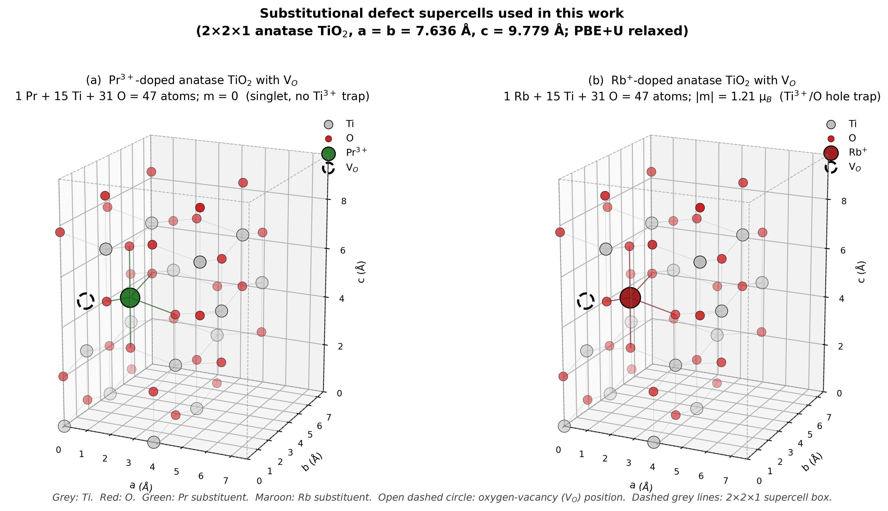
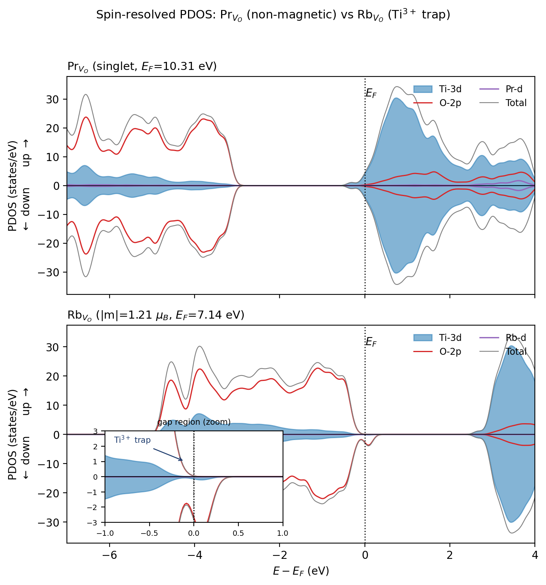

# Oxygen-Vacancy Energetics and Hole Localization in Pr- and Rb-Substituted Anatase TiO~2~: A DFT+U Comparison

Mohammad Ghadimimehr^1,2^, Azimah Binti Omar^2,3,\*^, Siti Rohani Binti Sheikh Raihan^2^

*^1^ Institute for Advanced Studies, Universiti Malaya, 50603 Kuala Lumpur, Malaysia*

*^2^ UM Power Energy Dedicated Advanced Centre (UMPEDAC), Universiti Malaya, 59990 Kuala Lumpur, Malaysia*

*^3^ Department of Electrical Engineering, Faculty of Engineering, Universiti Malaya, 50603 Kuala Lumpur, Malaysia*

\* *Corresponding author: azimahomar@um.edu.my*

> **Revision note (v4, 2 October 2026; delete before submission).** This version implements the thirteen corrections of the Error Audit (E1–E13) and responds to the eighteen findings of the Reviewer/Editor Audit (R01–R18). All numerical values are unchanged from the FINAL draft and were re-derived from the Rydberg totals in the Supporting Information. Passages marked **[AUTHOR ACTION]** require information or calculations that only the authors can supply; they are listed again in the accompanying revision report.

**Abstract**

Oxygen vacancies (V~O~) in wide-gap oxide electron-transport layers are a recognised source of trap-assisted recombination, and aliovalent substitution is the usual lever for controlling them. Trivalent rare-earth and monovalent alkali dopants are expected to act in opposite directions on V~O~ formation, but the two families have rarely been compared in the same host with the same protocol. Here we compare Pr^3+^ and Rb^+^ substitution on the Ti site of anatase TiO~2~ using spin-polarised PBE+U calculations (U = 3.5 eV on Ti-3d, 2×2×1 supercell, 48/47 atoms) with a common oxygen reference, μ~O~ = ½E(O~2~). The neutral V~O~ formation energy falls from +4.74 eV in pristine anatase to +1.29 eV in the Pr-substituted cell and to −4.06 eV in the Rb-substituted cell. Both substitutions therefore lower the cost of oxygen removal relative to pristine TiO~2~; the Pr cell remains uphill while the Rb cell is downhill, a 5.36 eV contrast that changes by only 0.04 eV on a 2×2×2 k-mesh. The formal electron count explains the ordering: Pr^3+^ introduces one hole per substitution and Rb^+^ three, so a single vacancy over-compensates Pr but leaves one residual hole in the Rb cell. The Rb cells carry unpaired spin in every treatment tested (absolute magnetisation 1.00–1.21 μ~B~), and a charged-cell series for Rb~Ti~+V~O~ reaches 2.99 μ~B~ at q = +2, consistent with three oxygen-2p holes per Rb. The Pr cells converge to non-magnetic solutions when U is applied to Ti-3d only, but the vacancy-free Pr cell develops a localised hole (1.00 μ~B~) when an oxygen-2p Hubbard term (U = 5.5 eV) is added, so hole localisation in Pr-substituted anatase is method dependent. Bader-charge differences, an HSE06 check on the pristine cell, dispersion-corrected single points and three alternative vacancy sites are reported as bounded sensitivity tests. The results are consistent with charge-compensation control of V~O~ energetics in this host and provide a benchmark for dopant screening in oxide electron-transport layers, while the two-dopant design does not by itself separate oxidation state from ionic size and bonding.

**Keywords:** DFT+U; anatase TiO~2~; oxygen vacancies; aliovalent substitution; praseodymium; rubidium; hole polaron; electron-transport layers.

**1. Introduction**

Indoor photovoltaics are the leading candidate to replace disposable batteries in the growing population of low-power sensors {{Pecunia2021}}. Under the 200–1000 lx illumination typical of indoor spaces the open-circuit voltage is limited by non-radiative recombination, and wide-gap absorbers such as CsPbBr~3~ {{Duan2018}} are paired with n-type oxide electron-transport layers (ETLs), most commonly TiO~2~ or SnO~2~ {{Kavan2020}}. The same oxides serve as electron-transport layers in organic light-emitting diodes {{Nagar2020}}. In TiO~2~ the oxygen vacancy (V~O~) is the dominant native defect: microscopy, photoemission, transient spectroscopy and first-principles work agree that its two excess electrons can either delocalise into the conduction band or localise as Ti^3+^ centres, and that the localised configuration acts as a trap {{Xie2020,Kreft2020,Yin2020,Li2020,Knez2020,Bigi2020,Bai2020,Yang2020,Yin2018}}. Controlling the equilibrium V~O~ population of an ETL is therefore a materials-design problem, and substitutional aliovalent doping is the principal lever {{Tian2025,Han2020,Raghav2020,Arrigoni2020,Morgan2007}}.

For trivalent dopants on the Ti^4+^ site the formal charge mismatch is −1 e per site. Several DFT+U and experimental studies of lanthanide-doped TiO~2~ and related oxides report that this deficit is accommodated electronically, by rehybridisation at the valence-band edge or by a change of dopant oxidation state, without a strong driving force for V~O~ formation {{Han2020,Polliotto2020,Mazierski2020,Ahmad2020,Chen2012,Chen2014,Albuquerque2014}}. The picture is not universal: Iwaszuk and Nolan showed for trivalent dopants in bulk rutile that oxygen-vacancy compensation can compete with, and in some cases dominate, electronic compensation {{Iwaszuk2011}}, and Bahmanrokh et al. derived a general defect-equilibria formalism for Ce-doped anatase in which both channels appear {{Bahmanrokh2020}}. Pr in particular has been treated at the anatase (101) surface {{Vural2023}} and in the bulk {{Chen2014}}, and is an attractive test case because its +3 state is well defined and its ionic radius (0.99 Å in six-fold coordination {{Shannon1976}}) is far from that of Ti^4+^ (0.605 Å). For monovalent alkali dopants the mismatch is −3 e per site, and the available evidence points consistently to V~O~ formation as the compensation channel: Carey and Nolan found that Li, Na, K and Rb substitution in α-Cr~2~O~3~ strongly reduces the V~O~ formation energy, with the larger alkalis having the larger effect {{Carey2017}}; hybrid-functional work on alkali-doped α-Bi~2~O~3~ reached a similar conclusion {{Li2020Bi}}; and Tian et al. recently showed experimentally that Rb doping, in synergy with lattice strain, lowers the V~O~ formation energy of TiO~2~ {{Tian2025}}.

What is missing is a comparison of the two dopant families in the same anatase host with the same supercell, pseudopotentials, Hubbard treatment and oxygen reference. Without such a comparison, differences between published trivalent and monovalent results cannot be separated from differences in host, protocol or reference state. The comparison is also a useful test of the Kröger–Vink bookkeeping that is routinely invoked for dopant selection {{Kroger1956}}: a Pr^3+^ substitution should leave one hole and a Rb^+^ substitution three, so a single neutral V~O~ (two electrons) should over-compensate Pr and under-compensate Rb.

This work provides that bounded comparison. Using one PBE+U protocol we compute the neutral V~O~ formation energy in pristine, Pr-substituted and Rb-substituted 2×2×1 anatase supercells, characterise the spin state and electron count of each cell, test the sensitivity of the localisation picture to an oxygen-site Hubbard term, and report charged-cell spin trends, Bader-charge differences, a hybrid-functional check on the pristine cell, dispersion-corrected single points, a k-mesh verification and alternative vacancy sites. We state explicitly which conclusions the two-dopant design supports: it establishes the ordering and magnitude of the V~O~ energetics within this protocol and shows that they follow the formal charge count, but it does not isolate oxidation state from ionic radius or dopant-specific bonding, and it does not establish device-level recombination behaviour. Section 2 describes the protocol, Section 3 reports structure, energetics, electronic structure and sensitivity tests, Section 4 discusses the results against prior work, Section 5 states the limitations and Section 6 concludes.

**2. Computational Methods**

**2.1 Code, functional and pseudopotentials.** All calculations were performed with Quantum ESPRESSO v7.5 {{Giannozzi2017,Giannozzi2020}} using the PBE exchange–correlation functional {{PBE1996}} and projector-augmented-wave datasets from PSlibrary 1.0.0 {{PSlibrary}}: Ti.pbe-spn-kjpaw_psl.1.0.0, O.pbe-n-kjpaw_psl.1.0.0, Pr.pbe-spdn-kjpaw_psl.1.0.0 and Rb.pbe-spn-kjpaw_psl.1.0.0. The valence configurations and electron counts of these datasets are listed in Table 1 because they fix the electron count of every supercell. The Pr dataset belongs to the PSlibrary "spdn" lanthanide family, which is generated for the trivalent ion with the 4f electrons frozen in the core; its 11 valence electrons are 5s^2^5p^6^5d^1^6s^2^. The Pr-4f states are therefore not variational in the present calculations, and no conclusion about 4f occupation or 4f hybridisation can be drawn from them (Section 5). The Bader electron totals of the Pr~Ti~+V~O~ and Rb~Ti~+V~O~ cells (376.998 and 374.998 e, Table S3) reproduce the counts in Table 1 and confirm the valence assignment. **[AUTHOR ACTION: insert the SHA-256 hashes of the four UPF files used, and copy the "Valence configuration" block of each UPF header into Table S7.]** Kinetic-energy cut-offs of 40 Ry (wavefunctions) and 320 Ry (charge density) were used throughout; 40 Ry is the convergence target of the PSlibrary 1.0.0 low-cut-off set, and a test at a higher cut-off has not been performed in this work (Section 5).

***Table 1. Pseudopotential valence configurations and resulting supercell electron counts.*** *N~e~ is the number of valence electrons per cell; all counts are for neutral cells. "Formal carriers" is the Kröger–Vink bookkeeping for Pr^3+^, Rb^+^, Ti^4+^ and O^2−^ with two electrons per neutral V~O~; it does not state where the carriers localise.*

| Species / cell | Valence configuration (PSlibrary 1.0.0) | Z~val~ | Composition | N~e~ | Formal carriers |
|---|---|---|---|---|---|
| Ti (spn) | 3s^2^3p^6^3d^2^4s^2^ | 12 | – | – | – |
| O (n) | 2s^2^2p^4^ | 6 | – | – | – |
| Pr (spdn, 4f in core) | 5s^2^5p^6^5d^1^6s^2^ | 11 | – | – | – |
| Rb (spn) | 4s^2^4p^6^5s^1^ | 9 | – | – | – |
| Pristine_perfect | – | – | Ti~16~O~32~ | 384 | none |
| Pristine_VO | – | – | Ti~16~O~31~ | 378 | 2 excess electrons |
| Pr_perfect | – | – | PrTi~15~O~32~ | 383 | 1 hole |
| Pr_VO | – | – | PrTi~15~O~31~ | 377 | 1 net excess electron |
| Rb_perfect | – | – | RbTi~15~O~32~ | 381 | 3 holes |
| Rb_VO | – | – | RbTi~15~O~31~ | 375 | 1 residual hole |

**2.2 Hubbard correction.** A Hubbard term in the rotationally invariant Dudarev form {{Dudarev1998}}, which is the form implemented behind the HUBBARD card of Quantum ESPRESSO 7.x, was applied to the Ti-3d manifold with U~eff~ = 3.5 eV using ortho-atomic projectors. The value is close to the ab initio linear-response estimate for anatase quoted by Deák et al. {{Deak2014}} and has been used for Er-doped anatase {{Mazierski2020}} and for anatase (101) defect chemistry {{Yin2020}}; other anatase work uses U = 4.2 eV {{Raghav2020,Arrigoni2020,Morgan2007}}, and the sensitivity of the present results to U is reported in Section 3.7. The DFT+U approach rests on the formulation of Anisimov et al. {{Anisimov1991}}; linear-response determination of U {{Cococcioni2005}} was not performed for the dopant-containing cells. For the oxygen-site tests of Section 3.4 an additional U~eff~ = 5.5 eV was placed on the O-2p manifold. This value is transferred from the Cr~2~O~3~ study of Carey and Nolan {{Carey2017}}, where it was used together with a Cr-3d term to localise oxygen holes; it has not been derived for anatase and is treated here as a sensitivity parameter rather than a calibrated value.

**2.3 Supercells.** A 2×2×1 anatase supercell with a = b = 7.63632 Å and c = 9.77900 Å (volume 570.25 Å^3^) was used, containing 48 atoms (Ti~16~O~32~) in the perfect cell and 47 after removal of one oxygen atom. Dopants were introduced by replacing one Ti atom with Pr or Rb, i.e. 6.25 % of cation sites; one V~O~ per cell corresponds to 3.1 % of oxygen sites or 1.75×10^21^ cm^−3^. These concentrations are far above the dilute limit relevant to ETLs, and all absolute quantities below should be read as those of a concentrated periodic defect array. Lattice parameters were taken from a converged variable-cell relaxation of the pristine cell and held fixed for all defect cells. The production V~O~ in the doped cells is the oxygen atom nearest to the dopant (Pr–O ≈ 2.17 Å in the relaxed Pr cell); three alternative sites are examined in Section 3.7. **[AUTHOR ACTION: give the atom index of the production V~O~ in the Rb cell, its Rb–O distance, and the relaxed dopant–O bond lengths for the first coordination shell of Pr and Rb (six values each), e.g. as Table S8.]**

**2.4 Brillouin-zone sampling and electronic settings.** Production relaxations used Γ-point sampling, following the practice of Arrigoni and Madsen for anatase defect cells of comparable size {{Arrigoni2020}}. Single-point total energies on the Γ-relaxed geometries were recomputed on a 2×2×2 Monkhorst–Pack mesh for all four doped cells, and the projected densities of states were obtained from non-self-consistent calculations on a 2×2×2 mesh; the k-mesh dependence of the formation-energy contrast is reported in Section 3.7. All calculations were spin-polarised (nspin = 2). Fractional occupations were treated with Gaussian smearing. **[AUTHOR ACTION: state the smearing width (degauss) used in the production relaxations; the Supporting Information records 0.005 Ry for the first pristine-V~O~ attempt and 0.01 Ry for the converged one.]** The electronic self-consistency threshold was 1×10^−8^ Ry.

**2.5 Magnetisation conventions and spin initialisation.** Two quantities are reported throughout: the total (net) magnetisation m = ∫[ρ~↑~(r) − ρ~↓~(r)] dr, which can be of either sign, and the absolute magnetisation m~abs~ = ∫|ρ~↑~(r) − ρ~↓~(r)| dr. For a single well-localised unpaired electron both are close to 1 μ~B~; m~abs~ > |m| indicates spin density of both signs. Production relaxations were started from zero magnetisation on all species. Because a zero start can trap a calculation in a non-magnetic solution, every cell that converged to m = 0 was re-relaxed from a magnetic start with starting_magnetization = 0.3 on Ti and 0.5 on the dopant (these are fractions of the valence charge in the Quantum ESPRESSO convention, not site moments in μ~B~) under a separate prefix, and the two total energies were compared. One magnetic trial per cell was performed; a wider search over site-specific and antiparallel seeds was not, and the non-magnetic solutions are therefore described below as the lowest-energy solutions among those tested rather than as established ground states.

**2.6 Geometry optimisation.** Ionic positions were relaxed with BFGS until the largest force component fell below 0.005 Ry/Bohr (0.129 eV/Å). Charge mixing was damped (mixing_beta = 0.1) and the BFGS history shortened (bfgs_ndim = 3) to suppress oscillation about shallow minima. The final maximum forces were 0.0026, 0.0042, 0.0037 and 0.0040 Ry/Bohr (0.067, 0.108, 0.095 and 0.103 eV/Å) for Pr_perfect, Pr_VO, Rb_perfect and Rb_VO. The Pr_VO relaxation was stopped manually after the force fell below the threshold while the BFGS step oscillated; the energy change over the last iterations was below 1×10^−9^ Ry. This tolerance is looser than the 0.01–0.03 eV/Å commonly used for defect energetics, and its consequences are discussed in Section 5. Force trajectories are shown in Figure S3.

**2.7 Formation energies.** The neutral V~O~ formation energy of host X was evaluated as

E~f~(V~O~^0^; X) = E(X with V~O~, q = 0) − E(X perfect, q = 0) + μ~O~, with μ~O~ = ½E(O~2~) + Δμ~O~ and Δμ~O~ = 0,

where E(O~2~) is the total energy of an isolated O~2~ molecule in a 12 Å cubic box computed with the same settings; it converged to the triplet ground state (m = 2.00 μ~B~) and ½E(O~2~) = −41.51621 Ry (−564.857 eV). This is the oxygen-rich electronic-energy reference; no finite-temperature gas-phase correction or competing-phase analysis was applied, and the values are conditional oxygen-removal energies from the already substituted cells rather than equilibrium vacancy concentrations {{Freysoldt2014}}. Formation energies were evaluated from unrounded Rydberg totals and are reported to 0.01 eV; the full-precision ledger is Table S9. The comparative quantity ΔE~f~ = E~f~(V~O~; Pr) − E~f~(V~O~; Rb) is independent of the oxygen reference.

**2.8 Additional calculations.** (i) Charged cells: Pr_VO and Rb_VO were relaxed at q = +1 and +2 with a uniform compensating background; no image-charge or potential-alignment correction was applied, so these cells are used only for their spin state and not for transition levels. (ii) U sweep: single-point calculations on the relaxed Pristine_perfect, Pr_VO and Rb_VO cells at U(Ti-3d) = 3.0, 4.0 and 4.5 eV. (iii) HSE06: one single-point calculation on the relaxed Pristine_perfect cell with exact-exchange fraction 0.25 and screening parameter 0.106 bohr^−1^ {{HSE2003,Krukau2006}}, Γ-only, 40 Ry, without the Hubbard term. **[AUTHOR ACTION: confirm the exact screening_parameter value in the input (0.106 bohr^−1^ corresponds to 0.2 Å^−1^; the canonical HSE06 value is 0.11 bohr^−1^), the exx q-grid, and that the +U term was switched off.]** (iv) Dispersion: single-point energies for Pr_VO and Rb_VO with the Grimme D3 correction and Becke–Johnson damping {{Grimme2010,Grimme2011}}, without three-body terms, following the DFT+U+D3 protocol used for defective anatase by Torres et al. {{Torres2021}}. (v) Alternative vacancy sites: three additional Pr_VO cells with the vacancy at atom indices O1, O7 and O17 of the production input. (vi) Bader analysis of Pr_VO and Rb_VO from pp.x charge densities with the Henkelman grid algorithm {{Henkelman2006,Tang2009}}. **[AUTHOR ACTION: state the FFT grid used for the pp.x density, whether the PAW all-electron reconstruction was included, and the Bader code version (v1.05 is given in the SI).]** (vii) Projected densities of states from projwfc.x on 2×2×2 non-self-consistent runs. **[AUTHOR ACTION: state the Gaussian broadening used in projwfc.x and the number of bands.]**
**3. Results**

**3.1 Structural relaxation**

All four doped supercells relaxed to maximum forces below the 0.005 Ry/Bohr threshold (Section 2.6; trajectories in Figure S3). The pristine V~O~ cell, which required a modified mixing scheme to converge (Section S1), was stopped at 0.0056 Ry/Bohr, slightly above the threshold. The relaxed Pr_VO and Rb_VO cells are shown in Figure 1. The production vacancy is the oxygen nearest the dopant in both cells. **[AUTHOR ACTION: add one sentence on the relaxed first-shell dopant–O distances and the outward relaxation of the six O neighbours around Pr and Rb relative to Ti–O = 1.94/1.97 Å in the pristine cell, from Table S8.]** Because the residual forces (0.07–0.11 eV/Å) are larger than the 0.01–0.03 eV/Å typically used for defect energetics, bond lengths quoted here are indicative, and the sensitivity of the energetics to tighter relaxation has not been tested (Section 5).

*Figure 1. Relaxed 2×2×1 anatase supercells with one substitutional dopant and one oxygen vacancy (PBE+U, U(Ti-3d) = 3.5 eV, Γ-only). (a) Pr~Ti~ + V~O~ (PrTi~15~O~31~, 47 atoms), non-magnetic solution (m = 0). (b) Rb~Ti~ + V~O~ (RbTi~15~O~31~, 47 atoms), m = −0.97 μ~B~, m~abs~ = 1.21 μ~B~. Grey: Ti; red: O; green: Pr; maroon: Rb; dashed circle: vacancy position; dashed box: supercell. **[AUTHOR ACTION: regenerate the artwork from the relaxed coordinates with the panel subtitles changed to the text above; remove "singlet, no Ti^3+^ trap" and "Ti^3+^/O hole trap"; add the vacancy atom index and dopant–V~O~ distance to each panel.]***

**3.2 Oxygen-vacancy formation energies**

Table 2 lists the neutral V~O~ formation energies at the oxygen-rich reference μ~O~ = ½E(O~2~), and Figure 2 displays them. In pristine anatase E~f~ = +4.74 eV. In the Pr-substituted cell E~f~ = +1.29 eV, and in the Rb-substituted cell E~f~ = −4.06 eV. Both substitutions lower the cost of removing the oxygen atom nearest the dopant relative to pristine TiO~2~, by 3.45 eV for Pr and 8.80 eV for Rb. The Pr cell remains uphill at this reference, so oxygen removal is not spontaneous; the Rb cell is downhill, so the vacancy-free Rb-substituted cell is unstable against oxygen loss at this reference. The Pr–Rb contrast ΔE~f~ is 5.36 eV (5.356 eV from the unrounded totals; the value 5.35 eV obtained by subtracting the rounded entries is a rounding artefact).

***Table 2. Neutral oxygen-vacancy formation energies at μ~O~ = ½E(O~2~) (PBE+U, U(Ti-3d) = 3.5 eV, 40 Ry).*** *Total energies are the converged Γ-only values in Ry; E~f~ is computed from the unrounded totals (full ledger in Table S9). The last column gives the single-point result on the Γ-relaxed geometry with a 2×2×2 k-mesh. The combined k-mesh and rounding uncertainty on each E~f~ is about ±0.15 eV in absolute terms and ±0.05 eV on the Pr–Rb difference; cut-off and relaxation-tolerance contributions have not been quantified (Section 5).*

| Host X | E(X perfect) (Ry) | E(X + V~O~) (Ry) | ½E(O~2~) (Ry) | E~f~(V~O~^0^), Γ (eV) | E~f~(V~O~^0^), 2×2×2 (eV) |
|---|---|---|---|---|---|
| Pristine TiO~2~ | −4275.01530 | −4233.15036 | −41.51621 | +4.74 | – ^a^ |
| Pr~Ti~ | −4576.71224 | −4535.10106 | −41.51621 | +1.29 | +1.19 |
| Rb~Ti~ | −4330.38890 | −4289.17135 | −41.51621 | −4.06 | −4.20 |
| ΔE~f~ (Pr − Rb) | | | | +5.36 | +5.39 |

*^a^ The pristine 2×2×2 single points were not computed.* **[AUTHOR ACTION: compute E(Pristine_perfect) and E(Pristine_VO) at 2×2×2 on the Γ geometries, or state in the table that they were not computed.]**

*Figure 2. Neutral oxygen-vacancy formation energies at the oxygen-rich reference μ~O~ = ½E(O~2~) for pristine, Pr-substituted and Rb-substituted anatase (PBE+U, U(Ti-3d) = 3.5 eV). Bars: Γ-only relaxed cells (this work; Table 2). Dashed ticks: single-point values at 2×2×2 on the Γ geometries. Both substitutions lower the formation energy relative to pristine; the Pr cell stays positive and the Rb cell becomes negative.*

The pristine value lies within the range reported for the neutral bulk vacancy in anatase by other DFT+U and hybrid studies (4.0–5.0 eV at U = 4.2 eV {{Arrigoni2020}}; 5.3–5.5 eV with HSE06 {{Boonchun2016,Deak2014}}), which supports the protocol at the level of absolute formation energies. **[AUTHOR ACTION: verify the Arrigoni–Madsen and Boonchun values and conditions against the full texts; the audit could not confirm them.]** On the 2×2×2 mesh the individual formation energies shift by −0.10 eV (Pr) and −0.14 eV (Rb) while the contrast moves from 5.36 to 5.39 eV, i.e. by +0.04 eV (defined as the 2×2×2 contrast minus the Γ-only contrast). The comparative conclusion is therefore insensitive to Brillouin-zone sampling at the 0.05 eV level, although the absolute values carry a 0.1–0.15 eV mesh dependence. The sign and direction of the Rb result agree with the experimental finding of Tian et al. that Rb doping lowers the V~O~ formation energy of TiO~2~ {{Tian2025}}; that work supports the mechanism and the sign, not the specific supercell value.

**3.3 Spin states and electron counts**

Table 3 collects the total and absolute magnetisation and the Fermi energy printed by the code for each production cell, and Figure 3 plots the magnetisations. Table 1 shows that every doped cell has an odd number of electrons. A collinear calculation of an odd-electron cell can converge to m = 0 only through fractional occupations, so the non-magnetic solutions found for Pr_perfect and Pr_VO are smeared solutions in which the formal hole (Pr_perfect) or the formal net excess electron (Pr_VO) is spread over band-edge states with equal spin-up and spin-down weight. They are not closed-shell singlets. The one magnetic trial performed for Pr_VO (Section 2.5) converged to m = 1.00 μ~B~, m~abs~ = 1.13 μ~B~, 0.281 eV above the non-magnetic solution; the non-magnetic solution is therefore the lower of the two solutions tested, and a broader search over spin seeds and local distortions would be needed to establish it as the ground state. The isolated O~2~ reference converged to its triplet (m = 2.00 μ~B~), which is the expected check of the spin-polarised pipeline.

The Rb cells behave differently. Rb_perfect converged to m = 1.00 μ~B~ (m~abs~ = 1.00 μ~B~) from a zero-magnetisation start, and Rb_VO to m = −0.97 μ~B~ with m~abs~ = 1.21 μ~B~. With three formal holes in Rb_perfect and one residual hole in Rb_VO (Table 1), the Ti-3d-only Hubbard treatment thus localises one unpaired spin in each Rb cell; the remaining two holes of Rb_perfect are spin-compensated in this treatment, a point that the oxygen-site Hubbard test of Section 3.4 resolves. The excess of m~abs~ over |m| in Rb_VO (0.24 μ~B~) indicates minority spin density of the opposite sign, consistent with a partly delocalised hole rather than a single-site moment.

***Table 3. Converged magnetisation and Fermi energy of the production cells (single-U(Ti-3d) = 3.5 eV, Γ-only).*** *m is the total magnetisation and m~abs~ the absolute magnetisation (Section 2.5). E~F~ is the Fermi energy printed by pw.x for each cell; the values are not aligned to a common reference and differences between chemically different cells are diagnostic only (Section 3.6).*

| Cell | N~e~ | m (μ~B~) | m~abs~ (μ~B~) | E~F~ (eV, unaligned) | Lowest solution among those tested |
|---|---|---|---|---|---|
| Pristine_perfect | 384 | 0.00 | 0.00 | 7.89 | non-magnetic |
| Pr_perfect | 383 | 0.00 | 0.00 | – ^b^ | non-magnetic (smeared) |
| Pr_VO | 377 | 0.00 | 0.00 | 9.99 | non-magnetic (smeared); magnetic trial +0.281 eV |
| Rb_perfect | 381 | 1.00 | 1.00 | – ^b^ | one unpaired spin |
| Rb_VO | 375 | −0.97 | 1.21 | 7.13 | one unpaired spin |
| O~2~ (12 Å box) | 12 | 2.00 | 2.00 | – | triplet |

*^b^* **[AUTHOR ACTION: insert E~F~ of Pr_perfect and Rb_perfect from the production output files.]**

*Figure 3. Total (|m|) and absolute (m~abs~) magnetisation of the production cells and of the O~2~ reference (single-U(Ti-3d) PBE+U relaxations). The Pr cells and the pristine cell converge to non-magnetic solutions; both Rb cells carry one unpaired spin, and Rb_VO shows m~abs~ > |m|.*

**3.4 Oxygen-site Hubbard correction: localisation of the dopant-induced holes**

Because a Ti-3d-only Hubbard term provides no localising potential for holes on the oxygen sublattice, the vacancy-free cells were re-relaxed with an additional U = 5.5 eV on O-2p (Section 2.2). The results are collected in Table 4. The pristine control remains non-magnetic (m~abs~ = 0.00 μ~B~), so the oxygen term does not by itself induce magnetism. Rb_perfect changes from m~abs~ = 1.00 to 3.00 μ~B~, i.e. the three formal holes of Table 1 become three localised, parallel oxygen-2p spins once the oxygen term is present; Rb_VO gives 1.00 μ~B~, the single residual hole after two have been filled by the vacancy electrons. Pr_perfect changes from the non-magnetic smeared solution to m~abs~ = 1.00 μ~B~, with a maximum residual force of 0.0049 Ry/Bohr; the one formal hole of the Pr substitution thus localises on oxygen when the oxygen term is present, and its Fermi energy (6.69 eV) lies 0.53 eV below that of the dual-U pristine cell (7.22 eV), as expected for a localised acceptor state. The electron count of each dual-U cell is reproduced by the spin count: one hole per Pr^3+^, three per Rb^+^, in line with the Kröger–Vink bookkeeping.

***Table 4. Effect of an oxygen-site Hubbard term (U(O-2p) = 5.5 eV added to U(Ti-3d) = 3.5 eV) on the absolute magnetisation of the vacancy-free and vacancy-containing cells.***

| Cell | m~abs~, Ti-3d-only U (μ~B~) | m~abs~, Ti-3d + O-2p U (μ~B~) | Formal holes (Table 1) |
|---|---|---|---|
| Pristine_perfect | 0.00 | 0.00 | 0 |
| Pr_perfect | 0.00 | 1.00 | 1 |
| Pr_VO | 0.00 | not computed | −1 (net electron) |
| Rb_perfect | 1.00 | 3.00 | 3 |
| Rb_VO | 1.21 | 1.00 | 1 |

Two consequences follow. First, the spin count of the Rb cells is now consistent across the two Hubbard treatments and with the charged-cell series of Section 3.5. Second, the description of the Pr-substituted parent is method dependent: the hole is delocalised in the Ti-3d-only treatment and localised on oxygen in the dual-U treatment. The dual-U Pr_VO cell and the dual-U formation-energy cycles were not computed, so we do not know whether the formation energies of Table 2 change under the oxygen term; the statement that formation energies are less sensitive than localisation descriptors is an expectation, not a result of this work. **[AUTHOR ACTION: relax Pr_VO, Rb_VO (already available), Pr_perfect and Rb_perfect under the dual-U scheme and report E~f~(V~O~) for both dopants with U(O-2p); this is the single most valuable addition before submission.]**

**3.5 Charged-cell spin series**

Relaxations of Pr_VO and Rb_VO at q = +1 and +2 (uniform background, no finite-size correction) converged in 216, 549, 293 and 360 ionic steps respectively; the raw total energies are listed in Table S9. Because the periodic-image electrostatics of a charged 2×2×1 cell are uncorrected, these energies are not used to derive ionisation energies or transition levels. The spin state is used as a diagnostic. For Pr_VO the absolute magnetisation remains 0.00 μ~B~ at q = 0, +1 and +2: removing one and then two electrons from the smeared non-magnetic solution leaves it non-magnetic. For Rb_VO the absolute magnetisation rises from 1.21 μ~B~ (q = 0) to 1.99 μ~B~ (q = +1) and 2.99 μ~B~ (q = +2). Each electron removed from the Rb cell therefore uncovers one further unpaired oxygen hole, and the q = +2 endpoint corresponds to the three holes per Rb^+^ substitution found independently in the dual-U calculation of Section 3.4. **[AUTHOR ACTION: report m and m~abs~ separately for each charge state; the values quoted in the FINAL draft appear to be m~abs~.]** The two probes are not fully independent, since both are PBE+U calculations on the same geometry family, but they rely on different mechanisms (an added localising potential versus electron removal) and agree.

**3.6 Electronic-structure diagnostics**

*Fermi energies.* The Fermi energies printed for the production cells (Table 3) are 7.89 eV (pristine), 9.99 eV (Pr_VO) and 7.13 eV (Rb_VO). They are referenced to each cell's own average electrostatic potential and are not aligned to a common vacuum or core level, so the differences (+2.10 eV for Pr_VO and −0.76 eV for Rb_VO relative to pristine; 2.86 eV between the two doped vacancy cells) should be read as qualitative indicators and not as band offsets or carrier-density shifts. With that caveat, the large upward shift in Pr_VO is consistent with the net excess electron of Table 1 occupying conduction-band states in a cell containing one carrier per 570 Å^3^ (1.75×10^21^ cm^−3^), and the small downward shift in Rb_VO is consistent with a partly filled oxygen-derived state near the valence-band edge. At realistic ETL carrier densities (10^17^–10^19^ cm^−3^) a conduction-band filling of this kind would amount to tens of meV at most. **[AUTHOR ACTION: if the Fermi-energy comparison is retained, align the cells by the average O-1s or Ti-2p core level, or by the macroscopic average potential far from the defect, and report the valence-band maximum and conduction-band minimum of each cell.]**

*Projected densities of states.* Figure 4 shows the spin-resolved projected densities of states of Pr_VO and Rb_VO from 2×2×2 non-self-consistent calculations on the relaxed cells. In Pr_VO the occupied states near E~F~ are conduction-band states of Ti-3d character, the O-2p valence band lies about 3 eV lower, no feature appears inside the gap at the broadening used, and the Pr-5d projection is small at both band edges; the Pr-4f states are frozen in the core and cannot appear (Section 2.1). In Rb_VO the Fermi level lies at the top of the valence band and a spin-split feature with both O-2p and Ti-3d weight is present within about 0.3 eV of E~F~ (inset); it is occupied in one spin channel and empty in the other, which accounts for the unpaired spin of Table 3. The projection does not by itself fix the orbital character of the hole; the Bader differences of Section 3.7 and the dual-U result of Section 3.4 indicate that it is predominantly O-2p. The Fermi energy of Pr_VO in Figure 4 (10.31 eV, 2×2×2 non-self-consistent) differs from the Γ-only self-consistent value (9.99 eV) because of the k-mesh dependence of the conduction-band filling; the pristine and Rb_VO Fermi energies are mesh-stable.

*Figure 4. Spin-resolved projected densities of states of Pr_VO (top) and Rb_VO (bottom) from non-self-consistent 2×2×2 calculations on the relaxed cells (PBE+U, U(Ti-3d) = 3.5 eV). Spin-up plotted upward, spin-down downward. Filled blue: Ti-3d; red: O-2p; purple: dopant 5d (Pr) or 4d (Rb); grey: total. Energies are relative to each cell's Fermi level. Inset: gap region of Rb_VO showing the spin-split occupied state with mixed O-2p/Ti-3d weight. **[AUTHOR ACTION: regenerate from the projwfc.x output with the figure title changed to the caption text, the "Ti^3+^ trap" labels removed from the title and inset, the broadening and band count stated, and the source run identifiers recorded in the figure script.]***

*Hybrid-functional check on the pristine cell.* A single-point HSE06 calculation on the relaxed Pristine_perfect cell (Section 2.8) gave a non-magnetic solution (m~abs~ = 0.00 μ~B~), a total energy of −3926.66858 Ry and a Fermi energy of 8.286 eV, 0.40 eV above the PBE+U value. The shift of the printed Fermi energy is not a band-gap measurement. The check establishes only that the non-magnetic pristine state survives the change of functional; no hybrid calculation was performed on the doped or defective cells, so the dopant contrast of Table 2 and the localisation results of Sections 3.3–3.5 have not been verified at the hybrid level. **[AUTHOR ACTION: if the HSE06 result is retained, report the PBE+U and HSE06 band gaps of the pristine cell from the eigenvalues.]**

**3.7 Sensitivity tests**

*Hubbard U.* Single-point calculations at U(Ti-3d) = 3.0, 4.0 and 4.5 eV on the relaxed Pristine_perfect, Pr_VO and Rb_VO cells (Table S1) leave the magnetisations unchanged in kind: Pr_VO non-magnetic at every U; Rb_VO with one unpaired spin at every U (m~abs~ = 1.00 μ~B~ at the three test values and 1.21 μ~B~ at the production value, the latter from the relaxed rather than single-point calculation). The printed Fermi energies vary by at most 0.26 eV across the 1.5 eV range. The qualitative Pr/Rb distinction is therefore not tied to the particular U used.

*k-mesh.* For Pristine_perfect, Pr_VO and Rb_VO the total energy was computed at Γ, 2×2×1, 2×2×2 and 3×3×2 meshes at U = 3.5 eV. Relative to 3×3×2 the Γ-only energies are high by 1.05, 1.08 and 1.16 eV per cell (22, 23 and 25 meV per atom), whereas the 2×2×1 energies are within 1.15, 1.05 and 0.42 meV per atom of 3×3×2. The Γ-only production energies are therefore not converged in absolute terms, and the formation energies of Table 2 rely on cancellation between the perfect and defective cell of the same host rather than on convergence of each total energy; the 2×2×2 column of Table 2 quantifies the residual: −0.10 eV (Pr), −0.14 eV (Rb) and +0.04 eV on their difference. The magnetisations are mesh-independent. **[AUTHOR ACTION: Table S2 currently lists only the Γ and 2×2×2 energies of the four doped cells; add the 2×2×1, 2×2×2 and 3×3×2 energies of Pristine_perfect, Pr_VO and Rb_VO quoted in this paragraph, with run identifiers.]**

*Dispersion.* D3(BJ) single points on the relaxed Pr_VO and Rb_VO cells gave dispersion contributions of −10.29 and −10.09 eV (Table S5; the differences between the D3 and production total energies are −10.25 and −10.08 eV, the small discrepancy reflecting the separate self-consistent cycles). The dispersion energies of the perfect substituted cells and of the O~2~ reference were not computed, so the dispersion correction to E~f~(V~O~) and to ΔE~f~ cannot be reconstructed from these results: the correction to the contrast requires [D3(Pr_VO) − D3(Pr_perfect)] − [D3(Rb_VO) − D3(Rb_perfect)], of which only the two defective-cell terms are available. The effect of dispersion on the vacancy energetics is therefore undetermined. The D3 single points leave the magnetisations (0.00 and 1.00 μ~B~) and Fermi energies (within 0.02 eV) of the production cells unchanged, which is expected for a geometry-dependent energy correction at fixed geometry. **[AUTHOR ACTION: run D3 single points on Pr_perfect and Rb_perfect (about 6 h each on the stated hardware) to complete the cycle, or delete this paragraph.]**

*Alternative vacancy sites in the Pr cell.* Three further Pr_VO cells were relaxed with the vacancy at the oxygen indices O1, O7 and O17 of the production input (Table S4). Sites O1 and O17 are symmetry-equivalent second-shell positions (Pr–O = 3.99 Å) and give E~f~ = +2.07 eV each, agreeing to 0.1 meV; the more distant site O7 (4.94 Å) gives +2.72 eV. The production site, the oxygen nearest to Pr (2.17 Å), is thus the lowest of the four sampled sites by 0.78 eV. This is a comparison among selected configurations in a 2×2×1 cell, where "distant" sites are still within one lattice parameter of the periodic images of the dopant; it indicates a preference for V~O~ adjacent to Pr but is not a global search, and no corresponding sampling was performed for the Rb cell. **[AUTHOR ACTION: list the coordinates and minimum-image Pr–V~O~ distances of all four sites in Table S4, and if possible add two Rb_VO sites (nearest and a second-shell oxygen).]**

*Bader charges.* Bader analysis of the relaxed Pr_VO and Rb_VO cells (Table S3) gives dopant charges of +2.14 e (Pr) and +0.82 e (Rb) relative to the PAW valence, consistent with the +3 and +1 formal states after the usual reduction of Bader charges relative to formal values. Relative to the Pr_VO cell, the 31 oxygen atoms of Rb_VO hold 0.97 e less in total, with the depletion concentrated on one oxygen in the second coordination shell of Rb (−0.26 e, O8) and a second oxygen (−0.14 e, O30), five further oxygens contributing −0.05 to −0.09 e each; the 15 Ti atoms show a uniform mean depletion of −0.012 e (−0.18 e in total) and no Ti differs by more than 0.05 e. No Ti site shows the depletion of order 1 e that a localised Ti^3+^ centre in Pr_VO would produce. The comparison is between cells of different composition, so the differences contain chemical polarisation by the dopant as well as carrier redistribution, and Bader charges are not orbital occupations; the result is therefore supporting evidence that the unpaired spin of Rb_VO resides mainly on oxygen, not a quantitative hole count. A same-composition comparison (Rb_VO at q = 0 versus q = +1, or the spin density itself) would be more direct. **[AUTHOR ACTION: add the spin-density isosurface of Rb_VO, which the pp.x output already allows, as Figure S4; it is the most direct evidence of where the hole sits.]**
**4. Discussion**

**4.1 The energetic ordering follows the formal electron count.** The three formation energies of Table 2 fall in the order pristine (+4.74 eV) > Pr (+1.29 eV) > Rb (−4.06 eV), which is the order of the formal hole count of the vacancy-free cells (0, 1, 3; Table 1). A neutral vacancy releases two electrons. In the pristine cell both must occupy conduction-band-derived states, and the full cost of oxygen removal is paid. In the Pr cell one of the two can instead fill the single acceptor-like hole introduced by Pr^3+^, and in the Rb cell both can fill two of the three holes introduced by Rb^+^. Transferring an electron from a conduction-band-like state to an oxygen-2p-derived hole near the valence-band edge recovers an energy of the order of the band gap, so reductions of several eV per transferred electron are expected and are what is found (3.45 eV for one electron in the Pr cell, 8.80 eV for two in the Rb cell). The per-electron gains are not equal, because the two dopants also differ in the electrostatic and elastic environment they create around the vacancy site; the two-dopant design cannot decompose the formation-energy difference into these contributions.

**4.2 Relation to previous work.** The Rb result reproduces, in anatase, the behaviour that Carey and Nolan found for alkali dopants in α-Cr~2~O~3~, where the V~O~ formation energy is strongly reduced and oxygen holes are localised with an O-2p Hubbard term {{Carey2017}}, and it agrees in sign with the experimental vacancy-formation trend reported for Rb-doped TiO~2~ by Tian et al. {{Tian2025}}. Because only one alkali was studied here, the radius dependence found by Carey and Nolan across Li–Rb is not tested. The Pr result is consistent with the trivalent-dopant picture of Iwaszuk and Nolan for rutile {{Iwaszuk2011}}: the vacancy is not spontaneous at the oxygen-rich reference, but its cost is reduced by 3.45 eV relative to the pristine host, so V~O~ compensation becomes accessible as the oxygen chemical potential is lowered. With E~f~(V~O~; Pr) = 1.29 eV + Δμ~O~, oxygen removal next to Pr becomes exothermic once μ~O~ falls more than 1.29 eV below the O~2~ reference, which is well inside the oxygen-poor range accessible to TiO~2~ before reduction to lower oxides. The preference for the vacancy adjacent to Pr (Section 3.7) agrees with the Pr–V~O~ clustering reported at the anatase (101) surface by Vural et al. {{Vural2023}}, with the caveat that only four sites were sampled here. The localisation of the Pr-induced hole on oxygen when an oxygen-site U is present parallels the O-2p hole states reported for other trivalent dopants in TiO~2~ {{Iwaszuk2011,Albuquerque2014}}; the analogous observation for Cu-doped anatase, where the dopant provides an empty gap state that accepts vacancy electrons {{Wang2020}}, is a chemical analogy rather than evidence for the Pr case.

**4.3 What the two-dopant comparison does and does not isolate.** Pr^3+^ and Rb^+^ differ in formal charge (−1 versus −3 e relative to Ti^4+^), in ionic radius (0.99 versus 1.52 Å {{Shannon1976}}), in bonding (a 5d-bearing trivalent cation versus a closed-shell alkali) and in accessible oxidation states. Both are larger than Ti^4+^ (0.605 Å), so the comparison does show that a large size mismatch is compatible with either sign of E~f~(V~O~); it does not hold size constant, and no strain or fixed-geometry decomposition was computed. The statement that the 5.36 eV contrast is "larger than any plausible strain contribution", made in an earlier version of this work, is therefore withdrawn; what can be said is that the sign and magnitude of the contrast are those expected from the electron count and that no size-based argument predicts them. Isolating the two variables would require a controlled series within the same protocol, for example La^3+^, Y^3+^ and Sc^3+^ (same valence, radii from 1.03 to 0.745 Å) and K^+^ and Na^+^ (same valence as Rb^+^, smaller radii), together with fixed-geometry single points to separate electronic from relaxation contributions.

**4.4 The Pr-substituted parent is method dependent.** The vacancy-free Pr cell is non-magnetic with U on Ti-3d only and carries a localised oxygen hole with U on O-2p (Section 3.4). The dual-U result is the one consistent with the electron count and with the behaviour of the Rb cells, but it rests on a U(O-2p) value transferred from Cr~2~O~3~ and on calculations that have not been extended to the vacancy cell or to the formation-energy cycle. Until those are available, the Pr-substituted parent should be described as having one hole whose localisation depends on the treatment of oxygen correlation, and the earlier description of Pr-substituted anatase as "closed-shell" and "trap-free" is withdrawn. For the vacancy-containing Pr cell, both treatments agree that the net carrier is one excess electron in conduction-band-derived states (Table 1 and Figure 4), but this conclusion is drawn from a single smeared non-magnetic solution and one magnetic trial, and it concerns a cell with one carrier per 570 Å^3^.

**4.5 Implications for dopant screening in oxide electron-transport layers.** The results support, within this protocol and host, the use of the formal charge mismatch as the first screening variable for whether a substitutional dopant will promote or resist oxygen-vacancy formation: dopants with |Δq| = 1 leave the vacancy uphill at the oxygen-rich limit, dopants with |Δq| = 3 make it spontaneous. Three further statements are hypotheses that this work motivates but does not test. (i) Trivalent rare-earth dopants other than Pr (La, Nd, Sm) should behave like Pr in the V~O~ energetics, because they share the −1 e mismatch. (ii) Pentavalent donors (Nb^5+^, Ta^5+^) should raise rather than lower E~f~(V~O~), being the electronic mirror image of the alkali case. (iii) The oxygen-hole states generated by alkali substitution are candidates for recombination centres at an ETL/absorber interface. Testing (iii) requires interface models, charge-transition levels with finite-size corrections and carrier-capture calculations, none of which are reported here, so no ranking of dopants by device performance is made.

**5. Limitations**

(i) *Supercell and concentration.* One dopant and one vacancy per 2×2×1 cell correspond to 6.25 % cation and 3.1 % anion substitution. Defect–image interactions are not corrected; absolute formation energies at the dilute limit may differ by several tenths of an eV. (ii) *Brillouin-zone sampling.* Production relaxations are Γ-only. Total energies are 22–25 meV per atom above the 3×3×2 values; formation energies rely on cancellation within each host, and the 2×2×2 check bounds the residual at 0.10–0.14 eV on each E~f~ and 0.04 eV on ΔE~f~. (iii) *Plane-wave cut-off.* 40 Ry was not tested against a higher cut-off; comparable studies use 55 Ry for the same species {{Raghav2020}}. (iv) *Force tolerance.* 0.005 Ry/Bohr (0.129 eV/Å) is loose; the Pr_VO relaxation was stopped manually and the pristine V~O~ relaxation ended at 0.0056 Ry/Bohr. The effect of tighter relaxation on the energetics and on the localisation results has not been tested. (v) *Spin search.* One magnetic trial per non-magnetic cell was performed; occupations, smearing and symmetry settings were not varied. (vi) *Pr-4f treatment.* The Pr dataset freezes the 4f electrons in the core. Mechanisms involving 4f occupation, 4f hybridisation or a Pr^3+^/Pr^4+^ change of oxidation state cannot be examined with it, and none is claimed. (vii) *Oxygen-site U.* U(O-2p) = 5.5 eV is transferred, not derived for anatase; the dual-U treatment was applied to the vacancy-free cells and Rb_VO but not to Pr_VO or to the formation-energy cycles. (viii) *Charged cells.* No electrostatic or potential-alignment correction was applied; charged-cell energies are not interpreted. An ion-clamped dielectric constant of ε~∞~ ≈ 5.8 would give a first-order monopole correction of a few tenths of an eV for q = +1 at this cell size and four times that for q = +2; the static constant of anatase is much larger and would reduce the estimate, so these numbers are upper bounds and are not used. (ix) *Oxygen reference.* All formation energies are at μ~O~ = ½E(O~2~) (oxygen-rich limit) without finite-temperature corrections; equilibrium vacancy concentrations, dopant incorporation energies and competing phases were not evaluated, so no statement about the synthesisable phase of Rb-doped anatase is made. (x) *Defect channels.* Only the V~O~ channel was computed; cation vacancies, interstitials and dopant clustering were not. (xi) *Functional.* The HSE06 check concerns the pristine cell only; the doped and defective cells have not been verified with a hybrid functional. (xii) *Dispersion.* The D3 correction to the formation energies is undetermined because the parent-cell terms were not computed. (xiii) *Bader analysis.* The comparison is between cells of different composition and is supporting rather than quantitative evidence. (xiv) *Scope.* No surface, interface, transition-level, capture-coefficient or device calculation is reported; statements about electron-transport layers are hypotheses.

**6. Conclusions**

Using one PBE+U protocol in the same 2×2×1 anatase supercell, we find neutral oxygen-vacancy formation energies of +4.74 eV (pristine), +1.29 eV (Pr-substituted) and −4.06 eV (Rb-substituted) at the oxygen-rich reference. Both substitutions lower the cost of oxygen removal; Pr leaves it uphill and Rb makes it spontaneous, a 5.36 eV contrast that is stable to 0.04 eV against the k-mesh. The ordering follows the formal electron count: one hole per Pr^3+^ and three per Rb^+^, with a single vacancy over-compensating Pr and leaving one residual hole in the Rb cell. The Rb cells carry unpaired oxygen-centred spin in every treatment tested, and a charged-cell series reaches three unpaired spins per Rb^+^. The Pr cells converge to non-magnetic smeared solutions with U on Ti-3d only, but the vacancy-free Pr cell develops a localised oxygen hole when U is also placed on O-2p, so the localisation picture for Pr-substituted anatase is method dependent and the "closed-shell, trap-free" description used earlier is not supported. The two-dopant comparison is consistent with charge-compensation control of oxygen-vacancy energetics in this host and provides a common-protocol benchmark for the two dopant families, but it does not separate oxidation state from ionic size and bonding, and it does not establish interfacial recombination behaviour. Completing the dual-U formation-energy cycles, tightening the relaxations and adding a matched-valence dopant series are the natural next steps.

**Acknowledgements**

The authors thank UM Power Energy Dedicated Advanced Centre (UMPEDAC), Universiti Malaya, for computational resources. **[AUTHOR ACTION: add funding sources and grant numbers, if any.]**

**Declaration of generative AI use**

During the preparation of this work the authors used Claude (Anthropic) to improve readability and to check the internal consistency of numbers, cross-references and citations. After using this tool the authors reviewed and edited the content as needed and take full responsibility for the content of the publication. All calculations, analyses and conclusions are the authors' own.

**CRediT author contributions**

M.G.: conceptualisation, methodology, investigation, formal analysis, data curation, visualisation, writing – original draft. A.B.O.: supervision, methodology, validation, writing – review and editing. S.R.B.S.R.: resources, writing – review and editing.

**Data availability**

The Quantum ESPRESSO input files, converged output files, pseudopotential files, Bader output tables, PDOS data, the full-precision energy ledger (Table S9), the run manifest (Table S10) and the Python scripts that generate every figure are deposited at Zenodo under DOI **[AUTHOR ACTION: deposit the package before submission and insert the DOI; reviewers should be able to open it during review]**.

**Declaration of competing interest**

The authors declare no competing financial or personal interests.
