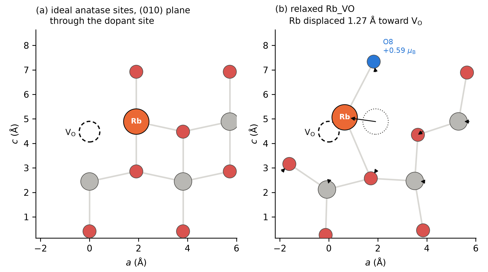
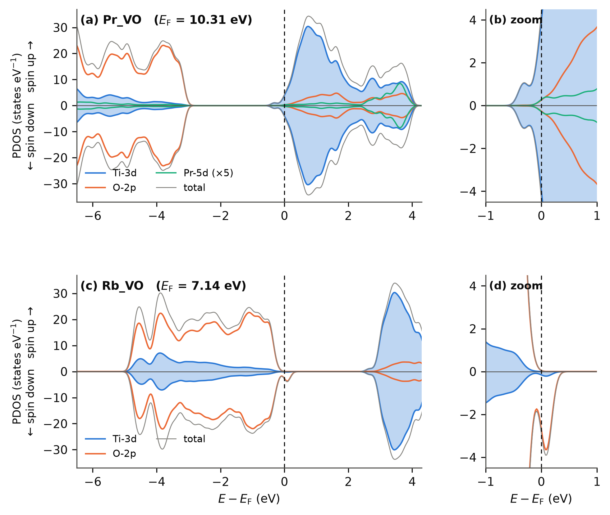

**3. Results**

**3.1 Structural relaxation**

All four doped supercells relaxed to maximum forces below the 0.005 Ry/Bohr threshold (Section 2.6; Pr_VO and Rb_VO trajectories in Figure S3). The pristine V~O~ cell, which required a modified mixing scheme to converge (Section S1), was stopped at 0.0056 Ry/Bohr, slightly above the threshold. Figure 1 shows the (010) atomic plane that contains the dopant site and the vacancy, at ideal positions and in the relaxed Rb_VO cell as read from its final coordinates (Table S8). The vacant site is an equatorial first-shell oxygen of the dopant site, 1.95 Å from the ideal cation position. In the relaxed cell the Rb ion has moved 1.27 Å from that position towards the vacancy and lies 0.87 Å from the vacant oxygen site; its four nearest oxygens are at 2.54 (two), 2.56 and 2.71 Å and the next two at 2.95 and 3.07 Å. The two Ti atoms that were bonded to the removed oxygen have moved away from it, to 2.36 and 2.38 Å from the vacant site (ideal Ti–O distances 2.03 and 1.95 Å). The large monovalent ion thus occupies part of the space vacated by the oxygen, so structural relaxation is part of the energy released when the vacancy forms next to Rb (Sections 3.2 and 4.3). **[AUTHOR ACTION: the relaxed Pr_VO coordinates were not available for this revision; place the pw.x output of the relaxed Pr_VO cell in figures/data/ so that make_fig1_structures.py adds panel (c), and state the Pr displacement and Pr–O distances here.]** Because the residual forces of the doped cells (0.07–0.11 eV/Å) are larger than the 0.01–0.03 eV/Å typically used for defect energetics, bond lengths quoted here are indicative, and the sensitivity of the energetics to tighter relaxation has not been tested (Section 5).

{width=100%}

*Figure 1. The (010) atomic plane containing the dopant site and the oxygen vacancy. (a) Ideal anatase positions built with the lattice parameters of this work (a = 7.63632 Å, c = 9.77900 Å, u = 0.208), with the dopant on the substituted Ti site and the vacant oxygen site marked by a dashed circle. (b) The same plane in the relaxed Rb_VO cell (PBE+U, U(Ti-3d) = 3.5 eV, Γ-only), from the final coordinates of the production relaxation. Arrows give the displacement of each in-plane atom from its ideal site after removal of the mean displacement; the dotted circle marks the ideal Rb site. The oxygen drawn in blue (O8) carries the largest Löwdin spin polarisation (+0.59 μ~B~; Section 3.6, Figure S1). Grey: Ti; red: O; orange: Rb. Only atoms in the plane are drawn, so each Ti shows fewer than six bonds. Plotted from the pw.x output by figures/make_fig1_structures.py.*

**3.2 Oxygen-vacancy formation energies**

Table 2 lists the neutral V~O~ formation energies at the oxygen-rich reference μ~O~ = ½E(O~2~), and Figure 2 displays them. In pristine anatase E~f~ = +4.74 eV. In the Pr-substituted cell E~f~ = +1.29 eV, and in the Rb-substituted cell E~f~ = −4.06 eV. Both substitutions lower the cost of removing an oxygen atom near the dopant site relative to pristine TiO~2~, by 3.45 eV for Pr and 8.81 eV for Rb (differences of the unrounded values). At this reference the Pr cell remains uphill, so oxygen removal is not spontaneous; the Rb cell is downhill, so the vacancy-free Rb-substituted cell is unstable against oxygen loss. Part of the Rb reduction is structural: the Rb ion moves 1.27 Å into the space vacated by the oxygen (Section 3.1), and the energy of this relaxation has not been separated from the electronic contribution. The Pr–Rb contrast ΔE~f~ is 5.36 eV (5.356 eV from the unrounded totals; the value 5.35 eV obtained by subtracting the rounded entries is a rounding artefact).

***Table 2. Neutral oxygen-vacancy formation energies at μ~O~ = ½E(O~2~) (PBE+U, U(Ti-3d) = 3.5 eV, 40 Ry).*** *Total energies are the converged Γ-only values in Ry; E~f~ is computed from the unrounded totals (full ledger in Table S9). The last column gives the single-point result on the Γ-relaxed geometry with a 2×2×2 k-mesh. The Γ-to-2×2×2 shift is −0.10 eV (Pr) and −0.14 eV (Rb) and was not evaluated for the pristine formation energy; the Pr–Rb difference shifts by +0.04 eV. The 2×2×2 Pr_VO and Rb_VO energies are runs of the k-mesh series (Table S2a), which start from scratch and therefore include small offsets from the relaxation endpoints (Section 3.7). Smearing, cut-off and relaxation-tolerance contributions to the absolute values have not been quantified (Sections 2.4 and 5).*

| Host X | E(X perfect) (Ry) | E(X + V~O~) (Ry) | ½E(O~2~) (Ry) | E~f~(V~O~^0^), Γ (eV) | E~f~(V~O~^0^), 2×2×2 (eV) |
|---|---|---|---|---|---|
| Pristine TiO~2~ | −4275.01530 | −4233.15036 | −41.51621 | +4.74 | – ^a^ |
| Pr~Ti~ | −4576.71224 | −4535.10106 | −41.51621 | +1.29 | +1.19 |
| Rb~Ti~ | −4330.38890 | −4289.17135 | −41.51621 | −4.06 | −4.20 |
| ΔE~f~ (Pr − Rb) | | | | +5.36 | +5.39 |

*^a^ The pristine V~O~ cell was not computed at 2×2×2 (the pristine perfect cell was, Section 3.7), so no 2×2×2 formation energy can be evaluated for the pristine host.* **[AUTHOR ACTION: compute E(Pristine_VO) at 2×2×2 on the Γ geometry and complete this entry.]**

{width=100%}

*Figure 2. Neutral oxygen-vacancy formation energies at the oxygen-rich reference μ~O~ = ½E(O~2~) for pristine, Pr-substituted and Rb-substituted anatase (PBE+U, U(Ti-3d) = 3.5 eV). Bars: Γ-only relaxed cells (this work; Table 2). Dashed ticks: single-point values at 2×2×2 on the Γ geometries. Both substitutions lower the formation energy relative to pristine; the Pr cell stays positive and the Rb cell becomes negative.*

The pristine value lies within the 4.0–5.0 eV range reported for the neutral bulk vacancy in anatase with DFT+U {{Arrigoni2020}} and below the 5.3–5.5 eV obtained with HSE06 at the oxygen-rich limit {{Deak2014,Boonchun2016}} **[NEEDS CITATION: the bulk-anatase hybrid-functional V~O~ study of Deák et al. is Deák, Aradi and Frauenheim, Phys. Rev. B 92 (2015) 045204 (cited as such by Arrigoni and Madsen), rather than the surface paper cited here; if the value is taken from that study, add it to refs.py and cite it in place of Deak2014.]**, as expected for a semi-local functional with a PBE O~2~ reference. This is a consistency check, not a validation of the protocol. **[AUTHOR ACTION: verify the Arrigoni–Madsen, Boonchun and Deák values and their oxygen-chemical-potential conditions against the full texts. Note that Arrigoni and Madsen used a larger U (5.8 eV in their arXiv preprint), fitted elemental-energy corrections to their DFT+U energies and a reduced exact-exchange fraction (HSE15) in their hybrid calculations, so their values are not directly comparable with an uncorrected PBE+U value at a PBE O~2~ reference.]** On the 2×2×2 mesh the individual formation energies shift by −0.10 eV (Pr) and −0.14 eV (Rb) while the contrast moves from 5.36 to 5.39 eV, i.e. by +0.04 eV from the unrounded totals (defined as the 2×2×2 contrast minus the Γ-only contrast). The comparative conclusion is therefore insensitive to Brillouin-zone sampling at the 0.05 eV level, although the absolute values carry a 0.10–0.14 eV mesh dependence. The direction of the Rb result (a reduction of E~f~ relative to pristine) agrees with the combined experimental and computational finding of Tian et al. that Rb doping promotes V~O~ formation in TiO~2~ {{Tian2025}}; that work supports the direction of the effect, not the specific supercell value.

**3.3 Spin states and electron counts**

Table 3 collects the total and absolute magnetisation and the Fermi energy printed by the code for each production cell, and Figure 3 plots the magnetisations. Table 1 shows that every doped cell has an odd number of electrons. A collinear calculation of an odd-electron cell can converge to m = 0 only through fractional occupations, so the non-magnetic solutions found for Pr_perfect and Pr_VO are smeared solutions in which the formal hole (Pr_perfect) or the formal net excess electron (Pr_VO) is carried by fractionally occupied states at E~F~ with equal spin-up and spin-down weight (conduction-band states in Pr_VO, Figure 4; not yet documented for Pr_perfect). They are not closed-shell singlets. The one magnetic trial performed for Pr_VO (Section 2.5) converged to m = 1.00 μ~B~, m~abs~ = 1.13 μ~B~. In smearing free energy (Section 2.4) it lies 0.281 eV above the non-magnetic energy logged with it for comparison and 0.394 eV above the final production energy (Table S9, runs 4, 24 and 25); this free energy includes a −TS term that favours fractionally occupied solutions. The non-magnetic solution is therefore the lower of the two solutions tested at this smearing, and a broader search over spin seeds and local distortions would be needed to establish it as the ground state. For Pr_VO the smeared character is documented by the projected densities of states, in which the occupied conduction-band states have equal weight in the two spin channels, and by the Löwdin analysis, in which no site carries more than 0.001 μ~B~ (Section 3.6). **[AUTHOR ACTION: document the occupations of the non-magnetic Pr_perfect solution in the same way.]** The isolated O~2~ reference converged to its triplet (m = 2.00 μ~B~), which is the expected check of the spin-polarised pipeline.

The Rb cells behave differently. Rb_perfect converged to m = 1.00 μ~B~ (m~abs~ = 1.00 μ~B~) from the production starting magnetisation, and Rb_VO to m = −0.97 μ~B~ with m~abs~ = 1.21 μ~B~. Single-point calculations started from zero magnetisation on the final Rb_VO geometry, at the production U without and with the D3 term (Section 3.7) and at other U values (Table S1), converge instead to m = 1.00 μ~B~. The two solutions are nearly degenerate: the from-scratch Γ single point (m = 1.00 μ~B~, E~F~ = 7.120 eV) lies 6.4 meV above the last relaxation step (m = −0.97 μ~B~, m~abs~ = 1.21 μ~B~, E~F~ = 7.133 eV; Table S2a). The self-consistent run that preceded the projected densities of states, started from 0.3 on Ti, reproduced the production Fermi energy and is taken to be the production solution, with the opposite (arbitrary) sign of m. With three formal holes in Rb_perfect and one residual hole in Rb_VO (Table 1), the Ti-3d-only Hubbard treatment thus yields one unpaired spin in each Rb cell; the remaining two holes of Rb_perfect are spin-paired in this treatment (m~abs~ = |m| excludes antiparallel moments), a point that the oxygen-site Hubbard test of Section 3.4 revisits. The excess of m~abs~ over |m| in Rb_VO (0.24 μ~B~) indicates regions of spin density of the opposite sign, which can arise from spin polarisation of the surrounding ions whether the hole is localised or delocalised, so this quantity does not by itself fix the degree of localisation; the Löwdin analysis (Section 3.6) finds a weak antiparallel polarisation of the Ti sublattice (−0.12 μ~B~ in total), which accounts for part of the excess.

***Table 3. Converged magnetisation and Fermi energy of the production cells (U(Ti-3d) = 3.5 eV only, Γ-only).*** *m is the total magnetisation and m~abs~ the absolute magnetisation (Section 2.5). E~F~ is the Fermi energy printed by pw.x for each cell; the values are not aligned to a common reference and differences between chemically different cells are diagnostic only (Section 3.6).*

| Cell | N~e~ | m (μ~B~) | m~abs~ (μ~B~) | E~F~ (eV, unaligned) | Lowest solution among those tested |
|---|---|---|---|---|---|
| Pristine_perfect | 384 | 0.00 | 0.00 | 7.89 | non-magnetic |
| Pristine_VO | 378 | 0.00 ^c^ | – ^c^ | **[AUTHOR ACTION: E~F~]** | non-magnetic (Section S1) |
| Pr_perfect | 383 | 0.00 | 0.00 | 7.40 | non-magnetic (smeared) |
| Pr_VO | 377 | 0.00 | 0.00 | 9.99 | non-magnetic (smeared); magnetic trial +0.28 to +0.39 eV ^d^ |
| Rb_perfect | 381 | 1.00 | 1.00 | 7.35 | one unpaired spin |
| Rb_VO | 375 | −0.97 | 1.21 | 7.13 | one unpaired spin (O-2p hole, Section 3.6) |
| O~2~ (12 Å box) | 12 | 2.00 | 2.00 | – | triplet |

*^c^ Reported as non-magnetic in Section S1; the printed values were not available for this revision. ^d^ Relative to the non-magnetic energy logged with the trial (+0.281 eV) and to the final production energy (+0.394 eV).*

{width=100%}

*Figure 3. Magnitude of the total magnetisation (|m|) and absolute magnetisation (m~abs~) of the production cells and of the O~2~ reference (PBE+U relaxations with U on Ti-3d only). The Pr cells and the pristine cell converge to non-magnetic solutions; both Rb cells carry one unpaired spin, and Rb_VO shows m~abs~ > |m|.*

**3.4 Oxygen-site Hubbard correction: spin state of the dopant-induced holes**

Because a Ti-3d-only Hubbard term provides no localising potential for holes on the oxygen sublattice, the three vacancy-free cells and Rb_VO were recomputed with an additional U = 5.5 eV on O-2p (Section 2.2), referred to below as the dual-U treatment. The pristine control is a single point; Pr_perfect and Rb_perfect were relaxed; the Rb_VO relaxation had not completed when its result was logged, so the Rb_VO entry is preliminary (Table S5). The magnetisations logged for these runs are total magnetisations m. **[AUTHOR ACTION: confirm from the output whether the dual-U Rb_VO relaxation finished, and give its final energy, m and m~abs~.]** The results are collected in Table 4. The pristine control remains non-magnetic (m = 0.00 μ~B~), so the oxygen term does not induce magnetism in a cell without carriers; this control does not test whether the term biases hole-containing cells towards spin-polarised solutions. Rb_perfect changes from m = 1.00 to m = 3.00 μ~B~, i.e. the three formal holes of Table 1 become three parallel unpaired spins once the oxygen term is present (their localisation has not been established from site-projected moments); Rb_VO gives m = 1.00 μ~B~ (preliminary), the single residual hole after two have been filled by the vacancy electrons. Pr_perfect changes from the non-magnetic smeared solution to m = 1.00 μ~B~, with a maximum residual force of 0.0049 Ry/Bohr; the one formal hole of the Pr substitution thus becomes spin-polarised when the oxygen term is present. Its printed Fermi energy (6.69 eV) lies 0.53 eV below that of the dual-U pristine cell (7.22 eV), which is the direction expected when E~F~ is pinned at a hole state near the valence-band edge instead of lying in the gap of an insulating cell, whether or not that hole is localised, although, as for all Fermi energies in this work (Section 3.6), the unaligned difference is a qualitative indicator only. Because the localising term was placed on O-2p, the spins are expected to reside on oxygen, but this has not been confirmed from site-projected moments or spin densities. **[AUTHOR ACTION: report m~abs~ and the Löwdin site moments of dual-U Rb_perfect and Pr_perfect (projwfc.x on the existing outputs).]** The formal hole count of each dual-U cell is matched by its spin count: one per Pr^3+^ (a trivalent state imposed by the 4f-in-core dataset, Section 2.1), three per Rb^+^ and one in Rb_VO, in line with the Kröger–Vink bookkeeping.

***Table 4. Effect of an oxygen-site Hubbard term (U(O-2p) = 5.5 eV added to U(Ti-3d) = 3.5 eV) on the magnetisation of the vacancy-free and vacancy-containing cells.*** *m: total magnetisation; m~abs~: absolute magnetisation (not recorded for the dual-U runs).*

| Cell | m / m~abs~, Ti-3d-only U (μ~B~) | m, Ti-3d + O-2p U (μ~B~) | Formal holes (Table 1) |
|---|---|---|---|
| Pristine_perfect | 0.00 / 0.00 | 0.00 (single point) | 0 |
| Pr_perfect | 0.00 / 0.00 | 1.00 (relaxed) | 1 |
| Pr_VO | 0.00 / 0.00 | not computed | −1 (net electron) |
| Rb_perfect | 1.00 / 1.00 | 3.00 (relaxed) | 3 |
| Rb_VO | −0.97 / 1.21 | 1.00 (preliminary) | 1 |

Two consequences follow. First, the dual-U spin count of the Rb cells equals the formal hole count and agrees with the q = +2 endpoint of the charged-cell series of Section 3.5, whereas the Ti-3d-only treatment gives one unpaired spin for the three holes of Rb_perfect. Second, the description of the Pr-substituted parent is method dependent: the hole is carried by a smeared non-magnetic solution in the Ti-3d-only treatment and by one unpaired spin, expected but not yet shown to reside on oxygen, in the dual-U treatment. The dual-U Pr_VO cell and the dual-U formation-energy cycles were not computed, so we do not know whether the formation energies of Table 2 change under the oxygen term; the statement that formation energies are less sensitive than localisation descriptors is an expectation, not a result of this work. **[AUTHOR ACTION: relax Pr_VO under the dual-U scheme (the other three dual-U cells exist), extract the dual-U total energies of Rb_perfect and Rb_VO from their outputs, and report E~f~(V~O~) for both dopants with U(O-2p); this is the single most valuable addition before submission. A U(O-2p) sensitivity test (e.g. 4.5 and 6.5 eV on Pr_perfect) would show whether the one-hole localisation depends on the transferred value.]**

**3.5 Charged-cell spin series**

Relaxations of Pr_VO and Rb_VO at q = +1 and +2 (uniform background, no finite-size correction) converged in 216, 549, 293 and 360 ionic steps respectively; the raw total energies are listed in Table S9. Because the periodic-image electrostatics of a charged 2×2×1 cell are uncorrected, these energies are not used to derive ionisation energies or transition levels. The spin state is used as a diagnostic. For Pr_VO both m and m~abs~ remain 0.00 μ~B~ at q = 0, +1 and +2: the q = +1 cell (376 electrons) has no formal carriers, and the one formal hole of the q = +2 cell (375 electrons) remains unpolarised, as in Pr_perfect under the same treatment. For Rb_VO the magnitude of the total magnetisation rises from 0.97 μ~B~ (q = 0) to 1.99 μ~B~ (q = +1) and 2.99 μ~B~ (q = +2); the absolute magnetisation is 1.21 μ~B~ at q = 0 and 3.82 μ~B~ at q = +2 (not recorded at q = +1), so the charged cells also contain spin density of the opposite sign. Each electron removed from the Rb cell therefore uncovers one further unpaired spin, and the q = +2 endpoint corresponds to the three holes per Rb^+^ substitution found independently in the dual-U calculation of Section 3.4; the orbital character of the uncovered spins is not probed by this series. In the same Ti-3d-only treatment the neutral Rb_perfect cell, which has the same formal hole count (three) as Rb_VO at q = +2, carries only 1.00 μ~B~ (Section 3.3), and the one-hole Pr_VO cell at q = +2 carries none, so the number of unpaired spins per hole is not a fixed property of this treatment and the series is a count of spins rather than a test of the hole count. **[AUTHOR ACTION: add m~abs~ of the q = +1 Rb_VO cell from its output.]** The two probes are not fully independent, since both are PBE+U calculations on the same geometry family, but they rely on different mechanisms (an added localising potential versus electron removal) and agree.

**3.6 Electronic-structure diagnostics**

*Fermi energies.* The Fermi energies printed for the production cells (Table 3) are 7.89 eV (pristine), 9.99 eV (Pr_VO) and 7.13 eV (Rb_VO). They are referenced to each cell's own average electrostatic potential and are not aligned to a common vacuum or core level; in the insulating pristine cell the printed value lies in the gap at a position set by the smearing rather than by a physical level (the same Γ-only cell prints 7.89 eV in the production run and 8.24 eV in a single point of the k-mesh series at the same total energy, Table S2a). The differences (+2.10 eV for Pr_VO and −0.76 eV for Rb_VO relative to pristine; 2.86 eV between the two doped vacancy cells) should therefore be read as qualitative indicators and not as band offsets or carrier-density shifts. With that caveat, the large upward shift in Pr_VO is consistent with the net excess electron of Table 1 occupying conduction-band states in a cell containing one carrier per 570 Å^3^ (1.75×10^21^ cm^−3^), and the small downward shift in Rb_VO is consistent with a partly filled oxygen-derived state near the valence-band edge. At realistic ETL carrier densities (10^17^–10^19^ cm^−3^) the corresponding conduction-band filling would be far smaller; no estimate is attempted here. **[AUTHOR ACTION: if the Fermi-energy comparison is retained, align the cells by the average O-1s or Ti-2p core level, or by the macroscopic average potential far from the defect, and report the valence-band maximum and conduction-band minimum of each cell.]**

*Projected densities of states and site moments.* Figure 4 shows the spin-resolved projected densities of states of Pr_VO and Rb_VO from 2×2×2 non-self-consistent calculations on the relaxed cells (Section 2.8), and Figure S2 the spin-summed densities of states. In Pr_VO the O-2p valence band ends about 2.9 eV below E~F~ and the Fermi level lies in the Ti-3d conduction band. The occupied conduction-band states within 0.6 eV below E~F~ have equal weight in the two spin channels (0.70 states each in the broadened DOS, 95 % Ti-3d), no feature appears inside the gap at this broadening, and the Pr-5d projection is small at both band edges. No site carries a Löwdin spin polarisation above 0.001 μ~B~, so the net excess electron is spin-paired over delocalised conduction-band states: this is the smeared solution of Section 3.3. The Pr-4f states are frozen in the core and cannot appear (Section 2.1). In Rb_VO the Fermi level lies at the top of the O-2p valence band and an empty state lies just above it in one spin channel only: between E~F~ and E~F~ + 0.6 eV the minority channel holds 0.79 states and the majority channel none, and 93 % of the minority weight is O-2p (Ti-3d 5 %). This empty minority-spin state is the residual hole of Table 1. The Löwdin moments locate it (Figure S1, Section S2.2). Of the total of +1.01 μ~B~, +0.59 μ~B~ sits on a single oxygen, O8, and +0.11 μ~B~ on each of two further oxygens, O6 and O17; the oxygen sublattice carries +1.12 μ~B~ in total, the Ti sublattice −0.12 μ~B~ (at most −0.03 μ~B~ on any Ti) and Rb none. O8 is bonded to the displaced Rb ion (2.56 Å) and to two Ti atoms (1.96 Å) and lies 3.40 Å from the vacant site; it is also the oxygen with the largest Bader depletion (Section 3.7). The residual hole is therefore an O-2p hole centred on one oxygen next to the dopant, with smaller weight on its oxygen neighbours and no Ti^3+^ character. The sum of the magnitudes of the Löwdin moments (1.24 μ~B~) is close to m~abs~ (1.21 μ~B~). Löwdin moments depend on the projector basis, so these numbers locate the spin density rather than quantify it. The separation between the valence-band top and the conduction-band onset is about 2.4–2.5 eV in both cells (onsets taken where the total DOS reaches 0.5 states eV^−1^). In the run used for Figure 4 the net moment is positive, so the hole appears in the spin-down channel; the sign of m is arbitrary in a collinear calculation, and the production relaxation (m = −0.97 μ~B~) corresponds to the same solution with the spins interchanged (Section 3.3). The Fermi energy of Pr_VO in Figure 4 (10.31 eV, 2×2×2 non-self-consistent) differs from the Γ-only self-consistent value (9.99 eV) because of the k-mesh dependence of the conduction-band filling; the Rb_VO Fermi energy is mesh-stable (7.13 versus 7.14 eV). **[AUTHOR ACTION (optional): add the Rb_VO spin-density isosurface (pp.x, plot_num = 6) as Figure S4 to complement the Löwdin moments.]**

{width=100%}

*Figure 4. Spin-resolved projected densities of states of (a) Pr_VO and (c) Rb_VO, with (b, d) the region within ±1 eV of E~F~, from 2×2×2 non-self-consistent calculations on the relaxed cells (PBE+U, U(Ti-3d) = 3.5 eV; tetrahedron occupations; Gaussian broadening 0.01 Ry). Spin up is plotted upwards and spin down downwards; energies are relative to each cell's Fermi level (10.31 and 7.14 eV). Filled blue: Ti-3d summed over 15 Ti; orange: O-2p summed over 31 O; green: Pr-5d multiplied by 5; grey: total. The Rb dataset has no d projector, so no dopant-d channel exists for Rb_VO. In (b) the occupied conduction-band states have equal weight in the two spin channels (0.70 states each between −0.6 eV and E~F~, 95 % Ti-3d). In (d) the empty state just above E~F~ appears in the spin-down channel only (0.79 states between E~F~ and +0.6 eV, 93 % O-2p; spin up 0.00). Plotted without smoothing from the summed projwfc.x output by figures/make_pdos_figures.py.*

*Hybrid-functional check on the pristine cell.* A single-point HSE06 calculation on the production Pristine_perfect geometry (Section 2.8) gave a non-magnetic solution (m = 0.00 μ~B~), a total energy of −3926.66858 Ry and a Fermi energy of 8.286 eV, 0.40 eV above the PBE+U value. The shift of the printed Fermi energy is not a band-gap measurement, and the hybrid total energy is not comparable with the PBE+U totals (Section 2.8). The check establishes only that the non-magnetic pristine state survives the change of functional, which is expected for a closed-shell cell without carriers; no hybrid calculation was performed on the doped or defective cells, so the dopant contrast of Table 2 and the localisation results of Sections 3.3–3.5 have not been verified at the hybrid level. **[AUTHOR ACTION: if the HSE06 result is retained, report the PBE+U and HSE06 band gaps of the pristine cell from the eigenvalues and resolve the pseudopotential question raised in Section 2.8.]**

**3.7 Sensitivity tests**

*Hubbard U.* Single-point calculations at U(Ti-3d) = 3.0, 4.0 and 4.5 eV on the production Pristine_perfect, Pr_VO and Rb_VO geometries (Table S1) leave the magnetisations unchanged in kind. Pr_VO is non-magnetic at every U, and Rb_VO carries one unpaired spin at every U (m = 1.00 μ~B~ in the from-scratch single points, versus m = −0.97 μ~B~, m~abs~ = 1.21 μ~B~ in the final relaxation step at U = 3.5 eV; see Section 3.3 for the two solutions). The printed Fermi energies of Pr_VO and Rb_VO vary by at most 0.26 eV across the 1.5 eV range; that of the insulating pristine cell lies in the gap and is not a physical level (Section 3.6). The total energies vary smoothly with U, by 6.1–6.6 eV per 0.5 eV step in all three cells. The qualitative Pr/Rb distinction in spin state is therefore not tied to the particular U(Ti-3d) used at fixed geometry; formation energies were not recomputed in the sweep.

*k-mesh.* For Pristine_perfect, Pr_VO and Rb_VO the total energy was computed at Γ, 2×2×1, 2×2×2 and 3×3×2 meshes at U = 3.5 eV. The Γ-only energies differ from the 3×3×2 values by 1.05, 1.08 and 1.16 eV per cell (22, 23 and 25 meV per atom), whereas the 2×2×1 energies are within 1.15, 1.05 and 0.42 meV per atom of 3×3×2. The Γ-only energies lie below the 3×3×2 values, and the 2×2×2 energies of the same series lie 0.2, 1.5 and 2.1 meV per atom above them for Pr_VO, Rb_VO and Pristine_perfect (Table S2a), so convergence beyond 2×2×1 is at the 1–2 meV per atom level and is not monotonic across mesh families. The Γ-only production energies are therefore not converged in absolute terms, and the formation energies of Table 2 rely on cancellation between the perfect and defective cell of the same host rather than on convergence of each total energy. The 2×2×2 column of Table 2 quantifies the residual: −0.10 eV (Pr), −0.14 eV (Rb) and +0.04 eV on their difference. Because the k-mesh single points start from scratch, the Γ-to-2×2×2 shifts include the differences between the from-scratch and relaxation-endpoint solutions at Γ (0.038 eV for Pr_VO and 6.4 meV for Rb_VO, Table S2a), which lie within the stated mesh dependence. A complete formation-energy cycle exists only at Γ and, for the doped hosts, at 2×2×2. The total magnetisations are mesh-independent: 0.00 μ~B~ for Pristine_perfect and Pr_VO and 0.99–1.00 μ~B~ for Rb_VO at every mesh, the latter being the from-scratch Rb_VO solution of Section 3.3.

*Dispersion.* D3(BJ) single points on the relaxed Pr_VO and Rb_VO cells gave dispersion contributions of −10.29 and −10.09 eV (Table S5). Because D3 is an additive geometric correction, the electronic part of each single point should reproduce the production total energy. It does so to 0.006 eV for Rb_VO but lies 0.038 eV above the production value for Pr_VO. The electronic part of the Pr_VO D3 single point is identical, to 10^−5^ Ry, to the from-scratch Γ single point of the k-mesh series (Table S2a), so the offset belongs to the from-scratch SCF solution of the smeared Pr_VO cell and not to the D3 term. The dispersion energies of the perfect substituted cells and of the O~2~ reference were not computed, so the dispersion correction to E~f~(V~O~) and to ΔE~f~ cannot be reconstructed from these results: the correction to the contrast requires [D3(Pr_VO) − D3(Pr_perfect)] − [D3(Rb_VO) − D3(Rb_perfect)], of which only the two defective-cell terms are available. The effect of dispersion on the vacancy energetics is therefore undetermined. The D3 single points give m = 0.00 μ~B~ (Pr_VO) and 1.00 μ~B~ (Rb_VO) and Fermi energies within 0.02 eV of the production values; the Rb_VO value is the from-scratch solution discussed in Section 3.3, not the production solution (m = −0.97 μ~B~, m~abs~ = 1.21 μ~B~). **[AUTHOR ACTION: run D3 single points on Pr_perfect, Rb_perfect and the O~2~ reference (about 6 h per cell on the hardware listed in Table S6) so that both the individual formation energies and their difference can be corrected, or delete this paragraph.]**

*Alternative vacancy sites in the Pr cell.* Three further Pr_VO cells were relaxed with the vacancy at the oxygen indices O1, O7 and O17 of the production input (Table S4). Sites O1 and O17 are symmetry-equivalent second-shell positions (Pr–O = 3.99 Å) and give E~f~ = +2.07 eV each, agreeing to 0.1 meV; the more distant site O7 (4.94 Å) gives +2.72 eV. The production site is thus the lowest of the four sampled sites by 0.78 eV. This is a comparison among selected configurations in a 2×2×1 cell, where "distant" sites are still within one lattice parameter of the periodic images of the dopant. It indicates a preference for the production site over the two more distant positions sampled but is not a global search. The production site is itself a first-shell oxygen of the dopant site (Section 2.3); a second first-shell candidate was not computed, site multiplicities are not given, and no corresponding sampling was performed for the Rb cell. The positions of the removed oxygens are listed in Table S4. **[AUTHOR ACTION: if possible, add two Rb_VO sites (a second first-shell and a second-shell oxygen).]**

*Bader charges.* Bader analysis of the relaxed Pr_VO and Rb_VO cells (Table S3) gives dopant charges of +2.14 e (Pr) and +0.82 e (Rb) relative to the PAW valence, consistent with the +3 and +1 formal states after the usual reduction of Bader charges relative to formal values. **[AUTHOR ACTION: these two values are inconsistent with the mean Ti and O populations of Table S3, from which the sum rule gives +2.04 e (Pr) and +0.87 e (Rb); re-extract all four numbers from ACF.dat. Also state that the two cells share the same atom ordering and which oxygen index was removed in each, and report the grid used; Bader grid convergence was not tested. ]** Relative to the Pr_VO cell, the 31 oxygen atoms of Rb_VO hold 0.97 e less in total, with the depletion concentrated on one oxygen bonded to the displaced Rb ion (−0.26 e, O8; Rb–O8 = 2.56 Å, 3.40 Å from the vacant site) and a second oxygen (−0.14 e, O30; 3.07 Å from Rb), five further oxygens contributing −0.05 to −0.09 e each. The 15 Ti atoms show a uniform mean depletion of −0.012 e (−0.18 e in total) and no Ti differs by more than 0.05 e. No Ti site shows the excess of a few tenths of an electron, relative to the other Ti sites, that a localised Ti^3+^ centre would produce, although the expected size of that signal was not calibrated on a reference cell containing a Ti^3+^ centre, so the test is indicative rather than decisive. The comparison is between cells of different composition, so the differences contain chemical polarisation by the dopant as well as carrier redistribution, and Bader charges are not orbital occupations; the two cells also differ by two carriers (the net excess electron of Pr_VO and the residual hole of Rb_VO, Table 1), whose contributions to the oxygen depletion this comparison cannot separate; the result is therefore compatible with an oxygen-centred hole in Rb_VO, but it is not a hole count and carries no spin information. The Löwdin analysis of Section 3.6 supplies the spin information: the oxygen with the largest Bader depletion, O8, also carries the largest spin moment (+0.59 μ~B~). A same-composition comparison (Rb_VO at q = 0 versus q = +1, or the spin density itself) would be more direct. 
