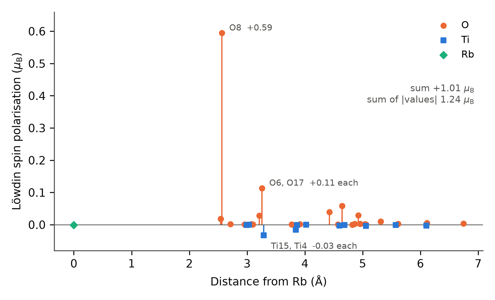
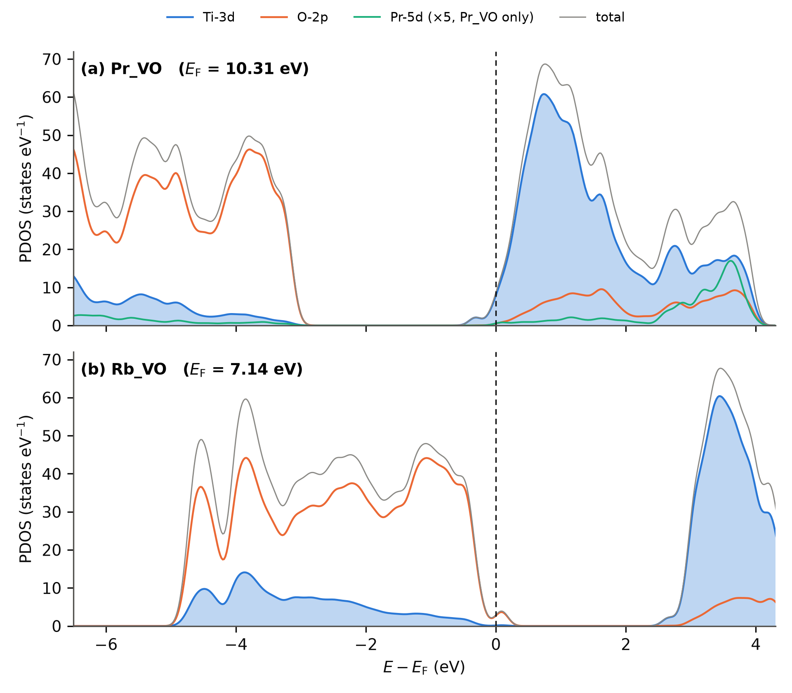

# Supporting Information

## Oxygen-Vacancy Energetics and Dopant-Induced Holes in Pr- and Rb-Substituted Anatase TiO~2~: A DFT+U Comparison

Mohammad Ghadimimehr, Azimah Binti Omar\*, Siti Rohani Binti Sheikh Raihan — Universiti Malaya

> **Revision note (v4; delete before submission).** Section numbering, table numbering and figure numbering follow the v4 main text. Items marked **[AUTHOR ACTION]** need data that only the authors can extract from the calculation records. Tables S9 and S10 are new and are the single traceable account of what was calculated that the audit asked for.

**Contents.** S1 Pristine V~O~ convergence · S2 Additional PDOS and Löwdin site moments · S3 Hubbard-U sweep · S4 k-mesh verification · S5 Bader analysis · S6 Alternative V~O~ sites · S7 Hybrid, dual-U and dispersion calculations · S8 Methods details, structural data and file inventory · S9 Full-precision energy ledger · S10 Run settings and manifest

### S1. Pristine V~O~ baseline: convergence recovery

The pristine anatase V~O~ reference reported in Table 2 of the main text (E~f~ = +4.74 eV) required two attempts. The first used mixing_mode = local-TF with mixing_beta = 0.3, not the damped mixing_beta = 0.1 of the doped-cell relaxations (Section 2.6), and oscillated, with the SCF accuracy estimate moving between 0.05 and 0.14 Ry over iterations 14–17, an instability associated with the two vacancy electrons occupying a dense manifold of conduction-band states. The second attempt (run Pristine_VO_v3) changed six settings together: mixing_beta 0.3 → 0.1; mixing_ndim → 12; Gaussian smearing degauss 0.005 → 0.01 Ry (≈ 136 meV); electron_maxstep → 300; diago_thr_init → 1×10^−3^ Ry; and starting_magnetization = 0.05 on both species as a symmetry-breaking nudge. The SCF then converged monotonically in 96 iterations of the first BFGS step to conv_thr = 1×10^−8^ Ry. Six further BFGS steps brought the maximum force to 0.00563 Ry/Bohr, slightly above the 0.005 Ry/Bohr production threshold, at which point the relaxation was stopped. The final total energy of the 47-atom cell is −4233.15036 Ry; against E(Pristine_perfect) = −4275.01530 Ry and ½E(O~2~) = −41.51621 Ry this gives E~f~ = +4.74 eV. The converged cell is non-magnetic. The single-point inputs derived from the doped-cell production runs (U sweep) use degauss = 0.005 Ry, so the converged pristine V~O~ cell may differ in smearing width from the other cells (Section 2.4 of the main text). Because the two vacancy electrons of the pristine V~O~ cell occupy conduction-band states, its −TS term need not be negligible at 0.01 Ry. The −TS terms of runs 1 and 2 were not extracted from the outputs.

### S2. Additional projected densities of states and Löwdin site moments

**S2.1 Settings.** The projected densities of states (PDOS) of Figure 4 of the main text and Figure S2 were computed with projwfc.x on 2×2×2 non-self-consistent runs (tetrahedron occupations; 260 bands for Pr_VO, 226 for Rb_VO) that read a Γ-only self-consistent density regenerated on the final relaxation geometry. The self-consistent runs used Gaussian smearing of 0.01 Ry and starting_magnetization = 0 (Pr_VO) or 0.3 on Ti (Rb_VO); the Rb_VO run reproduced the production Fermi energy (7.1329 eV) to 0.1 meV, although the from-scratch Rb_VO solution differs from it by only 13 meV (Section 3.3 of the main text). The non-self-consistent Fermi energies are 7.1440 eV (Rb_VO) and 10.306 eV (Pr_VO). In the Rb_VO run the majority-spin Kohn–Sham gap is 2.87 eV (valence-band top 0.22 eV below and conduction-band minimum 2.65 eV above E~F~), and the hole is a single minority-spin band 0.04–0.13 eV above E~F~; pw.x reported 33–37 unconverged eigenvalues per k-point, normally the highest of the 226 bands. The Rb_VO cell retains two symmetry operations (identity and a mirror plane), which the Löwdin moments respect (pairs O6/O17, Ti4/Ti15 and O29/O41). projwfc.x used Gaussian broadening of 0.01 Ry (0.136 eV) and an energy step of 0.02 eV. The atomic wavefunctions read from the datasets are Ti 3s/3p/3d, O 2s/2p, Pr 5p/5d and Rb 4s; there is no Pr-4f and no Rb-d projector, so the Pr curve is Pr-5d and no dopant-d curve exists for Rb_VO. The spilling parameters are 0.0030 (Pr_VO) and 0.0032 (Rb_VO). The summed projections are deposited as PDOS_Pr_VO(_spin).csv and PDOS_Rb_VO(_spin).csv and are plotted without smoothing or rescaling by figures/make_pdos_figures.py (Pr-5d multiplied by 5 where labelled).

**S2.2 Löwdin site moments.** The same projwfc.x runs give Löwdin charges and spin polarisations for every atom (lowdin_Pr_VO.csv, lowdin_Rb_VO.csv; extracted by figures/extract_lowdin.py). In Pr_VO no site exceeds 0.0006 μ~B~ in magnitude (sum −0.001 μ~B~, sum of magnitudes 0.004 μ~B~). In Rb_VO (Figure S1) the moments sum to +1.006 μ~B~ and their magnitudes to 1.242 μ~B~ (m~abs~ of the production relaxation: 1.21 μ~B~). The largest moment is +0.595 μ~B~ on O8, which is bonded to two Ti atoms (1.958 Å) and to the displaced Rb ion (2.564 Å) and lies 3.39 Å from the vacant site. O6 and O17 (3.26 Å from Rb) carry +0.114 μ~B~ each, O29 and O41 +0.059 μ~B~ each and O20 +0.039 μ~B~; the 31 oxygens together carry +1.124 μ~B~. The Ti sublattice carries −0.117 μ~B~, at most −0.033 μ~B~ on any site (Ti4 and Ti15, the two Ti bonded to O8), and Rb −0.001 μ~B~. O8 is also the oxygen with the largest Bader depletion (Table S3). In Pr_VO the four lowest oxygen populations are on O9, O30, O11 and O23 (four of the five remaining first-shell oxygens of the dopant site) and the highest Ti-3d populations on Ti2, Ti25 and Ti26, consistent with the same vacancy site as in Rb_VO, where Ti2 and Ti26 are the Ti bonded to the vacant site. Löwdin populations depend on the projector basis; they are used only to locate the spin density.

{width=90%}

*Figure S1. Löwdin spin polarisation of every atom of the Rb_VO cell against its minimum-image distance from Rb (projwfc.x, 2×2×2 non-self-consistent run on the relaxed cell). Orange circles: O; blue squares: Ti; green diamond: Rb. Symmetry-equivalent pairs (identical distance and moment) are labelled together.*

**S2.3 Spin-summed densities of states.** Figure S2 shows the companion of Figure 4 without spin decomposition. Pr_VO: E~F~ = 10.31 eV inside the Ti-3d conduction band, valence-band top about 2.9 eV below E~F~. Rb_VO: E~F~ = 7.14 eV at the top of the O-2p valence band, with a small feature centred just above E~F~ (the empty minority-spin state of Figure 4) and the conduction-band onset about 2.5 eV above E~F~.

{width=100%}

*Figure S2. Projected densities of states of (a) Pr_VO and (b) Rb_VO without spin decomposition (same runs and settings as Figure 4). Filled blue: Ti-3d; orange: O-2p; green: Pr-5d ×5 (Pr_VO only); grey: total.*

### S3. Hubbard-U sensitivity sweep

Single-point calculations on the relaxed Pristine_perfect, Pr_VO and Rb_VO cells at U(Ti-3d) = 3.0, 4.0 and 4.5 eV (Γ-only, 40 Ry, ortho-atomic projectors, Gaussian smearing 0.005 Ry, starting_magnetization = 0 on all species). The geometries were not re-relaxed at each U. The U = 3.5 eV entries are the production relaxations.

***Table S1. Total energy, total magnetisation and printed Fermi energy across the U(Ti-3d) sweep.*** *m is the total magnetisation; for the production Rb_VO relaxation m~abs~ = 1.21 μ~B~. Total energies at different U are not comparable as energies, but their smooth variation (6.1–6.6 eV per 0.5 eV step in every cell) shows that no electronic instability occurs in this range. Runs 38–46 of Table S9.*

| Cell | Quantity | U = 3.0 | U = 3.5 (production) | U = 4.0 | U = 4.5 |
|---|---|---|---|---|---|
| Pristine_perfect | E~tot~ (Ry) | −4275.49753 | −4275.01530 | −4274.53719 | −4274.06329 |
| | m (μ~B~) | 0.00 | 0.00 | 0.00 | 0.00 |
| | E~F~ (eV) | 8.184 | 7.887 ^a^ | 8.312 | 8.381 |
| Pr_VO | E~tot~ (Ry) | −4535.55974 | −4535.10106 | −4534.64041 | −4534.18631 |
| | m (μ~B~) | 0.00 | 0.00 | 0.00 | 0.00 |
| | E~F~ (eV) | 9.906 | 9.990 | 10.078 | 10.166 |
| Rb_VO | E~tot~ (Ry) | −4289.62997 | −4289.17135 | −4288.71556 | −4288.26409 |
| | m (μ~B~) | 1.00 | −0.97 | 1.00 | 1.00 |
| | E~F~ (eV) | 7.082 | 7.133 | 7.159 | 7.197 |

*^a^ The pristine cell is insulating and its printed E~F~ lies in the gap at a position set by the smearing; a Γ-only single point at the same total energy prints 8.244 eV (Table S2a).*

### S4. k-mesh verification

Single-point SCF energies on the Γ-relaxed geometries (40 Ry, U(Ti-3d) = 3.5 eV, Monkhorst–Pack meshes without offset). Table S2a gives the k-mesh series of Pristine_perfect, Pr_VO and Rb_VO; Table S2b the formation-energy check at 2×2×2.

***Table S2a. k-mesh series (runs 26–37 of Table S9).*** *All single points start from scratch (starting_magnetization = 0). The Γ entries differ slightly from the production relaxation endpoints (Pristine: < 1×10^−5^ Ry; Pr_VO: +0.00281 Ry = +0.038 eV; Rb_VO: +0.00047 Ry = +6.4 meV, the from-scratch Rb_VO solution with m = 1.00 μ~B~, Section 3.3 of the main text).*

| Cell | Mesh (k-points) | E~tot~ (Ry) | E − E(3×3×2) (meV/atom) | m (μ~B~) | E~F~ (eV) |
|---|---|---|---|---|---|
| Pristine_perfect | Γ (1) | −4275.01530 | −21.8 | 0.00 | 8.244 |
| | 2×2×1 (4) | −4274.93420 | +1.15 | 0.00 | 8.244 |
| | 2×2×2 (8) | −4274.93072 | +2.13 | 0.00 | 8.247 |
| | 3×3×2 (18) | −4274.93826 | 0 | 0.00 | 8.248 |
| Pr_VO | Γ (1) | −4535.09825 | −23.0 | 0.00 | 9.992 |
| | 2×2×1 (4) | −4535.02249 | −1.05 | 0.00 | 10.274 |
| | 2×2×2 (8) | −4535.01814 | +0.20 | 0.00 | 10.277 |
| | 3×3×2 (18) | −4535.01885 | 0 | 0.00 | 10.271 |
| Rb_VO | Γ (1) | −4289.17088 | −24.7 | 1.00 | 7.120 |
| | 2×2×1 (4) | −4289.08408 | +0.42 | 0.99 | 7.053 |
| | 2×2×2 (8) | −4289.08034 | +1.50 | 0.99 | 7.043 |
| | 3×3×2 (18) | −4289.08553 | 0 | 1.00 | 7.058 |

The Γ-only energies lie 22–25 meV per atom below the 3×3×2 values; beyond 2×2×1 the energies agree with 3×3×2 to within 2.1 meV per atom, not monotonically. The magnetisations are mesh-independent.

***Table S2b. Total energies at Γ-only and 2×2×2 (Ry) and the resulting formation energies (eV).*** *The Γ column holds the production relaxation endpoints; the Pr_VO and Rb_VO 2×2×2 entries are runs 32 and 36 of the k-mesh series (runs 9 and 11 of Table S9), and the Pr_perfect and Rb_perfect entries are runs 8 and 10. Because the 2×2×2 single points start from scratch, the Γ-to-2×2×2 differences include the small from-scratch offsets noted under Table S2a.*

| Cell | E~tot~, Γ (Ry) | E~tot~, 2×2×2 (Ry) | ΔE = E(2×2×2) − E(Γ) (Ry) | ΔE (eV) |
|---|---|---|---|---|
| Pr_perfect | −4576.71224 | −4576.62183 | +0.09041 | +1.230 |
| Pr_VO | −4535.10106 | −4535.01814 | +0.08292 | +1.128 |
| Rb_perfect | −4330.38890 | −4330.28761 | +0.10129 | +1.378 |
| Rb_VO | −4289.17135 | −4289.08034 | +0.09101 | +1.238 |
| E~f~(V~O~; Pr) | +1.292 eV | +1.190 eV | | |
| E~f~(V~O~; Rb) | −4.063 eV | −4.203 eV | | |
| ΔE~f~ (Pr − Rb) | +5.356 eV | +5.394 eV | | ΔΔE = +0.038 eV |

ΔΔE is defined as the 2×2×2 contrast minus the Γ-only contrast. The pristine V~O~ cell was not computed at 2×2×2. 

### S5. Bader topological-charge analysis

Bader analysis of the relaxed Pr_VO and Rb_VO cells: pp.x charge density (plot_num = 0, output_format = 6, Gaussian cube) decomposed with the Henkelman grid-based code (v1.05, 2023-08-19). pp.x wrote the valence pseudo-density (plot_num = 0, without the PAW all-electron reconstruction) on the FFT grid of the 40/320 Ry calculation; grid convergence of the Bader charges was not tested.

***Table S3. Summary Bader metrics.*** *Charges are Bader electron populations in e; "depletion" is the population difference Rb_VO − Pr_VO for the corresponding atom.*

| Quantity | Pr_VO | Rb_VO |
|---|---|---|
| Total electrons (Bader sum) | 376.998 | 374.998 |
| Mean Ti population (15 atoms) | 9.683 | 9.671 |
| Mean O population (31 atoms) | 7.187 | 7.155 |
| Dopant population implied by the totals and sublattice means; charge = Z~val~ − population ^a^ | Pr: 8.96 e (+2.04 e) | Rb: 8.13 e (+0.87 e) |
| O sublattice total difference (Rb_VO − Pr_VO) | reference | −0.97 e |
| Largest single-atom O depletion | reference | −0.257 e on O8 (bonded to Rb, 2.56 Å; 3.39 Å from the vacant site; largest Löwdin moment, S2.2) |
| Second-largest O depletion | reference | −0.14 e on O30 (3.07 Å from Rb; 3.64 Å from the vacant site) |
| Mean Ti depletion | reference | −0.012 e per Ti (−0.18 e total); none exceeds −0.05 e |

The Bader sums reproduce the valence electron counts of Table 1 of the main text (377 and 375) and thereby confirm the Z~val~ = 11 (4f-in-core) Pr dataset. *^a^ Dopant population = total − 15 × mean Ti − 31 × mean O; the rounding of the means to three decimals gives an uncertainty of ±0.03 e. The run notes give +2.14 e (Pr) and +0.82 e (Rb), which these sums do not reproduce; the per-atom ACF.dat tables were not re-extracted for this revision and belong to the data deposit.* The atom indices of Table S3 follow the pw.x ordering, which is the same in both cells (S2.2); distances are from the relaxed Rb_VO coordinates (Table S8).

### S6. Alternative V~O~ sites in the Pr cell

***Table S4. V~O~ formation energies at four selected oxygen sites of the Pr-substituted cell (BFGS, U(Ti-3d) = 3.5 eV only, Γ-only, 40 Ry).*** *Sites 1 and 17 are symmetry-equivalent; their agreement to 0.1 meV is an internal consistency check. Coordinates are the Cartesian positions (Å) of the removed oxygen in the perfect cell; distances are minimum-image distances from the ideal cation site (1.909, 1.909, 4.890 Å).*

| Site (index in orchestration input) | Removed O position (Å) | Distance from dopant site (Å) | E~tot~ (Ry) | E~f~(V~O~) (eV) | Relative to production site (eV) |
|---|---|---|---|---|---|
| Production Pr_VO (first-shell, equatorial) | (0.000, 1.909, 4.479) ^a^ | 1.95 (ideal) | −4535.10106 | +1.29 | 0 |
| Site 1 (second shell) | (−0.017, −0.029, 1.983) | 3.99 | −4535.04367 | +2.07 | +0.78 |
| Site 7 (distant) | (1.909, −0.029, 9.431) | 4.94 | −4534.99608 | +2.72 | +1.43 |
| Site 17 (second shell, equivalent to site 1) | (3.835, −0.029, 1.983) | 3.99 | −4535.04366 | +2.07 | +0.78 |

*^a^ Ideal position of the vacant site identified from the relaxed Rb_VO coordinates (Section S8); the Löwdin populations of Pr_VO are consistent with the same site (S2.2). Site labels are those of the orchestration input, not pw.x atom numbers. The value ≈2.17 Å quoted in earlier drafts for the production site is undocumented and is not used; the production vacancy of the Pr cell was not confirmed from its input for this revision.* 

### S7. Hybrid-functional, dual-Hubbard and dispersion calculations

***Table S5. Results of the additional calculations (Sections 3.4, 3.6 and 3.7 of the main text).*** *m is the total magnetisation (the quantity recorded for these runs).*

| Calculation | Cell | Run type | E~tot~ (Ry) | Key observable |
|---|---|---|---|---|
| HSE06 single point (α = 0.25, ω = 0.106 Bohr^−1^) | Pristine_perfect | single point | −3926.66858 | E~F~ = 8.286 eV; m = 0.00 μ~B~ |
| Dual-U (U(Ti-3d) = 3.5 eV, U(O-2p) = 5.5 eV), control | Pristine_perfect | single point | −4269.72111 | m = 0.00 μ~B~; E~F~ = 7.218 eV |
| Dual-U | Pr_perfect | relaxation, F~max~ = 0.0049 Ry/Bohr | −4571.33095 | m = 1.00 μ~B~; E~F~ = 6.689 eV |
| Dual-U | Rb_perfect | relaxation | −4324.98591 ^b^ | m = 3.00 μ~B~; m~abs~ not recorded |
| Dual-U | Rb_VO | relaxation, not completed when logged | −4284.02974 ^b^ | m = 1.00 μ~B~ (preliminary); m~abs~ not recorded |
| D3(BJ) single point (dftd3_version = 4, no three-body) | Pr_VO | single point, from scratch | −4535.85464 | D3 term = −0.75639 Ry (−10.29 eV); m = 0.00 μ~B~; E~F~ = 9.992 eV |
| D3(BJ) single point | Rb_VO | single point, from scratch | −4289.91254 | D3 term = −0.74166 Ry (−10.09 eV); m = 1.00 μ~B~; E~F~ = 7.120 eV |

*^b^ Logged in eV only (−58844.4305 and −58287.1934 eV) and converted here with 13.605693 eV/Ry, the factor the run spreadsheet uses for the four production cells logged in both units (reproduced to 0.0006 eV). They enter no formation energy: a dual-U O~2~ reference would be needed.* 

Removing the D3 term from each single point leaves −4535.09825 Ry (Pr_VO) and −4289.17088 Ry (Rb_VO), identical to within 10^−5^ Ry to the from-scratch Γ single points of the k-mesh series (Table S2a); the 0.038 eV offset of Pr_VO from the production relaxation endpoint is therefore a property of the from-scratch SCF solution, not of the D3 term. The D3 single points were not performed on Pr_perfect, Rb_perfect or O~2~, so no D3-corrected formation energy can be formed (main text Section 3.7). The HSE06 total energy is not comparable with the PBE+U totals.

### S8. Methods details, structural data and file inventory

Quantum ESPRESSO v7.5; PSlibrary 1.0.0 PAW datasets (Table S7); nspin = 2; HUBBARD (ortho-atomic) with U(Ti-3d) = 3.5 eV and, for the dual-U runs, U(O-2p) = 5.5 eV; Dudarev formulation as printed by pw.x.

The input templates, orchestrator scripts, raw output files, ACF.dat files, PDOS files, Löwdin tables, the energy ledger (energy_ledger.csv, with check_ledger.py, which recomputes every derived energy in the paper) and the master spreadsheet are deposited on Zenodo (DOI in the Data availability statement of the main text). Local directory names of the authors' computing facility are not reported.

***Table S6. Wall-time summary (Intel i5-3570, 4 cores).***

| Stage | Wall time | Outcome |
|---|---|---|
| Production single-U relaxations (5 cells) | ≈ 3 days each | below 0.005 Ry/Bohr (Pr_VO stopped manually; Section 2.6) |
| Pristine V~O~ relaxation (after mixing recovery, S1) | ≈ 14 h | F~max~ = 0.0056 Ry/Bohr |
| HSE06 single point, Pristine_perfect | 8 days | done |
| Dual-U: Pristine single point and Pr_perfect relaxation | ≈ 24 h | done |
| Dual-U relaxations, Rb_perfect and Rb_VO | not recorded | Rb_perfect done; Rb_VO not completed when logged |
| D3 single points, Pr_VO and Rb_VO | ≈ 12 h total | done |
| Alternative-site Pr_VO relaxations (3) | ≈ 33 h total | done |
| Bader, Pr_VO and Rb_VO | ≈ 2 h | done (Pristine not completed) |
| 2×2×2 single points of Pr_perfect and Rb_perfect | ≈ 6 h total | done |
| Charged cells (4 relaxations) | not recorded | done (216, 549, 293 and 360 BFGS steps) |
| U sweep (9 single points) | ≈ 4–5 h total (run log) | done |
| k-mesh series at Γ, 2×2×1, 2×2×2, 3×3×2 (3 cells, 12 runs) | not recorded | done |
| Pristine_perfect single point (run 1) | not recorded | unrelaxed, F~max~ 0.0225 Ry/Bohr (main text Section 2.6) |
| PDOS: Γ SCF, 2×2×2 NSCF and projwfc.x (Pr_VO, Rb_VO) | ≈ 7 h (Rb_VO NSCF) | done |

***Table S7. Pseudopotential datasets.*** *Z~val~ and MD5 checksums as printed by pw.x; projectors as listed by projwfc.x.*

| Dataset | Z~val~ | MD5 checksum (pw.x) | Atomic wavefunctions used by projwfc.x |
|---|---|---|---|
| Ti.pbe-spn-kjpaw_psl.1.0.0.UPF | 12 | 01f69b0d8ba4438b2e03ac6ea4af1c0b | 3s, 3p, 3d |
| O.pbe-n-kjpaw_psl.1.0.0.UPF | 6 | e99d9cef9b487d1ca56f5b95ecd0fd7a | 2s, 2p |
| Pr.pbe-spdn-kjpaw_psl.1.0.0.UPF | 11 | not recorded ^a^ | 5p, 5d (no 4f) |
| Rb.pbe-spn-kjpaw_psl.1.0.0.UPF | 9 | a11e6fb9d11e64d6427b9eb26aa4a0b1 | 4s |

*^a^ The Pr checksum is printed only in the headers of the Pr-cell pw.x outputs, which were not available for this revision; the valence configurations of all four datasets are given in Table 1 of the main text.*

***Table S8. Local structure of the relaxed Rb_VO cell.*** *From the final coordinates of the production relaxation as printed in the header of the 2×2×2 non-self-consistent run. Displacements are relative to ideal anatase sites built with the lattice parameters of this work (u = 0.208) after removal of the mean displacement of all atoms.*

| Quantity | Value |
|---|---|
| Rb displacement from the ideal cation site | 1.27 Å, towards the vacant oxygen site |
| Ideal cation site to vacant oxygen site | 1.95 Å (equatorial first-shell oxygen) |
| Relaxed Rb to vacant oxygen site | 0.87 Å |
| Rb–O distances, six nearest | 2.542 (O11), 2.542 (O23), 2.564 (O8), 2.709 (O9), 2.954 (O33), 3.074 (O30) Å |
| Ti bonded to the removed oxygen: distance to the vacant site | 2.362 (Ti2; ideal 2.03) and 2.378 Å (Ti26; ideal 1.95) |
| O8 (largest Löwdin moment): neighbours | Ti4 and Ti15 at 1.958 Å; Rb at 2.564 Å |

*The corresponding values for Pr_VO, Pr_perfect and Rb_perfect were not extracted, because their relaxed coordinates were not available for this revision.*

### S9. Full-precision energy ledger

All values are the final "!" total energies printed by pw.x (smearing free energies for the smeared cells; see Section 2.4 of the main text) as recorded in the authors' run spreadsheet and output files; conversions use 1 Ry = 13.605693 eV. In the Protocol column, single-U denotes U(Ti-3d) = 3.5 eV only and dual-U denotes U(Ti-3d) = 3.5 eV plus U(O-2p) = 5.5 eV. N~e~ of the charged cells: Pr_VO 376 (q = +1) and 375 (q = +2); Rb_VO 374 (q = +1) and 373 (q = +2). The same ledger is deposited as energy_ledger.csv; check_ledger.py recomputes every formation energy, energy difference and per-atom k-mesh offset quoted in the paper from it.

***Table S9. Energy ledger.*** *m: total magnetisation; m~abs~: absolute magnetisation (– = not recorded).*

| Run | Cell | q | Protocol | k-mesh | E~tot~ (Ry) | m / m~abs~ (μ~B~) | Derived quantity |
|---|---|---|---|---|---|---|---|
| 1 | Pristine_perfect | 0 | single-U | Γ | −4275.01530 | 0.00 / 0.00 | reference; single point on unrelaxed positions, F~max~ 0.0225 Ry/Bohr |
| 2 | Pristine_VO_v3 | 0 | single-U | Γ | −4233.15036 | 0.00 / – | E~f~ = +4.745 eV |
| 3 | Pr_perfect | 0 | single-U | Γ | −4576.71224 | 0.00 / 0.00 | reference |
| 4 | Pr_VO (production site) | 0 | single-U | Γ | −4535.10106 | 0.00 / 0.00 | E~f~ = +1.292 eV |
| 5 | Rb_perfect | 0 | single-U | Γ | −4330.38890 | 1.00 / 1.00 | reference |
| 6 | Rb_VO | 0 | single-U | Γ | −4289.17135 | −0.97 / 1.21 | E~f~ = −4.063 eV |
| 7 | O~2~ (12 Å box, triplet) | 0 | PBE | Γ | −83.03243 | 2.00 / 2.00 | ½E(O~2~) = −41.51621 Ry = −564.857 eV |
| 8 | Pr_perfect | 0 | single-U | 2×2×2 | −4576.62183 | – | |
| 9 | Pr_VO (= run 32) | 0 | single-U | 2×2×2 | −4535.01814 | 0.00 / – | E~f~ = +1.190 eV |
| 10 | Rb_perfect | 0 | single-U | 2×2×2 | −4330.28761 | – | |
| 11 | Rb_VO (= run 36) | 0 | single-U | 2×2×2 | −4289.08034 | 0.99 / – | E~f~ = −4.203 eV |
| 12 | Pr_VO, site 1 | 0 | single-U | Γ | −4535.04367 | – | E~f~ = +2.073 eV |
| 13 | Pr_VO, site 7 | 0 | single-U | Γ | −4534.99608 | – | E~f~ = +2.720 eV |
| 14 | Pr_VO, site 17 | 0 | single-U | Γ | −4535.04366 | – | E~f~ = +2.073 eV |
| 15 | Pr_VO | +1 | single-U, uniform background | Γ | −4535.83092 | 0.00 / 0.00 | spin diagnostic only |
| 16 | Pr_VO | +2 | single-U, uniform background | Γ | −4536.36183 | 0.00 / 0.00 | spin diagnostic only |
| 17 | Rb_VO | +1 | single-U, uniform background | Γ | −4289.68663 | 1.99 / – | spin diagnostic only |
| 18 | Rb_VO | +2 | single-U, uniform background | Γ | −4290.19380 | 2.99 / 3.82 | spin diagnostic only |
| 19 | Pr_perfect | 0 | dual-U | Γ | −4571.33095 | 1.00 / – | relaxed |
| 20 | Pristine_perfect | 0 | dual-U | Γ | −4269.72111 | 0.00 / – | single point |
| 20a | Rb_perfect | 0 | dual-U | Γ | −4324.98591 ^b^ | 3.00 / – | relaxed |
| 20b | Rb_VO | 0 | dual-U | Γ | −4284.02974 ^b^ | 1.00 / – | preliminary (relaxation not completed when logged) |
| 21 | Pristine_perfect | 0 | HSE06 | Γ | −3926.66858 | 0.00 / – | not comparable with PBE+U totals |
| 22 | Pr_VO | 0 | single-U + D3(BJ) | Γ | −4535.85464 | 0.00 / – | minus D3 term = run 30 |
| 23 | Rb_VO | 0 | single-U + D3(BJ) | Γ | −4289.91254 | 1.00 / – | minus D3 term = run 34 |
| 24 | Pr_VO, magnetic trial | 0 | single-U, magnetic start | Γ | −4535.07207 | 1.00 / 1.13 | +0.281 eV above run 25; +0.394 eV above run 4 |
| 25 | Pr_VO, non-magnetic value logged with run 24 | 0 | single-U | Γ | −4535.09269 | 0.00 / 0.00 | comparison value for run 24 |
| 26–29 | Pristine_perfect, k-mesh series | 0 | single-U | Γ … 3×3×2 | Table S2a | 0.00 / – | |
| 30–33 | Pr_VO, k-mesh series | 0 | single-U | Γ … 3×3×2 | Table S2a | 0.00 / – | run 30: +0.038 eV above run 4 |
| 34–37 | Rb_VO, k-mesh series | 0 | single-U | Γ … 3×3×2 | Table S2a | 1.00 / – | run 34: +6.4 meV above run 6 |
| 38–46 | U sweep (3 cells × 3 U values) | 0 | U(Ti-3d) = 3.0, 4.0, 4.5 eV | Γ | Table S1 | Table S1 | |

*^b^ Converted from the logged eV values; see Table S5.*

*Run 25 is the Pr_VO energy recorded in the run log at the time of the magnetic trial; it lies 0.114 eV above the final production energy (run 4), consistent with an earlier step of the damped Pr_VO relaxation, which was restarted (main text Section 2.6). The production comparison is the 0.394 eV of run 24 against run 4.*

*Output file names recorded in the run log: Pristine_perfect.out, Pr_perfect.out, Pr_VO.out, Rb_perfect.out and Rb_VO.out (runs 1 and 3–6); relax_Pr_VO_qp1.out, relax_Pr_VO_qp2.out, relax_Rb_VO_qp1.out and relax_Rb_VO_qp2.out (15–18); scf_Pristine_perfect_U3p0.out and the corresponding U4p0/U4p5 and Pr_VO/Rb_VO files (38–46); nscf_Pr_VO.out, nscf_Rb_VO.out, proj_Pr_VO.out and proj_Rb_VO.out (PDOS). The names of the remaining outputs were not recorded.*

Derived differences: E~f~(Pr) − E~f~(Pristine) = −3.453 eV; E~f~(Rb) − E~f~(Pristine) = −8.808 eV; ΔE~f~(Pr − Rb) = 5.356 eV (Γ), 5.394 eV (2×2×2); ΔΔE = +0.038 eV.

### S10. Run settings and manifest

***Table S10. Input settings by run family, as recorded in the run log and in the input templates supplied for this revision.*** *All runs: PBE, PAW (Table S7), 40/320 Ry, nspin = 2, conv_thr = 1×10^−8^ Ry (relaxations and single points), Gaussian smearing, HUBBARD ortho-atomic.*

| Run family (Table S9) | calculation | degauss (Ry) | starting_magnetization | Other settings | Source |
|---|---|---|---|---|---|
| Production relaxations (3–6) | relax (BFGS, forc_conv_thr 0.005 Ry/Bohr; etot_conv_thr not recorded) | 0.005 or 0.01 ^c^ | 0 on all species (run log) | mixing_beta 0.1, bfgs_ndim 3 | run log (production inputs not re-inspected) |
| Pristine_perfect (1) | scf (single point on unrelaxed positions) ^d^ | 0.005 or 0.01 ^c^ | 0 on all species (run log) | | run log |
| Pristine V~O~ (2) | relax | 0.01 | 0.05 on Ti and O | mixing_beta 0.1, mixing_ndim 12, electron_maxstep 300 | Section S1 |
| Pr_VO magnetic trial (24) | relax | not recorded | Ti 0.3, Pr 0.5, O 0 | separate prefix | run log |
| U sweep (38–46) | scf | 0.005 | 0 on all species | mixing plain, beta 0.1, atomic+random start | input templates |
| k-mesh series (26–37) | scf | not recorded | 0 (from scratch) | | run log |
| PDOS SCF (Pr_VO, Rb_VO) | scf | 0.01 | Pr_VO: 0; Rb_VO: Ti 0.3 | mixing_beta 0.1 | input templates |
| PDOS NSCF | nscf, 2×2×2, 260/226 bands | tetrahedra | – | | input templates, outputs |
| projwfc.x | – | Gaussian 0.01 Ry broadening | – | DeltaE 0.02 eV, E −8 to 16 eV | input template |

*^c^ The U-sweep templates derived from the production runs use 0.005 Ry, but the PDOS SCF at 0.01 Ry reproduces the production Rb_VO Fermi energy to 0.1 meV, so the production value is not established. ^d^ Run 1 is a single point on the positions of the variable-cell relaxation of the conventional cell, with a residual force of 0.0225 Ry/Bohr (run log); its logged energy in eV converts to the Table S9 value, and run 26 reproduces it from scratch (main text Section 2.6).* *nosym, tot_magnetization and constrained_magnetization appear in none of the input templates or run-log entries; symmetry was left to the code's default detection. Output file names, where recorded, are listed under Table S9.*
