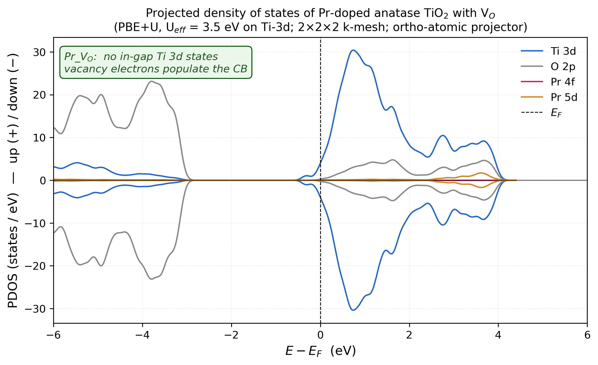
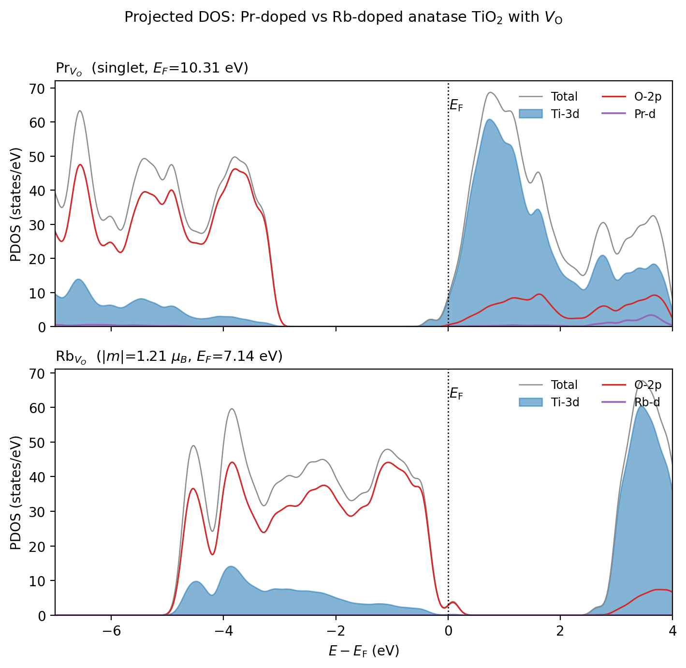
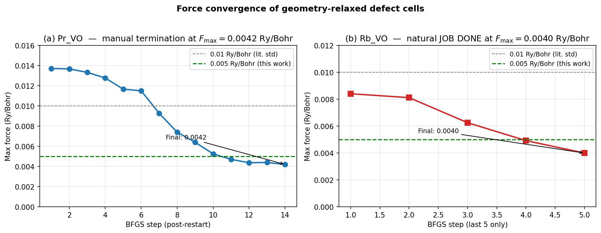

# Supporting Information

## Oxygen-Vacancy Energetics and Hole Localization in Pr- and Rb-Substituted Anatase TiO~2~: A DFT+U Comparison

Mohammad Ghadimimehr, Azimah Binti Omar\*, Siti Rohani Binti Sheikh Raihan — Universiti Malaya

> **Revision note (v4; delete before submission).** Section numbering, table numbering and figure numbering follow the v4 main text. Items marked **[AUTHOR ACTION]** need data that only the authors can extract from the calculation records. Tables S9 and S10 are new and are the single traceable account of what was calculated that the audit asked for.

**Contents.** S1 Pristine V~O~ convergence · S2 Additional PDOS · S3 Hubbard-U sweep · S4 k-mesh verification · S5 Bader analysis · S6 Alternative V~O~ sites · S7 Hybrid, dual-U and dispersion single points · S8 Methods details and file inventory · S9 Full-precision energy ledger · S10 Run manifest · S11 Force-convergence trajectories

### S1. Pristine V~O~ baseline: convergence recovery

The pristine anatase V~O~ reference reported in Table 2 of the main text (E~f~ = +4.74 eV) required two attempts. The first used the production protocol with the default mixing (mixing_mode = local-TF, mixing_beta = 0.3) and oscillated, with the SCF accuracy estimate moving between 0.05 and 0.14 Ry over iterations 14–17, a known instability of the half-filled two-electron conduction-band manifold of the neutral vacancy in anatase. The second attempt (run Pristine_VO_v3) changed seven settings together: mixing_beta 0.3 → 0.1; mixing_ndim → 12; Gaussian smearing degauss 0.005 → 0.01 Ry (≈ 136 meV); electron_maxstep → 300; diago_thr_init → 1×10^−3^ Ry; and starting_magnetization = 0.05 on both species as a symmetry-breaking nudge. The SCF then converged monotonically in 96 iterations of the first BFGS step to conv_thr = 1×10^−8^ Ry. Six further BFGS steps brought the maximum force to 0.00563 Ry/Bohr, slightly above the 0.005 Ry/Bohr production threshold, at which point the relaxation was stopped. The final total energy of the 47-atom cell is −4233.15036 Ry; against E(Pristine_perfect) = −4275.01530 Ry and ½E(O~2~) = −41.51621 Ry this gives E~f~ = +4.74 eV. The converged cell is non-magnetic. **[AUTHOR ACTION: state whether the production doped-cell relaxations used degauss = 0.005 or 0.01 Ry; if the pristine V~O~ cell used a different smearing from the doped cells, say so in Section 2.4 of the main text.]**

### S2. Additional projected densities of states

**S2.1 Pr_VO with dopant channels.** Figure S1 shows the PDOS of the Pr_VO cell with the Pr-5d and Pr-5p channels plotted separately from Ti-3d and O-2p. The conduction band is dominated by Ti-3d; the Fermi level lies inside the conduction band because the cell carries one net excess electron (Table 1 of the main text). The Pr.pbe-spdn-kjpaw_psl.1.0.0 dataset has Z~val~ = 11 (5s^2^5p^6^5d^1^6s^2^) with the 4f electrons frozen in the core, so no 4f projection exists; the "Pr 4f" curve present in the earlier version of this figure was an empty channel and must be removed. **[AUTHOR ACTION: regenerate Figure S1 from projwfc.x output with channels Ti-3d, O-2p, Pr-5d, Pr-5p and total only; state the Gaussian broadening; remove the green text box.]** The small residual between the total DOS and the sum of the projected channels arises from the incompleteness of the atomic projectors, not from a missing 4f channel.

*Figure S1. Projected density of states of the Pr_VO cell (PBE+U, U(Ti-3d) = 3.5 eV, 2×2×2 non-self-consistent, E~F~ = 10.306 eV). Channels: Ti-3d summed over 15 Ti; O-2p summed over 31 O; Pr-5d; Pr-5p; total. (Artwork to be regenerated as noted above.)*

**S2.2 Total DOS, Pr_VO versus Rb_VO.** Figure S2 shows the non-spin-resolved companion of Figure 4 of the main text. Pr_VO: E~F~ = 10.31 eV inside the Ti-3d conduction band. Rb_VO: E~F~ = 7.14 eV at the top of the O-2p valence band, with a small occupied feature at E~F~.

*Figure S2. Projected density of states of Pr_VO (top) and Rb_VO (bottom) without spin decomposition. Filled: Ti-3d; red: O-2p; purple: dopant d; grey: total.*

### S3. Hubbard-U sensitivity sweep

Single-point calculations on the relaxed Pristine_perfect, Pr_VO and Rb_VO cells at U(Ti-3d) = 3.0, 4.0 and 4.5 eV (Γ-only, 40 Ry, ortho-atomic projectors). The maximum variation of the printed Fermi energy across the sweep is 0.26 eV.

***Table S1. Absolute magnetisation m~abs~ (μ~B~) across the U(Ti-3d) sweep.*** *The production (3.5 eV) column is from the relaxed calculation; the others are single points on the same geometry.*

| Cell | U = 3.0 | U = 3.5 (production) | U = 4.0 | U = 4.5 |
|---|---|---|---|---|
| Pristine_perfect | 0.00 | 0.00 | 0.00 | 0.00 |
| Pr_VO | 0.00 | 0.00 | 0.00 | 0.00 |
| Rb_VO | 1.00 | 1.21 | 1.00 | 1.00 |

**[AUTHOR ACTION: add the total energies and Fermi energies of the nine single points as additional columns, with run identifiers.]**

### S4. k-mesh verification

Single-point SCF energies on the Γ-relaxed geometries at a 2×2×2 Monkhorst–Pack mesh (40 Ry, U(Ti-3d) = 3.5 eV).

***Table S2. Total energies at Γ-only and 2×2×2 (Ry) and the resulting formation energies (eV).***

| Cell | E~tot~, Γ (Ry) | E~tot~, 2×2×2 (Ry) | ΔE (Ry) | ΔE (eV) |
|---|---|---|---|---|
| Pr_perfect | −4576.71224 | −4576.62183 | +0.09041 | +1.230 |
| Pr_VO | −4535.10106 | −4535.01814 | +0.08292 | +1.128 |
| Rb_perfect | −4330.38890 | −4330.28761 | +0.10129 | +1.378 |
| Rb_VO | −4289.17135 | −4289.08034 | +0.09101 | +1.238 |
| E~f~(V~O~; Pr) | +1.292 eV | +1.190 eV | | |
| E~f~(V~O~; Rb) | −4.063 eV | −4.203 eV | | |
| ΔE~f~ (Pr − Rb) | +5.356 eV | +5.394 eV | | ΔΔE = +0.038 eV |

ΔΔE is defined as the 2×2×2 contrast minus the Γ-only contrast. The main text (Section 3.7) also quotes energies for Pristine_perfect, Pr_VO and Rb_VO at 2×2×1 and 3×3×2 meshes (Γ − 3×3×2 = 1.05, 1.08, 1.16 eV; 2×2×1 − 3×3×2 = 1.15, 1.05, 0.42 meV/atom). **[AUTHOR ACTION: add those energies to this table with run identifiers, and either add the pristine 2×2×2 single points or state that they were not computed. Table S6 lists "Pr_perfect, Rb_perfect, Pr_VO OK" for this stage but the Rb_VO value above is also reported; reconcile.]**

### S5. Bader topological-charge analysis

Bader analysis of the relaxed Pr_VO and Rb_VO cells: pp.x charge density (plot_num = 0, output_format = 6, Gaussian cube) decomposed with the Henkelman grid-based code (v1.05, 2023-08-19). **[AUTHOR ACTION: state the FFT grid dimensions and whether the all-electron PAW density was reconstructed; if not, say that the comparison uses the smooth valence density.]**

***Table S3. Summary Bader metrics.*** *Charges are Bader electron populations in e; "depletion" is the population difference Rb_VO − Pr_VO for the corresponding atom.*

| Quantity | Pr_VO | Rb_VO |
|---|---|---|
| Total electrons (Bader sum) | 376.998 | 374.998 |
| Mean Ti population (15 atoms) | 9.683 | 9.671 |
| Mean O population (31 atoms) | 7.187 | 7.155 |
| Dopant population (Bader charge) | Pr: +2.14 e | Rb: +0.82 e |
| O sublattice total difference (Rb_VO − Pr_VO) | reference | −0.97 e |
| Largest single-atom O depletion | reference | −0.257 e on O8 (2nd shell of Rb) |
| Second-largest O depletion | reference | −0.14 e on O30 |
| Mean Ti depletion | reference | −0.012 e per Ti (−0.18 e total); none exceeds −0.05 e |

The Bader sums reproduce the valence electron counts of Table 1 of the main text (377 and 375) and thereby confirm the Z~val~ = 11 (4f-in-core) Pr dataset. The full ACF.dat tables (47 rows each) are in the data deposit. **[AUTHOR ACTION: add the spin-density isosurface of Rb_VO as Figure S4.]**

### S6. Alternative V~O~ sites in the Pr cell

***Table S4. V~O~ formation energies at four selected oxygen sites of the Pr-substituted cell (BFGS, single-U Ti-3d, Γ-only, 40 Ry).*** *Sites O1 and O17 are symmetry-equivalent; their agreement to 0.1 meV is an internal consistency check.*

| Site (index in production input) | Pr–O distance (Å) | E~tot~ (Ry) | E~f~(V~O~) (eV) | Relative to production site (eV) |
|---|---|---|---|---|
| Production Pr_VO (nearest O to Pr) | ≈ 2.17 (1st shell) | −4535.10106 | +1.29 | 0 |
| O1 (2nd shell) | 3.99 | −4535.04367 | +2.07 | +0.78 |
| O7 (distant) | 4.94 | −4534.99608 | +2.72 | +1.43 |
| O17 (2nd shell, equivalent to O1) | 3.99 | −4535.04366 | +2.07 | +0.78 |

**[AUTHOR ACTION: add the Cartesian coordinates of the four removed oxygen atoms and the minimum-image Pr–V~O~ distances; state the index of the production vacancy.]**

### S7. Hybrid-functional, dual-Hubbard and dispersion single points

***Table S5. Results of the additional calculations (Sections 3.4, 3.6 and 3.7 of the main text).***

| Calculation | Cell | E~tot~ (Ry) | Key observable |
|---|---|---|---|
| HSE06 single point (α = 0.25, ω = 0.106 bohr^−1^) | Pristine_perfect | −3926.66858 | E~F~ = 8.286 eV; m~abs~ = 0 |
| Dual-U relaxation (U~Ti~ = 3.5, U~O~ = 5.5 eV) | Pr_perfect | −4571.33095 | m~abs~ = 1.00 μ~B~; E~F~ = 6.69 eV; F~max~ = 0.0049 Ry/Bohr |
| Dual-U (control) | Pristine_perfect | −4269.72111 | m~abs~ = 0; E~F~ = 7.22 eV |
| Dual-U | Rb_perfect | **[AUTHOR ACTION: E~tot~]** | m~abs~ = 3.00 μ~B~ |
| Dual-U | Rb_VO | **[AUTHOR ACTION: E~tot~]** | m~abs~ = 1.00 μ~B~ |
| D3(BJ) single point (dftd3_version = 4, no three-body) | Pr_VO | −4535.85464 | D3 term = −10.29 eV; m~abs~ = 0; E~F~ = 9.99 eV |
| D3(BJ) single point | Rb_VO | −4289.91254 | D3 term = −10.09 eV; m~abs~ = 1.00 μ~B~; E~F~ = 7.12 eV |

The D3 single points were not performed on Pr_perfect, Rb_perfect or O~2~, so no D3-corrected formation energy can be formed (main text Section 3.7). The HSE06 total energy is not comparable with the PBE+U totals.

### S8. Methods details and file inventory

Quantum ESPRESSO v7.5; PSlibrary 1.0.0 PAW datasets Ti.pbe-spn-kjpaw_psl.1.0.0.UPF, O.pbe-n-kjpaw_psl.1.0.0.UPF, Pr.pbe-spdn-kjpaw_psl.1.0.0.UPF (Z~val~ = 11; 4f in core) and Rb.pbe-spn-kjpaw_psl.1.0.0.UPF; nspin = 2; HUBBARD (ortho-atomic) with U Ti-3d 3.5 eV and, for the dual-U runs, U O-2p 5.5 eV. **[AUTHOR ACTION: Table S7 — paste the "Valence configuration" block and SHA-256 hash of each UPF file. Table S8 — relaxed first-shell dopant–O distances for Pr and Rb.]**

The input templates, orchestrator scripts, raw output files, ACF.dat files, PDOS files and the master spreadsheet are deposited on Zenodo (DOI in the main-text Data Availability statement). Local directory names of the authors' computing facility are not reported.

***Table S6. Wall-time summary (Intel i5-3570, 4 cores).***

| Stage | Wall time | Outcome |
|---|---|---|
| Production single-U relaxations (5 cells) | ≈ 3 days each | all converged (Section 2.6) |
| Pristine V~O~ relaxation (after mixing recovery, S1) | ≈ 14 h | F~max~ = 0.0056 Ry/Bohr |
| HSE06 single point, Pristine_perfect | 8 days | done |
| Dual-U relaxations, Pr_perfect and Pristine | ≈ 24 h | done |
| Dual-U relaxations, Rb_perfect and Rb_VO | **[AUTHOR ACTION]** | done |
| D3 single points, Pr_VO and Rb_VO | ≈ 12 h total | done |
| Alternative-site Pr_VO relaxations (3) | ≈ 33 h total | done |
| Bader, Pr_VO and Rb_VO | ≈ 2 h | done (Pristine not completed) |
| 2×2×2 single points (4 doped cells) | ≈ 6 h total | done **[AUTHOR ACTION: reconcile with S4]** |
| Charged cells (4 relaxations) | **[AUTHOR ACTION]** | done |
| U sweep (9 single points) | **[AUTHOR ACTION]** | done |
| k-mesh series at 2×2×1, 2×2×2, 3×3×2 (3 cells) | **[AUTHOR ACTION]** | done |

### S9. Full-precision energy ledger

All values in Ry as printed by pw.x; conversions use 1 Ry = 13.605693 eV. Formation energies in the main text are computed from these values.

***Table S9. Energy ledger.***

| Run | Cell | q | Protocol | k-mesh | E~tot~ (Ry) | Derived quantity |
|---|---|---|---|---|---|---|
| 1 | Pristine_perfect | 0 | single-U | Γ | −4275.01530 | reference |
| 2 | Pristine_VO_v3 | 0 | single-U | Γ | −4233.15036 | E~f~ = +4.745 eV |
| 3 | Pr_perfect | 0 | single-U | Γ | −4576.71224 | reference |
| 4 | Pr_VO (production site) | 0 | single-U | Γ | −4535.10106 | E~f~ = +1.292 eV |
| 5 | Rb_perfect | 0 | single-U | Γ | −4330.38890 | reference |
| 6 | Rb_VO | 0 | single-U | Γ | −4289.17135 | E~f~ = −4.063 eV |
| 7 | O~2~ (12 Å box, triplet) | 0 | PBE | Γ | 2 × (−41.51621) | ½E(O~2~) = −41.51621 Ry = −564.857 eV |
| 8 | Pr_perfect | 0 | single-U | 2×2×2 | −4576.62183 | |
| 9 | Pr_VO | 0 | single-U | 2×2×2 | −4535.01814 | E~f~ = +1.190 eV |
| 10 | Rb_perfect | 0 | single-U | 2×2×2 | −4330.28761 | |
| 11 | Rb_VO | 0 | single-U | 2×2×2 | −4289.08034 | E~f~ = −4.203 eV |
| 12 | Pr_VO, site O1 | 0 | single-U | Γ | −4535.04367 | E~f~ = +2.073 eV |
| 13 | Pr_VO, site O7 | 0 | single-U | Γ | −4534.99608 | E~f~ = +2.720 eV |
| 14 | Pr_VO, site O17 | 0 | single-U | Γ | −4535.04366 | E~f~ = +2.073 eV |
| 15 | Pr_VO | +1 | single-U, uniform background | Γ | −4535.83092 | spin diagnostic only |
| 16 | Pr_VO | +2 | single-U, uniform background | Γ | −4536.36183 | spin diagnostic only |
| 17 | Rb_VO | +1 | single-U, uniform background | Γ | −4289.68663 | spin diagnostic only |
| 18 | Rb_VO | +2 | single-U, uniform background | Γ | −4290.19380 | spin diagnostic only |
| 19 | Pr_perfect | 0 | dual-U | Γ | −4571.33095 | m~abs~ = 1.00 μ~B~ |
| 20 | Pristine_perfect | 0 | dual-U | Γ | −4269.72111 | m~abs~ = 0 |
| 21 | Pristine_perfect | 0 | HSE06 | Γ | −3926.66858 | not comparable with PBE+U totals |
| 22 | Pr_VO | 0 | single-U + D3(BJ) | Γ | −4535.85464 | E(D3) − E(run 4) = −10.25 eV |
| 23 | Rb_VO | 0 | single-U + D3(BJ) | Γ | −4289.91254 | E(D3) − E(run 6) = −10.08 eV |
| 24 | Pr_VO, magnetic trial | 0 | single-U, magnetic start | Γ | **[AUTHOR ACTION]** | +0.281 eV above run 4; m = 1.00, m~abs~ = 1.13 μ~B~ |

Derived differences: E~f~(Pr) − E~f~(Pristine) = −3.453 eV; E~f~(Rb) − E~f~(Pristine) = −8.808 eV; ΔE~f~(Pr − Rb) = 5.356 eV (Γ), 5.394 eV (2×2×2); ΔΔE = +0.038 eV.

### S10. Run manifest

***Table S10. Run manifest (template to be completed from the output files).*** *One row per pw.x run that contributes a number to the main text or SI.*

| Run ID | Output file | Cell | Composition | N~e~ | q | Functional / U (eV) | k-mesh | E~cut~ (Ry) | degauss (Ry) | starting_magnetization | calculation | E~tot~ (Ry) | m (μ~B~) | m~abs~ (μ~B~) | E~F~ (eV) | F~max~ (Ry/Bohr) | exit status |
|---|---|---|---|---|---|---|---|---|---|---|---|---|---|---|---|---|---|
| 1 | | Pristine_perfect | Ti~16~O~32~ | 384 | 0 | PBE+U 3.5 | Γ | 40/320 | | 0 | relax | −4275.01530 | 0.00 | 0.00 | 7.89 | | |
| … | | | | | | | | | | | | | | | | | |

**[AUTHOR ACTION: complete all 24+ rows from the output files; this table is what reviewers will use to trace every number.]**

### S11. Force-convergence trajectories

*Figure S3. Maximum-force trajectories of the Pr_VO (left, last 14 BFGS steps after restart) and Rb_VO (right, last 5 steps) relaxations. Dashed green: the 0.005 Ry/Bohr threshold of this work. Final values 0.0042 and 0.0040 Ry/Bohr (0.108 and 0.103 eV/Å). **[AUTHOR ACTION: regenerate with a secondary axis or labels in eV/Å, remove the unsourced "0.01 Ry/Bohr (lit. std)" line, and show the complete trajectories.]***
